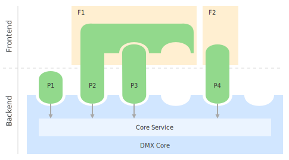
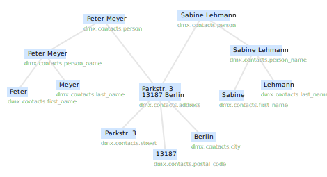
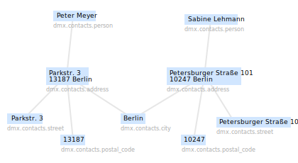
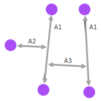
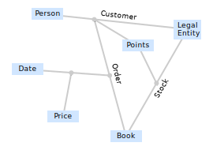

.. _developer-guide:

###################
DMX Developer Guide
###################

This guide describes how to develop DMX plugins.

************
Introduction
************

What a DMX plugin can do
========================

To give you an impression what a DMX plugin can do, these might be the effects once you install one:

* The database contains an additional **data model** resp. existing data models are changed/extended. In DMX a data model consists basically of *Topic Types* and *Association Types*. Some of the types may appear in the DMX Webclient menus. E.g. the `dmx-notes <https://git.dmx.systems/dmx-platform/dmx-platform/-/tree/master/modules/dmx-notes>`_ plugin creates the "Note" data model and let the "Note" topic type appear in the DMX Webclient search/create dialog, allowing the user to create/edit/search notes.
* The **DMX Webclient** is customized:

    * Customized topic/association **detail renderings**. E.g. the `dmx-datetime <https://git.dmx.systems/dmx-platform/dmx-platform/-/tree/master/modules/dmx-datetime>`_ plugin provides formatters/editors for date and time values.
    * Customized **topicmap renderings**. An additional *Topicmap Type* becomes available in the search/create dialog. E.g. once `dmx-geomaps <https://git.dmx.systems/dmx-plugins/dmx-geomaps>`_ plugin is installed the user can create geo maps (besides normal topicmaps).
    * New commands appear in the topic/association **context menu**. E.g. the `dmx-dita <https://git.dmx.systems/dmx-plugins/dmx-dita>`_ plugin defines a topic type "DITA Processor", and adds a "Run" command to the context menu of DITA Processor topics.

* A **custom web front-end**, completely independent from DMX Webclient, becomes available at a dedicated URL. E.g. once the `dmx-mobile <https://git.dmx.systems/dmx-plugins/dmx-mobile>`_ plugin is installed you can launch its front-end via ``http://localhost:8080/systems.dmx.mobile/``. You might recognize that some front-end widgets are recycled from the DMX Webclient, e.g. the detail/form renderer and the search/create dialog.
* At back-end an additional **OSGi service** becomes available, consumable by other plugins. E.g. the `dmx-workspaces <https://git.dmx.systems/dmx-platform/dmx-platform/-/tree/master/modules/dmx-workspaces>`_ plugin provides the `WorkspacesService <https://apidocs.dmx.systems/index.html?systems/dmx/workspaces/WorkspacesService.html>`_. Any plugin can consume it and call e.g. its ``createWorkspace()`` method in order to programmatically create a workspace.
* An additional **RESTful service** (with an underlying OSGi service) becomes available at a dedicated namespace URI. E.g. when the `dmx-topicmaps <https://git.dmx.systems/dmx-platform/dmx-platform/-/tree/master/modules/dmx-topicmaps>`_ plugin is installed its RESTful service for creating/manipulating topicmaps becomes available under ``http://localhost:8080/topicmaps``. A RESTful service is accessible by any DMX front-end as well as by any external application, regardless of programming language. E.g. there is a DMX-CLI written in Python: `py4dmx <https://git.dmx.systems/dmx-contrib/py4dmx>`_.

A DMX plugin contains one or more of these effects, in an arbitrary combination.

In every case a plugin is a single ``.jar`` file prefixed by ``dmx-``, e.g. ``dmx-geomaps-0.1.jar``. A plugin is hot-deployed/stopped/updated at runtime by (re)moving that .jar file to/from ``bundle-deploy/``.

.. hint::

    The DMX platform itself is built from (about 20) plugins, e.g. `dmx-webclient <https://git.dmx.systems/dmx-platform/dmx-platform/-/tree/master/modules/dmx-webclient>`_, `dmx-topicmaps <https://git.dmx.systems/dmx-platform/dmx-platform/-/tree/master/modules/dmx-topicmaps>`_, `dmx-contacts <https://git.dmx.systems/dmx-platform/dmx-platform/-/tree/master/modules/dmx-contacts>`_, `dmx-search <https://git.dmx.systems/dmx-platform/dmx-platform/-/tree/master/modules/dmx-search>`_. These plugins are in no way different than the plugins you're developing. Furthermore there are various external plugins available (via separate download), e.g. `dmx-geomaps <https://git.dmx.systems/dmx-plugins/dmx-geomaps>`_, `dmx-mobile <https://git.dmx.systems/dmx-plugins/dmx-mobile>`_.

    Whenever this guide mentions a plugin it links to its source code. This provides you a great learning resource as you can explore how "real" DMX plugins are made.

The DMX platform
================

The DMX platform is a web application server written in Java.
It provides a framework for application developers.

Traditionally a web application consists of 3 parts: *data model*, *business logic* (server-side), and a front-end. In DMX there are no *applications*. Instead there is the DMX platform on one hand, and *DMX plugins* on the other, nothing else. One specialty about a DMX plugin (green) is that it can contain both, a back-end portion and a front-end portion, in one single hot-deployable ``.jar`` file.

.. _plugin-types:

In its back-end portion (see P1) a plugin can define a data model (creating *Types* and their relationships), and/or provide business logic in form of a service (consumable by other plugins or through a REST API). In its client-side portion a plugin either *creates* a front-end (see P2, P3), or *extends* an existing front-end (see P4).

All installed plugins operate on the same semantic storage (with access restrictions applied). Operating on the semantic storage is possible exclusively through the *DMX Core Service* (`Java interface <https://apidocs.dmx.systems/index.html?systems/dmx/core/service/CoreService.html>`_) which is injected into every plugin.

The heart of the platform is the *DMX Core*. The Core provides the runtime environment for DMX plugins. The Core a) loads plugins and manages their life-cycle, and b) governs all access to the semantic storage, and provides this duty as *DMX Core Service*.

.. hint::

    The most prominent DMX plugin is probably `dmx-webclient <https://git.dmx.systems/dmx-platform/dmx-platform/-/tree/master/modules/dmx-webclient>`_ (see P3). It creates an extensible web front-end: the well-known "DMX Webclient".

.. _semantic-storage:

Semantic Storage
================

* The *Semantic Storage* holds a semantic network consisting of topics and associations. Unconnected subnetworks can exist. Topics and associations together are referred to as *DMX Objects*.
* Topics and associations have no properties. In DMX the meaning of an object is seen not as a set of properties but as the relationships the object has.
* In DMX there are just values. *Simple values* (text, number, boolean, html) and *composite values* (a hierarchy). Values are typed. A type is identified by its URI.
* The URI is mappable to public vocabularies like Dublin Core or schema.org.
* Uniqueness: everything that exists in reality only once exists in DMX only once as well, e.g. a city, a person, or a postal address. E.g. the city "Berlin" exists exactly once and is shared between all postal addresses within Berlin.
* Multi user support: every DMX object is assigned to a *Workspace* which imposes an access level: *private*, *confidential*, *collaborative*, *public*, and *common*. Access control is enforced by the DMX Core on a per-request basis, by inspecting the request's ``Authorization`` header.

    2 persons live at the same place. The corresponding Address topic is shared between 2 Person topics. "Person" and "Address" are composite types, at the leaves are values of simple types. Below each topic its type URI is shown.

Immutability
------------

Besides *representation* the semantic storage is also responsible for data *manipulation*. Manipulating of shared semantic data is a tricky thing. As everything is stored *only once* and is potentially shared by many parents, changing a shared object might have unintended semantic *side effects*.

Example: an Address topic is shared between many Person topics, the semantics being: these persons live/work together. Now consider one particular person is moving. We must not change the value of the Address topic, as this would express wrong semantics. Only one person has moved, not all together.

To solve the problem of side effects, in DMX values are *immutable*, they never change. Only the associations forming the composite values do.

When issuing the move-person request the DMX Core creates a *new* Address topic and associates it to the person moved. Not quite: actually DMX will first look if such an address exists already, that is an Address topic with exactly the 4 particular children ("Petersburger Straße 101", "10247", "Berlin", "Germany"), and if so associate that one.

When updating a composite topic you never maintain the hierarchy associations manually. You just give a (fragment of the) new value hierarchy, and the Core will maintain the associations. This Core responsibility is called *Value Integration*. This works for arbitrary hierarchy depth.

    After one person has moved the 2 persons do not share a common Address topic anymore; the City topic "Berlin" and Country topic "Germany" are still shared between the 2 Address topics though.

Value vs. Entity
----------------

We've seen values in DMX are immutable. When an address's (parent) street and postal code (children) change, a *new* Address topic is created. Now lets consider another change-request, Peter Meyer changes his phone number, and apply the very same rule as with the address. As the particular person (parent) phone (child) combination does not yet exist, a *new* Person topic would be created. That is we have now 2 "Peter Meyer" topics when in reality there is only one. The uniqueness criteria (see :ref:`semantic-storage`) is violated.

The solution is to introduce another concept -- **Entity** -- and categorize composite types either as value type or entity type.

Values are immutable. Simple topics are always immutable. Examples for values: "Person Name", "First Name", "Last Name", "Street", "Postal Code", "City", "Address", "Time", "Date", "Geo Coordinate".

Entities on the other hand are mutable. An entity topic's child hierarchy may change while the topic keeps its identity. When modeling an entity type, you have to configure whose of its children make up its identity. A person could be identified e.g. either by the Name/Birthday/City of Birth combination or by a synthetic attribute like Social Security Number. Examples for entities: "Person", "Note".

Associative Model of Data
-------------------------

The above images suggest the DMX storage model is *graph* based: *nodes* and *edges*. Actually DMX is based on the *Associative Model of Data*, an substantial extension of the graph model.

While in a graph an edge is always a connection between 2 *nodes*, in the Associative Model of Data an edge can connect *edges* too. That is an edge connects either 2 nodes (as traditionally, see A1), or a node and an edge (A2), or 2 edges (A3).

Basically DMX makes associations objects of discourse too. Associations can be associated with other topics/associations, just like topics. This results in expressive highly-connected structures at both levels, data model and content (= *instances*).

Here an associative data model for a "bookstore" application is shown. Note that "Customer", "Order", and "Stock" are modeled as *associations* (not as topics). That is a "Customer" *instance* is an *association* (not a topic), e.g. between "Michael Peters" (a "Person") and "Bookpages" (a "Legal Entity").

Furthermore note that "Order" is an association between "Customer" and "Book", that is an association between a topic and an association. An order has a date and a price. With every purchase the customer's "Points" account grows. For every book in stock the store keeps the information with how many points its purchase is rewarded.

.. hint::

    Learn more about the Associative Model of Data:

    | Joseph V. Homan, Paul J. Kovacs -- A Comparison Of The Relational Database Model And The Associative Database Model (6 page article)
    | *Issues in Information Systems*, Volume X, No. 1, 2009
    | http://iacis.org/iis/2009/P2009_1301.pdf

    | Simon Williams -- The Associative Model Of Data (24 page article)
    | *Journal of Database Marketing*, Volume 8, 4, 2001
    | https://link.springer.com/content/pdf/10.1057/palgrave.jdm.3240049.pdf

    | Simon Williams -- The Associative Model Of Data (book, 284 pages)
    | *Lazy Software*, 2nd edition, 2002
    | http://www.sentences.com/docs/other_docs/AMD.pdf

Hot code replacement
====================

TODO: revise/extend

Technically the DMX platform is a Java/OSGi based application server. OSGi is a service oriented component architecture to support modularity. A DMX plugin is also an *OSGi Bundle*. A DMX application consists of one or more plugins. Plugins provide services consumable by other plugins, and exposed via a REST API. Plugins can be installed/updated/uninstalled without restarting the server (Hot Deployment). When a service becomes unavailable all plugins depending on that service shutdown. When the service becomes available again, all depending plugins are activated again. This has great advantages for both administration and development.

The 4 plugin archetypes
=======================

To find out what type of plugin (see :ref:`P1-P4 <plugin-types>` illustration above) you're about to develop, ask yourself these questions:

* Will it have a back-end portion?
* Will it have a front-end portion? If yes:

    * Will it extend the DMX Webclient (or a custom front-end)? Or:
    * Will it create a custom front-end

Note: the "plugin type" is nothing explicit. You effectively change a plugin's type by adding/removing the respective portions/assets to/from it.

The following list gives you an impression what it means when you're developing a DMX plugin of the respective type:

Back-end-only (P1)
    A plugin that acts purely at the back-end. It defines a data model (optionally) and/or provides business logic:

    * Defines a **data model**: creating *Topic Types*, *Association Types*, *Role Types*, and default instances. Your data model can build upon, and even change, the data models provided by the platform or by other plugins. To do so in a controlled manner the platform provides a migration facility that runs the migrations provided by a plugin.

      A purely passive plugin that doesn't do anything but defining a data model is nothing unusual. Often in this case no Java code is required at all; you define a data model declaratively, in JSON.

      Examples are basically the `dmx-base <https://git.dmx.systems/dmx-platform/dmx-platform/-/tree/master/modules/dmx-base>`_, `dmx-bookmarks <https://git.dmx.systems/dmx-platform/dmx-platform/-/tree/master/modules/dmx-bookmarks>`_, `dmx-contacts <https://git.dmx.systems/dmx-platform/dmx-platform/-/tree/master/modules/dmx-contacts>`_, `dmx-datetime <https://git.dmx.systems/dmx-platform/dmx-platform/-/tree/master/modules/dmx-datetime>`_, `dmx-events <https://git.dmx.systems/dmx-platform/dmx-platform/-/tree/master/modules/dmx-events>`_, `dmx-notes <https://git.dmx.systems/dmx-platform/dmx-platform/-/tree/master/modules/dmx-notes>`_, and the `dmx-tags <https://git.dmx.systems/dmx-platform/dmx-platform/-/tree/master/modules/dmx-tags>`_ plugins. These effectively create the included DMX applications (*Note Taking*, *Contact Management*, *Bookmark Management*, and *Calendar*), just by providing data models. All the functionality on the other hand (e.g. create, search, edit, navigate, share, delete) is generic platform functionality.

    * Has Java code:

        * Provides **business logic** as **OSGi service**. A service method can be made RESTful just by adding JAX-RS annotations. JAX-RS knowledge is useful.
        * Consumes OSGi services provided by other plugins, or by the platform.
        * Listens to Core **events**, and events fired by other plugins.
        * Implements **plugin life-cycle** hooks.

Front-end (P2)
    A plugin that creates a user interface:

    * Has all the assets (``index.html``, ``.vue``, ``.js``, ``.css``, ...) to create a SPA front-end.
    * Communicates with the back-end via `dmx-api <https://git.dmx.systems/nodejs-modules/dmx-api>`_ library.

    Examples are the `dmx-webclient <https://git.dmx.systems/dmx-platform/dmx-platform/-/tree/master/modules/dmx-webclient>`_ and `dmx-mobile <https://git.dmx.systems/dmx-plugins/dmx-mobile>`_ plugins.

    Use case **Headless CMS**: You're relying basically on DMX back-end capabilities (see P1) and build a custom front-end. You can freely choose the 3rd party front-end libraries/frameworks then. You're not bound to Vue or anything. For convenience you'll probably use the `dmx-api <https://git.dmx.systems/nodejs-modules/dmx-api>`_ library to communicate with the DMX back-end. And *if* you're using Vue you can possibly re-use some of the Vue components the DMX Webclient is built from, e.g. the detail renderer/form generator (`dmx-object-renderer <https://git.dmx.systems/nodejs-modules/dmx-object-renderer>`_) or the topicmap rendering (`dmx-topicmap-panel <https://git.dmx.systems/nodejs-modules/dmx-topicmap-panel>`_). See `npm <https://www.npmjs.com/~jri>`_ for available components.

    Such a plugin can have a back-end part as well (see P1).

Front-end Host (P3)
    A plugin that creates a user interface (see P2) that is extensible by other plugins (see P4):

    * Manages loading the front-end parts of installed plugins.

    An example is the `dmx-webclient <https://git.dmx.systems/dmx-platform/dmx-platform/-/tree/master/modules/dmx-webclient>`_ plugin. Other plugins can extend it e.g. with additional topic/topicmap renderers and menu items.

    Such a plugin can have a back-end part as well (see P1).

Front-end Extension (P4)
    A plugin that extends the user interface created by another plugin:

    * Has all the assets (e.g. ``.vue``, ``.js``) as expected by the Front-end Host (see P3).

    Examples are the `dmx-accesscontrol <https://git.dmx.systems/dmx-platform/dmx-platform/-/tree/master/modules/dmx-accesscontrol>`_, `dmx-base <https://git.dmx.systems/dmx-platform/dmx-platform/-/tree/master/modules/dmx-base>`_, `dmx-contacts <https://git.dmx.systems/dmx-platform/dmx-platform/-/tree/master/modules/dmx-contacts>`_, `dmx-datetime <https://git.dmx.systems/dmx-platform/dmx-platform/-/tree/master/modules/dmx-datetime>`_, `dmx-details <https://git.dmx.systems/dmx-platform/dmx-platform/-/tree/master/modules/dmx-details>`_, `dmx-help-menu <https://git.dmx.systems/dmx-platform/dmx-platform/-/tree/master/modules/dmx-help-menu>`_, `dmx-search <https://git.dmx.systems/dmx-platform/dmx-platform/-/tree/master/modules/dmx-search>`_, `dmx-topicmaps <https://git.dmx.systems/dmx-platform/dmx-platform/-/tree/master/modules/dmx-topicmaps>`_, `dmx-typeeditor <https://git.dmx.systems/dmx-platform/dmx-platform/-/tree/master/modules/dmx-typeeditor>`_, `dmx-workspaces <https://git.dmx.systems/dmx-platform/dmx-platform/-/tree/master/modules/dmx-workspaces>`_, and the `dmx-geomaps <https://git.dmx.systems/dmx-plugins/dmx-geomaps>`_ plugins. All their front-end parts extend the DMX Webclient.

    When developing an extension for the DMX Webclient you'll get in touch with `Vue <https://vuejs.org>`_ (for reactivity), `Vuex <https://vuex.vuejs.org>`_ (state management), and possibly `Element UI <https://element.eleme.io>`_ (widgets). These are the libraries the DMX Webclient is built from.

    You can start developing a DMX Webclient extension by cloning `dmx-plugin-template <https://git.dmx.systems/dmx-plugins/dmx-plugin-template>`_.

    Such a plugin can have a back-end part as well (see P1).

.. important::

    Building a DMX plugin is possible only if the DMX platform components exist in your local Maven repository. To fulfill this requirement you're requested to build the DMX platform from source first.

Building DMX platform from source
=================================

Requirements:

* **Java 8** (other versions do *not* work)
* **Maven**
* **Node.js**
* **Git**

Build DMX platform from source:

.. code-block:: bash

    $ git clone https://git.dmx.systems/dmx-platform/dmx-platform.git
    $ cd dmx-platform
    $ mvn install -P all

This builds all components of the DMX platform and installs them in your local Maven repository. All tests are run; you'll see a lot of information logged, cumulating in:

.. code-block:: text

    ...
    [INFO] ------------------------------------------------------------------------
    [INFO] BUILD SUCCESS
    [INFO] ------------------------------------------------------------------------
    [INFO] Total time: 03:07 min
    ...

****************************
The plugin turn-around cycle
****************************

This section illustrates how to begin a plugin project, how to build and how to deploy a plugin, and how to redeploy the plugin once you made changes in its source code. In other words, this section illustrates the plugin development turn-around cycle.

Let's start with a very simple plugin called *DMX Tagging*. This plugin will just create a new topic type called ``Tag``. Once the plugin is activated the topic type will appear in the DMX Webclient's *Create* menu, so you can create tag topics and associate them with arbitrary topics. And you will be able to fulltext search for tags.

Developing a plugin whose only purpose is to provide new topic type definitions requires no Java or JavaScript coding. All is declarative, mainly in JSON format.

Of course the topic type could be created interactively as well, by using the DMX Webclient's type editor. However, being packaged as a plugin means you can distribute it. When other DMX users install your plugin they can use your type definitions.

Begin a plugin project
======================

Naming Conventions
------------------

.. hint::

    It is convention to have prefix ``dmx-`` when creating a Git repo for your DMX plugin, eg. ``dmx-tagging``.

From the developer's view a DMX plugin is a directory on your hard disc. The directory can have an arbitrary name and exist at an arbitrary location. By convention the plugin directory begins with ``dmx-`` as it is aimed to the DMX platform. The directory content adheres to a certain directory structure and file name conventions. The files are text files (xml, json, properties, java, js, css) and resources like images.

To create the *DMX Tagging* plugin setup a directory structure as follows:

.. code-block:: text

    dmx-tagging/
        pom.xml
        src/
            main/
                resources/
                    migrations/
                        migration1.json
                    plugin.properties

Create the file ``pom.xml`` with this content:

.. code-block:: xml

    <project>
        <modelVersion>4.0.0</modelVersion>

        <name>DMX Tagging</name>
        <groupId>org.mydomain</groupId>
        <artifactId>dmx-tagging</artifactId>
        <version>0.1-SNAPSHOT</version>
        <packaging>bundle</packaging>

        <parent>
            <groupId>systems.dmx</groupId>
            <artifactId>dmx-plugin</artifactId>
            <version>5.0-SNAPSHOT</version>
        </parent>

        <build>
            <plugins>
                <plugin>
                    <groupId>org.apache.felix</groupId>
                    <artifactId>maven-bundle-plugin</artifactId>
                    <configuration>
                        <instructions>
                            <Bundle-SymbolicName>
                                org.mydomain.dmx-tagging
                            </Bundle-SymbolicName>
                        </instructions>
                    </configuration>
                </plugin>
            </plugins>
        </build>
    </project>

Create the file ``migration1.json``:

.. code-block:: js

    {
        topic_types: [
            {
                value: "Tag",
                uri: "domain.tagging.tag",
                dataTypeUri: "dmx.core.text",
                viewConfigTopics: [
                    {
                        typeUri: "dmx.webclient.view_config",
                        children: {
                            dmx.webclient.add_to_create_menu: true
                        }
                    }
                ]
            }
        ]
    }

Create the file ``plugin.properties``:

.. code-block:: text

    dmx.plugin.model_version = 1
    dmx.plugin.dependencies = systems.dmx.webclient

Setup for Hot-Deployment
========================

The easiest way to let DMX hot-deploy the plugin is to develop it within the ``bundle-dev/`` directory. To do so move the plugin directory on your hard disc into DMX's hot-deployment folder called ``bundle-dev/``. The next step is then to build your plugin.

But lets first start DMX in development mode, that is with hot-deployment activated.

In the home directory ``dmx-platform``:

.. code-block:: bash

    $ mvn pax:run

You'll see a lot of information logged, cumulating with:

.. code-block:: text

    ...
    Apr 6, 2013 11:21:20 PM de.deepamehta.core.impl.PluginManager checkAllPluginsActivated
    INFO: ### Bundles total: 32, DeepaMehta plugins: 16, Activated: 16
    Apr 6, 2013 11:21:20 PM de.deepamehta.core.impl.PluginManager activatePlugin
    INFO: ########## All Plugins Activated ##########
    Apr 6, 2013 11:21:20 PM de.deepamehta.plugins.webclient.WebclientPlugin allPluginsActive
    INFO: ### Launching webclient (url="http://localhost:8080/de.deepamehta.webclient/")
    ...

Then a browser windows opens automatically and displays the DMX Webclient.

The terminal is now occupied by the *Gogo* shell. Press the return key some times and you'll see its ``g!`` prompt.

Type the ``lb`` command to get the list of activated bundles:

.. code-block:: bash

    g! lb

The output  looks like this:

.. code-block:: text

    START LEVEL 6
       ID|State      |Level|Name
        0|Active     |    0|System Bundle (3.2.1)
       ...
       14|Active     |    5|DeepaMehta 4 Help (4.1.1.SNAPSHOT)
       15|Active     |    5|DeepaMehta 4 Topicmaps (4.1.1.SNAPSHOT)
       16|Active     |    5|DeepaMehta 4 Webservice (4.1.1.SNAPSHOT)
       17|Active     |    5|DeepaMehta 4 Files (4.1.1.SNAPSHOT)
       18|Active     |    5|DeepaMehta 4 Geomaps (4.1.1.SNAPSHOT)
       19|Active     |    5|DeepaMehta 4 Storage - Neo4j (4.1.1.SNAPSHOT)
       20|Active     |    5|DeepaMehta 4 Core (4.1.1.SNAPSHOT)
       21|Active     |    5|DeepaMehta 4 Access Control (4.1.1.SNAPSHOT)
       22|Active     |    5|DeepaMehta 4 Webclient (4.1.1.SNAPSHOT)
       23|Active     |    5|DeepaMehta 4 Webbrowser (4.1.1.SNAPSHOT)
       24|Active     |    5|DeepaMehta 4 Type Search (4.1.1.SNAPSHOT)
       25|Active     |    5|DeepaMehta 4 Workspaces (4.1.1.SNAPSHOT)
       26|Active     |    5|DeepaMehta 4 Notes (4.1.1.SNAPSHOT)
       27|Active     |    5|DeepaMehta 4 Type Editor (4.1.1.SNAPSHOT)
       28|Active     |    5|DeepaMehta 4 Contacts (4.1.1.SNAPSHOT)
       29|Active     |    5|DeepaMehta 4 Facets (4.1.1.SNAPSHOT)
       30|Active     |    5|DeepaMehta 4 File Manager (4.1.1.SNAPSHOT)
       31|Active     |    5|DeepaMehta 4 Icon Picker (4.1.1.SNAPSHOT)

The *DMX Tagging* plugin does not yet appear in that list as it is not yet build.

Build the plugin
================

In another terminal:

.. code-block:: bash

    $ cd dmx-tagging
    $ mvn clean package

This builds the plugin. After some seconds you'll see:

.. code-block:: text

    ...
    [INFO] ------------------------------------------------------------------------
    [INFO] BUILD SUCCESS
    [INFO] ------------------------------------------------------------------------
    [INFO] Total time: 3.988s
    ...

Once build, DMX hot-deploys the plugin automatically. In the terminal where you've started DMX the logging informs you about plugin activation:

.. code-block:: text

    Apr 6, 2013 11:38:40 PM de.deepamehta.core.impl.PluginImpl readConfigFile
    INFO: Reading config file "/plugin.properties" for plugin "DeepaMehta 4 Tagging"
    Apr 6, 2013 11:38:40 PM de.deepamehta.core.osgi.PluginActivator start
    INFO: ========== Starting plugin "DeepaMehta 4 Tagging" ==========
    Apr 6, 2013 11:38:40 PM de.deepamehta.core.impl.PluginImpl createPluginServiceTrackers
    INFO: Tracking plugin services for plugin "DeepaMehta 4 Tagging" ABORTED -- no consumed services declared
    Apr 6, 2013 11:38:40 PM de.deepamehta.core.impl.PluginImpl addService
    INFO: Adding DeepaMehta 4 core service to plugin "DeepaMehta 4 Tagging"
    Apr 6, 2013 11:38:40 PM de.deepamehta.core.impl.PluginImpl addService
    INFO: Adding Web Publishing service to plugin "DeepaMehta 4 Tagging"
    Apr 6, 2013 11:38:40 PM de.deepamehta.core.impl.PluginImpl registerWebResources
    INFO: Registering Web resources of plugin "DeepaMehta 4 Tagging" ABORTED -- no Web resources provided
    Apr 6, 2013 11:38:40 PM de.deepamehta.core.impl.PluginImpl registerRestResources
    INFO: Registering REST resources of plugin "DeepaMehta 4 Tagging" ABORTED -- no REST resources provided
    Apr 6, 2013 11:38:40 PM de.deepamehta.core.impl.PluginImpl registerRestResources
    INFO: Registering provider classes of plugin "DeepaMehta 4 Tagging" ABORTED -- no provider classes provided
    Apr 6, 2013 11:38:40 PM de.deepamehta.core.impl.PluginImpl addService
    INFO: Adding Event Admin service to plugin "DeepaMehta 4 Tagging"
    Apr 6, 2013 11:38:40 PM de.deepamehta.core.impl.PluginManager activatePlugin
    INFO: ----- Activating plugin "DeepaMehta 4 Tagging" -----
    Apr 6, 2013 11:38:40 PM de.deepamehta.core.impl.PluginImpl createPluginTopicIfNotExists
    INFO: Installing plugin "DeepaMehta 4 Tagging" in the database
    Apr 6, 2013 11:38:40 PM de.deepamehta.core.impl.MigrationManager runPluginMigrations
    INFO: Running 1 migrations for plugin "DeepaMehta 4 Tagging" (migrationNr=0, requiredMigrationNr=1)
    Apr 6, 2013 11:38:40 PM de.deepamehta.core.impl.MigrationManager$MigrationInfo readMigrationConfigFile
    INFO: Reading migration config file "/migrations/migration1.properties" ABORTED -- file does not exist
    Apr 6, 2013 11:38:40 PM de.deepamehta.core.impl.MigrationManager runMigration
    INFO: Running migration 1 of plugin "DeepaMehta 4 Tagging" (runMode=ALWAYS, isCleanInstall=true)
    Apr 6, 2013 11:38:40 PM de.deepamehta.core.util.DeepaMehtaUtils readMigrationFile
    INFO: Reading migration file "/migrations/migration1.json"
    Apr 6, 2013 11:38:40 PM de.deepamehta.core.impl.MigrationManager runMigration
    INFO: Completing migration 1 of plugin "DeepaMehta 4 Tagging"
    Apr 6, 2013 11:38:40 PM de.deepamehta.core.impl.MigrationManager runMigration
    INFO: Updating migration number (1)
    Apr 6, 2013 11:38:40 PM de.deepamehta.core.impl.PluginImpl registerListeners
    INFO: Registering listeners of plugin "DeepaMehta 4 Tagging" at DeepaMehta 4 core service ABORTED -- no listeners implemented
    Apr 6, 2013 11:38:40 PM de.deepamehta.core.impl.PluginImpl registerPluginService
    INFO: Registering OSGi service of plugin "DeepaMehta 4 Tagging" ABORTED -- no OSGi service provided
    Apr 6, 2013 11:38:40 PM de.deepamehta.core.impl.PluginManager activatePlugin
    INFO: ----- Activation of plugin "DeepaMehta 4 Tagging" complete -----
    Apr 6, 2013 11:38:40 PM de.deepamehta.core.impl.PluginManager checkAllPluginsActivated
    INFO: ### Bundles total: 33, DeepaMehta plugins: 17, Activated: 17
    Apr 6, 2013 11:38:40 PM de.deepamehta.core.impl.PluginManager activatePlugin
    INFO: ########## All Plugins Activated ##########
    Apr 6, 2013 11:38:40 PM de.deepamehta.plugins.webclient.WebclientPlugin allPluginsActive
    INFO: ### Launching webclient (url="http://localhost:8080/de.deepamehta.webclient/") ABORTED -- already launched
    ...

When you type again ``lb`` in the DMX terminal you'll see the *DMX Tagging* plugin now appears in the list of activated bundles:

.. code-block:: text

    START LEVEL 6
       ID|State      |Level|Name
        0|Active     |    0|System Bundle (3.2.1)
       ...
       30|Active     |    5|DeepaMehta 4 File Manager (4.1.1.SNAPSHOT)
       31|Active     |    5|DeepaMehta 4 Icon Picker (4.1.1.SNAPSHOT)
       32|Active     |    5|DeepaMehta 4 Tagging (0.1.0.SNAPSHOT)

Try out the plugin
==================

Now you can try out the plugin. In the DMX Webclient login as user "admin" and leave the password field empty. The *Create* menu appears and when you open it you'll see the new type *Tag* listed. Thus, you can create tags now. Additionally you can associate tags to your content topics, search for tags, and navigate along the tag associations, just as you do with other topics.

The result so far: the *DMX Tagging* plugin provides a new topic type definition or, in other words: a data model. All the active operations on the other hand like create, edit, search, delete, associate, and navigate are provided by the DMX Webclient at a generic level, and are applicable to your new topic type as well.

Redeploy the plugin
===================

Once you've made any changes to the plugin files, you have to build the plugin again. Just like before in the plugin terminal:

.. code-block:: bash

    $ mvn clean package

Once building is complete the changed plugin is redeployed automatically. You'll notice activity in the DMX terminal:

.. code-block:: text

    Apr 8, 2013 1:10:40 AM de.deepamehta.core.osgi.PluginActivator stop
    INFO: ========== Stopping plugin "DeepaMehta 4 Tagging" ==========
    Apr 8, 2013 1:10:40 AM de.deepamehta.core.impl.PluginImpl removeService
    INFO: Removing DeepaMehta 4 core service from plugin "DeepaMehta 4 Tagging"
    Apr 8, 2013 1:10:40 AM de.deepamehta.core.impl.PluginImpl removeService
    INFO: Removing Web Publishing service from plugin "DeepaMehta 4 Tagging"
    Apr 8, 2013 1:10:40 AM de.deepamehta.core.impl.PluginImpl removeService
    INFO: Removing Event Admin service from plugin "DeepaMehta 4 Tagging"
    ...
    ...
    Apr 8, 2013 1:10:44 AM de.deepamehta.core.osgi.PluginActivator start
    INFO: ========== Starting plugin "DeepaMehta 4 Tagging" ==========
    ...
    ...
    Apr 8, 2013 1:10:44 AM de.deepamehta.core.impl.PluginManager activatePlugin
    INFO: ----- Activating plugin "DeepaMehta 4 Tagging" -----
    Apr 8, 2013 1:10:44 AM de.deepamehta.core.impl.PluginImpl createPluginTopicIfNotExists
    INFO: Installing plugin "DeepaMehta 4 Tagging" in the database ABORTED -- already installed
    Apr 8, 2013 1:10:44 AM de.deepamehta.core.impl.MigrationManager runPluginMigrations
    INFO: Running migrations for plugin "DeepaMehta 4 Tagging" ABORTED -- everything up-to-date (migrationNr=1)
    ...
    ...
    Apr 8, 2013 1:10:44 AM de.deepamehta.core.impl.PluginManager activatePlugin
    INFO: ----- Activation of plugin "DeepaMehta 4 Tagging" complete -----
    Apr 8, 2013 1:10:44 AM de.deepamehta.core.impl.PluginManager checkAllPluginsActivated
    INFO: ### Bundles total: 33, DeepaMehta plugins: 17, Activated: 17
    Apr 8, 2013 1:10:44 AM de.deepamehta.core.impl.PluginManager activatePlugin
    INFO: ########## All Plugins Activated ##########
    Apr 8, 2013 1:10:44 AM de.deepamehta.plugins.webclient.WebclientPlugin allPluginsActive
    INFO: ### Launching webclient (url="http://localhost:8080/de.deepamehta.webclient/") ABORTED -- already launched
    ...

In contrast to the initial build of the plugin you can recognize some differences in this log:

* The old version of the plugin currently deployed is stopped.
* The new version of the plugin is deployed (that is *started* and *activated*) right away.
* The plugin is *not* installed again in the database as already done while initial build.
* The migration is *not* run again as already done while initial build.

To ensure the DMX Webclient is aware of the changed plugin press the browser's reload button.

Stopping the DMX server
=======================

To stop the DMX server, in the Gogo shell type:

.. code-block:: bash

    g! stop 0

This stops all bundles, shuts down the webserver, and the database.

**********
Migrations
**********

A *migration* is a sequence of database operations that is executed exactly once in the lifetime of a particular DMX installation. You as a developer are responsible for equipping your plugin with the required migrations. Migrations serve several purposes:

1. Define the plugin's data model. That is, storing new topic type definitions and association type definitions in the database. E.g. a *Books* plugin might define the types *Book*, *Title*, and *Author*.

2. A newer version of your plugin might extend or modify the data model defined by the previous version of your plugin. The migration of the updated plugin change the stored type definitions *and* transforms existing content if necessary.

3. The application logic of a newer version of your plugin changes in a way it is not compatible anymore with the existing database content. The migration must transform the existing content then.

So, the purpose expressed in points 2. and 3. is to make your plugin *upgradable*. That is, keeping existing database content *in-snyc* with the plugin logic. By providing the corresponding migrations you make your plugin *compatible* with the previous plugin version.

The migration machinery
=======================

Each plugin comes with its own data model. For each plugin DMX keeps track what data model version is currently installed. It does so by storing the version of the installed data model in the database as well. The data model version is an integer number that starts at 0 and is increased consecutively: 0, 1, 2, and so on. Each version number (except 0) corresponds with a particular migration. The migration with number *n* is responsible for transforming the database content from version *n-1* to version *n*.

You as the developer know 2 things about your plugin: a) Which plugin version relies on which data model version, and b) How to transform the database content in order to advance from a given data model version to the next. So, when you ship your plugin you must equip it with 2 things:

* The information what data model version the plugin relies on.
* All the migrations required to update to that data model version.

The relationship between plugin version and data model version might look as follows:

==============  ==================
Plugin Version  Data Model Version
==============  ==================
0.1             2
0.2             5
0.2.1           5
0.3             6
==============  ==================

If e.g. version 0.1 of the plugin is currently installed, the database holds "2" as the current data model version. When the user updates to version 0.3 of the plugin, DMX's migration machinery will recognize that data model version 2 is present but version 6 is required. As a consequence DMX will consecutively run migrations 3 through 6. Once completed, the database holds "6" as the current data model version.

Thus, the users database will always be compatible with the installed version of the plugin. Furthermore, the user is free to skip versions when upgrading the plugin.

Plugin configuration
====================

If your plugin comes with its own data model you must tell DMX the data model version it relies on. To do so, set the ``dmx.plugin.model_version`` configuration property in the ``plugin.properties`` file, e.g.:

.. code-block:: text

    dmx.plugin.model_version = 2

DMX's migration machinery takes charge of running the plugin's migrations up to that configured number. If your plugin comes with no data model, you can specify ``0`` resp. omit the ``dmx.plugin.model_version`` property as ``0`` is its default value.

Usually each plugin has its own ``plugin.properties`` file. It allows the developer to configure certain aspects of the plugin. The name of the ``plugin.properties`` file and its path within the plugin directory is fixed:

.. code-block:: text

    dmx-myplugin/src/main/resources/plugin.properties

If no ``plugin.properties`` file is present, the default configuration values apply.

The two kinds of migrations
===========================

As you've already learned, migrations serve different (but related) purposes: some just *create* new type definitions and others *modify* existing type definitions and/or transform existing database content. To support the developer with these different tasks DMX offers two kinds of migrations:

* A **Declarative Migration** is a JSON file that declares 4 kinds of things: topic types, association types, topics, associations. Use a declarative migration to let DMX create new types and instances in the database. Use a declarative migration to let your plugin setup the initial type definitions.

  With a declarative migration you can only create new things. You can't modify existing things. All you do with a declarative migration you could achieve with an imperative migration as well, but as long as you just want create new things, it is more convenient to do it declaratively.

* An **Imperative Migration** is a Java class that has access to the *DMX Core Service*. Thus, you can perform arbitrary database operations like creation, retrieval, update, deletion. Use an imperative migration when (a later version of) your plugin needs to modify existing type definitions and/or transform existing database content.

The developer can equip a plugin with an arbitrary number of both, declarative migrations and imperative migrations.

Directory structure
===================

In order to let DMX find the plugin's migration files, you must adhere to a fixed directory structure and file names. Each migration file must contain its number, so DMX can run them consecutively.

A declarative migration must be named ``migration<nr>.json`` and must be located in the plugin's ``src/main/resources/migrations/`` directory.

An imperative migration must be named ``Migration<nr>.java`` and must be located in the plugin's ``src/main/java/<your plugin package>/migrations/`` directory.

Example:

.. code-block:: text

    dmx-myplugin/
        src/
            main/
                java/
                    org/
                        mydomain/
                            dmx/
                                myplugin/
                                    migrations/
                                        Migration2.java
                                        Migration5.java
                resources/
                    migrations/
                        migration1.json
                        migration3.json
                        migration4.json
                        migration6.json
                    plugin.properties

This example plugin would have set ``dmx.plugin.model_version`` to 6 (configured in ``plugin.properties``), so 6 migrations are involved. 4 are declarative and 2 are imperative here.

Important: for each number between 1 and ``dmx.plugin.model_version`` exactly one migration file must exist. That is *either* a declarative migration file *or* an imperative migration file.

It would be invalid if for a given number a) no migration file exists, or b) two migration files exist (one declarative and one imperative). In these cases the DMX migration machinery throws an error and the plugin is not activated.

Writing a declarative migration
===============================

A declarative migration is a JSON file with exactly one JSON Object in it. In a declarative migration you can define 4 things: topic types, association types, topics, associations. The general format is:

.. code-block:: js

    {
        topic_types: [
            ...
        ],
        assoc_types: [
            ...
        ],
        topics: [
            ...
        ],
        associations: [
            ...
        ]
    }

Each of the 4 sections is optional.

As an example see the (simplified) migration that defines the *Note* topic type. This migration is part of the *DMX Notes* plugin:

.. code-block:: js

    {
        topic_types: [
            {
                value:       "Title",
                uri:         "dmx.notes.title",
                dataTypeUri: "dmx.core.text"
            },
            {
                value:       "Text",
                uri:         "dmx.notes.text",
                dataTypeUri: "dmx.core.html"
            },
            {
                value:       "Note",
                uri:         "dmx.notes.note",
                dataTypeUri: "dmx.core.entity",
                compDefs: [
                    {
                        childTypeUri:        "dmx.notes.title",
                        childCardinalityUri: "dmx.core.one"
                    },
                    {
                        childTypeUri:        "dmx.notes.text",
                        childCardinalityUri: "dmx.core.one"
                    }
                ],
                viewConfigTopics: [
                    {
                        typeUri: "dmx.webclient.view_config",
                        children: {
                            dmx.webclient.icon: "\uf24a",
                            dmx.webclient.add_to_create_menu: true
                        }
                    }
                ]
            }
        ]
    }

As you see, this migration defines 3 topic types (and no other things): *Title* and *Text* are 2 simple types, and *Note* is a composite type. A Note is composed of one Title and one Text.

Writing an imperative migration
===============================

An imperative migration is a Java class that is derived from ``systems.dmx.core.service.Migration`` and that overrides the ``run()`` method. The ``run()`` method is called by DMX to run the migration.

Within the migration you have access to the DMX *Core Service* through the ``dmx`` object. By the means of the Core Service you can perform arbitrary database operations. Typically this involves importing further objects from the ``systems.dmx.core`` API.

As an example see a migration that comes with the *DMX Topicmaps* plugin:

.. code-block:: java

    package systems.dmx.topicmaps.migrations;

    import systems.dmx.core.TopicType;
    import systems.dmx.core.service.Migration;

    public class Migration3 extends Migration {

        @Override
        public void run() {
            TopicType type = dmx.getTopicType("dmx.topicmaps.topicmap");
            type.addCompDef(mf.newCompDefModel(
                "dmx.topicmaps.topicmap", "dmx.topicmaps.state", "dmx.core.one")
            );
        }
    }

Here a **Composition Definition** is added to the *Topicmap* type subsequently.

*******************
The plugin back-end
*******************

What a DMX plugin can do at back-end:

* **Listen to DMX Core events**. In particular situations the DMX Core fires events, e.g. before and after it creates a new topic in the database. Your plugin can listen to these events and react in its own way. Thus, the *DMX Workspaces* plugin e.g. ensures that each new topic is assigned to a workspace.

* **Access the DMX Core Service**. The DMX *Core Service* provides the basic database operations (create, retrieve, update, delete) to deal with the DMX Core objects: Topics, Associations, Topic Types, Association Types.

* **Providing a service**. Your plugin can make its business logic, that is its service methods, accessible by other plugins (via OSGi) and/or by external applications (via HTTP/REST). Example: the service provided by the *DMX Topicmaps* plugin includes methods to add a topic to a topicmap or to change the topic's coordinates within a topicmap.

* **Consuming services provided by other plugins**. Example: in order to investigate a topic's workspace assignments and the current user's memberships the *DMX Access Control* plugin consumes the service provided by the *DMX Workspaces* plugin.

Whether a DMX plugin has a back-end part depends on the the plugin's purpose. Plugins without a back-end part include those which e.g. just define a data model or just provide a custom (JavaScript) renderer.

The plugin main file
====================

You must write a *plugin main file* if your plugin needs to a) listen to DMX Core events and/or b) provide a service. The plugin main file contains the event handlers resp. the service implementation then.

The plugin main file must be located directly in the plugin's ``src/main/java/<your plugin package>/`` directory. By convention the plugin main class ends with ``Plugin``.

Example:

.. code-block:: text

    dmx-mycoolplugin/
        src/
            main/
                java/
                    org/
                        mydomain/
                            dmx/
                                mycoolplugin/
                                    MyCoolPlugin.java

Here the plugin package is ``org.mydomain.dmx.mycoolplugin`` and the plugin main class is ``MyCoolPlugin``.

A plugin main file is a Java class that is derived from ``systems.dmx.core.osgi.PluginActivator``. The smallest possible plugin main file looks like this:

.. code-block:: java

    package org.mydomain.dmx.mycoolplugin;

    import systems.dmx.core.osgi.PluginActivator;

    public class MyCoolPlugin extends PluginActivator {
    }

3 things are illustrated here:

* The plugin should be packaged in an unique namespace.
* The ``PluginActivator`` class needs to be imported.
* The plugin main class must be derived from ``PluginActivator`` and must be public.

Furthermore when writing a plugin main file you must add 2 entries in the plugin's ``pom.xml``:

1. a <parent> element to declare the artifactId ``dmx-plugin``. This brings you necessary dependenies and the ``PluginActivator`` class.
2. a <build> element to configure the Maven Bundle Plugin. It needs to know what your plugin main class is. You must specify the fully-qualified class name.

.. code-block:: xml

    <project>
        <modelVersion>4.0.0</modelVersion>

        <name>My Cool Plugin</name>
        <groupId>org.mydomain</groupId>
        <artifactId>dmx-mycoolplugin</artifactId>
        <version>0.1-SNAPSHOT</version>
        <packaging>bundle</packaging>

        <parent>
            <groupId>systems.dmx</groupId>
            <artifactId>dmx-plugin</artifactId>
            <version>5.0-SNAPSHOT</version>
        </parent>

        <build>
            <plugins>
                <plugin>
                    <groupId>org.apache.felix</groupId>
                    <artifactId>maven-bundle-plugin</artifactId>
                    <configuration>
                        <instructions>
                            <Bundle-SymbolicName>
                                org.mydomain.dmx-mycoolplugin
                            </Bundle-SymbolicName>
                            <Bundle-Activator>
                                org.mydomain.dmx.mycoolplugin.MyCoolPlugin
                            </Bundle-Activator>
                        </instructions>
                    </configuration>
                </plugin>
            </plugins>
        </build>
    </project>

Using the DMX Core Service
==========================

TODO

Listen to DMX Core events
=========================

In particular situations the DMX Core fires events, e.g. before and after it creates a new topic in the database. Your plugin can listen to these events and react in its own way.

Listening to a DMX Core event means implementing the corresponding listener interface. A listener interface consist of just one method: the *listener method*. That method is called by the DMX Core when the event is fired. The listener interfaces are located in package ``systems.dmx.core.service.event``.

To listen to a DMX Core event, in the plugin main class you must:

* Import the listener interface.
* Declare the plugin main class implements that interface.
* Implement the listener method. Use the ``@Override`` annotation.
* Import the classes appearing in the listener method arguments.

Example:

.. code-block:: java

    package org.mydomain.dmx.mycoolplugin;

    import systems.dmx.core.Topic;
    import systems.dmx.core.model.TopicModel;
    import systems.dmx.core.osgi.PluginActivator;
    import systems.dmx.core.service.Directives;
    import systems.dmx.core.service.event.PostCreateTopic;
    import systems.dmx.core.service.event.PostUpdateTopic;

    import java.util.logging.Logger;

    public class MyCoolPlugin extends PluginActivator implements PostCreateTopic, PostUpdateTopic {

        private Logger log = Logger.getLogger(getClass().getName());

        @Override
        public void postCreateTopic(Topic topic) {
            log.info("### Topic created: " + topic);
        }

        @Override
        public void postUpdateTopic(Topic topic, TopicModel newModel, TopicModel oldModel) {
            log.info("### Topic updated: " + topic + "\nOld topic: " + oldModel);
        }
    }

This example plugin listens to 2 DMX Core events: ``POST_CREATE_TOPIC`` and ``POST_UPDATE_TOPIC``.

These particular events are fired *after* the DMX Core has created resp. updated a topic. The DMX Core passes the created/updated topic to the respective listener method. In case of "update" the previous topic content (``oldModel``) is also passed to enable the plugin to investigate what exactly has changed.

The example plugin just logs the created resp. updated topic. In case of "update" the previous topic content is logged as well.

A [[DMXCoreEvents|list of all DMX Core events]] is available in the reference section.

Providing a service
===================

Your plugin can make its business logic, that is its service methods, accessible by other plugins (via OSGi) and/or by external applications (via HTTP/REST).

The service interface
---------------------

For a plugin to provide a service you must define a *service interface*. The service interface contains all the method signatures that make up the service. When other plugins consume your plugin's service they do so via the service interface.

To be recogbized the service interface *must* by convention end its name on ``...Service``. The service interface must be declared ``public`` and is a regular Java interface.

A DMX plugin can define *one* service interface at most. More than one service interface is not supported.

As an example see the *Topicmaps* plugin (part of the DMX platform):

.. code-block:: text

    dmx-topicmaps/
        src/
            main/
                java/
                    systems/
                        dmx/
                            topicmaps/
                                TopicmapsService.java

The service interface of the *Topicmaps* plugin is named ``TopicmapsService``. The plugin package is ``systems.dmx.topicmaps``.

The *Topicmaps* service interface looks like this:

.. code-block:: java

    package systems.dmx.topicmaps.service;

    import systems.dmx.topicmaps.TopicmapRenderer;
    import systems.dmx.topicmaps.model.ClusterCoords;
    import systems.dmx.topicmaps.model.Topicmap;

    import systems.dmx.core.Topic;

    public interface TopicmapsService {

        Topic createTopicmap(String name,             String topicmapRendererUri);
        Topic createTopicmap(String name, String uri, String topicmapRendererUri);

        // ---

        Topicmap getTopicmap(long topicmapId);

        // ---

        void addTopicToTopicmap(long topicmapId, long topicId, int x, int y);

        void addAssociationToTopicmap(long topicmapId, long assocId);

        void moveTopic(long topicmapId, long topicId, int x, int y);

        void setTopicVisibility(long topicmapId, long topicId, boolean visibility);

        void removeAssociationFromTopicmap(long topicmapId, long assocId);

        void moveCluster(long topicmapId, ClusterCoords coords);

        void setTopicmapTranslation(long topicmapId, int trans_x, int trans_y);

        // ---

        void registerTopicmapRenderer(TopicmapRenderer renderer);
    }

You see the Topicmaps service consist of methods to create topicmaps, retrieve topicmaps, and manipulate topicmaps.

Implementing the service
------------------------

After defining the plugin's service interface you must implement the actual service methods. Implementation takes place in the plugin main file.

The plugin main class must declare that it implements the plugin's service interface. (So you need to import the service interface.) Each service method implementation must be ``public``. Annotate each service method implementation with ``@Override``.

As an example see the implementation of the *Topicmaps* service:

.. code-block:: java

    package systems.dmx.topicmaps;

    import systems.dmx.topicmaps.model.Topicmap;
    import systems.dmx.topicmaps.TopicmapsService;

    import systems.dmx.core.Topic;
    import systems.dmx.core.osgi.PluginActivator;

    public class TopicmapsPlugin extends PluginActivator implements TopicmapsService {

        // *** TopicmapsService Implementation ***

        @Override
        public Topic createTopicmap(String name, String topicmapRendererUri) {
            ...
        }

        @Override
        public Topic createTopicmap(String name, String uri, String topicmapRendererUri) {
            ...
        }

        // ---

        @Override
        public Topicmap getTopicmap(long topicmapId) {
            ...
        }

        // ---

        @Override
        public void addTopicToTopicmap(long topicmapId, long topicId, int x, int y) {
            ...
        }

        ...

You see, the plugin main class ``TopicmapsPlugin`` implements the plugin's service interface ``TopicmapsService``.

Consuming a service
===================

Your plugin can consume the services provided by other plugins. To do so your plugin must get hold of the *service object* of the other plugin. Through the service object your plugin can call all the service methods declared in the other's plugin service interface.

To tell the DMX Core which plugin service your plugin wants to consume you need to declare an instance variable in your plugin like using the @Inject notation:

.. code-block:: java

    @Inject
    private AccessControlService acService;

Make sure to add your interest in building on the respective plugin service as dependencies to your ``pom.xml`` file. In the case of using the AccessControlService we would need to add the following:

.. code-block:: xml

    <dependencies>
        <dependency>
            <groupId>systems.dmx</groupId>
            <artifactId>dmx-accesscontrol</artifactId>
            <version>5.0-SNAPSHOT</version>
        </dependency>
    </dependencies>

Behind the scenes the DMX Core handles a plugin service as an OSGi service. Because of the dynamic nature of an OSGi environment DMX plugin services can arrive and go away at any time. Your plugin must deal with that. However, you as a plugin developer must not care about DMX's OSGi foundation. The DMX Core hides the details from you and provides an easy-to-use API for consuming plugin services.

To deal with other plugin services coming and going your plugin can override 2 hooks: ``serviceArrived`` and ``serviceGone``. These 2 hooks are called by the DMX Core as soon as a desired plugin becomes available resp. goes away.

The single argument of the 2 ``serviceArrived`` and ``serviceGone`` hooks is the respective service object, declared generically just as ``PluginService``. (Remember, ``PluginService`` is the common base interface for all plugin services.) So casting is required. In ``serviceArrived`` you typically store the service object in a private instance variable. In ``serviceGone`` you typically set the instance variable to ``null`` in order to release the service object.

As an example, see how the *Workspaces* plugin (part of the DMX platform) consumes the *Facets* service:

.. code-block:: java

    package systems.dmx.workspaces;

    import systems.dmx.facets.FacetsService;

    import systems.dmx.core.osgi.PluginActivator;
    import systems.dmx.core.service.PluginService;
    import systems.dmx.core.service.annotation.ConsumesService;

    public class WorkspacesPlugin extends PluginActivator {

        @Inject
        private FacetsService facetsService;

        // *** Hook Implementations ***

        @Override
        public void serviceArrived(PluginService service) {
            if (service instanceof FacetsService) {
                // do something when the facet service comes around
            }
        }

        @Override
        public void serviceGone(PluginService service) {
            // do something when a service goes away
        }

You see the Workspaces plugin consumes a plugin service: the *Facets* service.  The ``PluginService`` object passed to the 2 hooks needs not being further investigated.

In this way your plugin could also consume more than one service.

Providing a RESTful web service
===============================

Until here your plugin service is accessible from within the OSGi environment only. You can make the service accessible from *outside* the OSGi environment as well by promoting it to a RESTful web service. Your plugin service is then accessible from external applications via HTTP. (External application here means both, the client-side portion of a DMX plugin, or an arbitrary 3rd-party application).

To provide a RESTful web service you must provide a generic plugin service first (as described above in [[#Providingaservice|Providing a service]]) and then make it RESTful by using JAX-RS annotations. With JAX-RS annotations you basically control how HTTP requests will be mapped to your service methods.

To make your plugin service RESTful you must:

* Annotate the plugin main class with ``@Path`` to anchor the plugin service in URI space.

* Annotate the plugin main class with ``@Consumes`` and ``@Produces`` to declare the supported HTTP request and response media types. You can use these annotations also at a particular service method to override the class-level defaults.

* Annotate each service method with one of ``@GET``, ``@POST``, ``@PUT``, or ``@DELETE`` to declare the HTTP method that will invoke that service method.

* Annotate each service method with ``@Path`` to declare the URI template that will invoke that service method. The URI template can contain parameters, notated with curly braces ``{...}``.

* Annotate service method parameters with ``@PathParam`` to map URI template parameters to service method parameters.

As an example let's see how the *Topicmaps* plugin (part of the DMX platform) annotates its main class and service methods:

.. code-block:: java

    package systems.dmx.topicmaps;

    import systems.dmx.topicmaps.model.Topicmap;
    import systems.dmx.topicmaps.TopicmapsService;

    import systems.dmx.core.Topic;
    import systems.dmx.core.osgi.PluginActivator;

    import javax.ws.rs.GET;
    import javax.ws.rs.PUT;
    import javax.ws.rs.POST;
    import javax.ws.rs.DELETE;
    import javax.ws.rs.HeaderParam;
    import javax.ws.rs.Path;
    import javax.ws.rs.PathParam;
    import javax.ws.rs.Produces;
    import javax.ws.rs.Consumes;

    @Path("/topicmap")
    @Consumes("application/json")
    @Produces("application/json")
    public class TopicmapsPlugin extends PluginActivator implements TopicmapsService {

        // *** TopicmapsService Implementation ***

        @POST
        @Path("/{name}/{topicmap_renderer_uri}")
        @Override
        public Topic createTopicmap(@PathParam("name") String name,
                                    @PathParam("topicmap_renderer_uri") String topicmapRendererUri) {
            ...
        }

        @GET
        @Path("/{id}")
        @Override
        public Topicmap getTopicmap(@PathParam("id") long topicmapId) {
            ...
        }

        @POST
        @Path("/{id}/topic/{topic_id}/{x}/{y}")
        @Override
        public void addTopicToTopicmap(@PathParam("id") long topicmapId, @PathParam("topic_id") long topicId,
                                       @PathParam("x") int x, @PathParam("y") int y) {
            ...
        }

        ...

JAX-RS: Java API for RESTful Web Services[[BR]]
http://jsr311.java.net/nonav/releases/1.1/spec/spec.html

Extract values from a HTTP request
----------------------------------

This section describes in more detail how DMX (resp. the underlying JAX-RS implementation to be precise) extracts the service method argument values from the various parts of a HTTP request. As seen in the example above this is controlled by annotating the service method arguments. Besides ``@PathParam`` you can use further annotations:

================  ==============================================
Annotation        Semantics
================  ==============================================
``@PathParam``    Extracts the value of a URI template parameter
``@QueryParam``   Extracts the value of a URI query parameter
``@HeaderParam``  Extracts the value of a header
================  ==============================================

A value extracted from a HTTP request is inherently a string. So the JAX-RS implementation must know how to actually construct a Java object (resp. a primitive value) from it. That's why the type of a service method argument that is annotated with one of these annotations must satisfy one of these criteria:

1. The type is a primitive type like ``int``, ``long``, ``float``, ``double``, ``boolean``, ``char``.

2. The type has a constructor that accepts a single ``String`` argument.

3. The type has a static method named ``valueOf`` that takes a single ``String`` argument and returns an instance of the type.

    Enum types are special as they already have a static ``valueOf`` method. If this one does not fit your need add a ``fromString`` method to your enum type that has the same characteristics as the ``valueOf`` method mentioned above.

4. The type is ``List<T>``, ``Set<T>``, or ``SortedSet<T>``, where ``T`` satisfies criterion 2 or 3.

So, when you use a self-defined class (including enum classes) along with ``@PathParam``, ``@QueryParam``, or ``@HeaderParam`` make sure your class satisfies criterion 2 or 3.

As an example lets revisit the ``getTopicmap`` method from the previous section:

.. code-block:: java

    @GET
    @Path("/{id}")
    @Override
    public Topicmap getTopicmap(@PathParam("id") long topicmapId) {
        ...
    }

Now you know how exactly the JAX-RS implementation extracts the ``topicmapId`` parameter value from the HTTP request:

    The ``topicmapId`` value is extracted from the request's URI path and then converted to a ``long``. Here criterion 1 is satisfied and the conversion is straight-forward.

Parsing the HTTP request body
-----------------------------

Until here we talked about how to extract values from the HTTP request's path, the request's query string, or the request headers. This section describes how to feed the *HTTP request body* into your service methods. Feeding here refers to a) parsing the body's byte stream, b) constructing a Java object from it, and passing that Java object to a particular service method.

JAX-RS can't know how to construct arbitrary application objects from a sole byte stream. That's why JAX-RS comprises a extension facility called *Provider Classes*. A provider class is responsible to read the request body, parse it, and construct an particular application object from it. It is the duty of the application developer to implement the required provider classes for the application objects.

A service method that want to receive the constructed application object must have a dedicated parameter called (in JAX-RS speak) the *Entity Parameter*. The entity parameter stands for the entity that is represented in the request body. Unlike the other service method parameters the entity parameter has *no* annotation. A service method can have *one* entity parameter at most (a HTTP request has *one* body).

To feed the HTTP request body into a service method you must:

* Add an entity parameter to the service method. That is a parameter without any annotation.

* Implement a provider class for the type of the entity parameter, resp. make sure such a provider class already exists (as part of the DMX Core or one of the installed DMX plugins).

*********************************
Writing a DMX Webclient extension
*********************************

TODO

*********
Reference
*********

TODO
