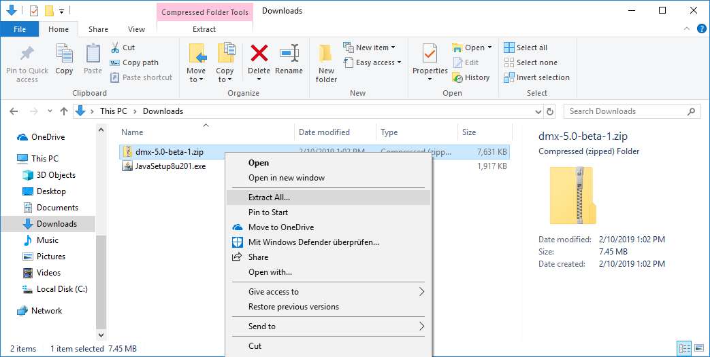
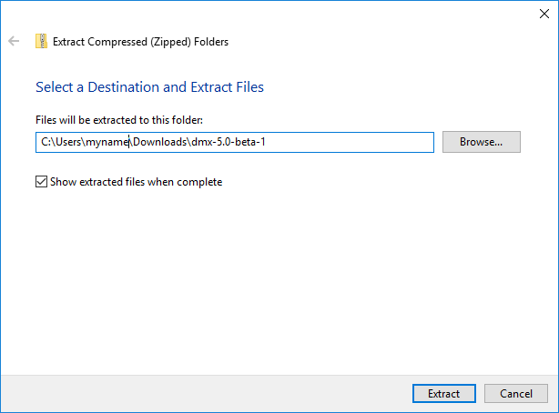

.. _installation:

############
Installation
############

DMX is built on the Java Platform which can be installed on many operating systems.
On this page we have covered how to run DMX on :ref:`Windows <installation-windows>`, :ref:`Mac OS <installation-macos>` and :ref:`Linux <installation-linux>`.

DMX is a web application consisting of a client and a server.
If you run DMX a web server is started (see Starting DMX) which makes the DMX web client accessible in your web browser (see Opening the Web Client).

.. _installation-windows:

**********************
Running DMX on Windows
**********************

Installing Java
===============

DMX runs out of the box with Java versions 6 to 8.
To run DMX we recommend you to download **Java 8**.
If Java 8 is not already installed you can download it from the `AdoptOpenJDK <https://adoptopenjdk.net/>`_ or `Oracle's Java <https://java.com/en/download/>`_ website.
Double-click the downloaded file and click through the installer.

Downloading DMX
===============

The latest stable release is the `DMX 5.0-beta-6 release <https://download.dmx.systems/dmx-5.0-beta-6.zip>`_.
Previous versions of DMX are available for download on https://download.dmx.systems/.

Save the according file to a location of your choice.
Extract the ``.zip`` archive.

A new folder is created and the folder has the name of the ``.zip`` file.
This is your *DMX Home* folder and you can now start DMX.

Starting DMX
============

Enter the folder that was created when you unpacked the zip archive.
Double-click the file ``dmx-windows.bat``.
If your Explorer does not display file extensions, you only see ``dmx-windows`` as a file name.
That is the same file.

A black terminal window opens to display what is happening.
Just leave it there.
The Windows Defender Firewall might ask you to allow Java access.
Choose "Private networks, such as my home or work network".

When started, DMX tries to open the DMX web client automatically for you (at http://localhost:8080/systems.dmx.webclient/) using your default web browser.

.. hint:: Log in as "admin" without a password.

Opening the Web Client
======================

To open the DMX web client point your browser to the full address http://localhost:8080/systems.dmx.webclient/.
Without the path (``systems.dmx.webclient/``) your browser cannot open the DMX web client.
The DMX server must be running (see Starting DMX) for the web client to be accessible in your browser.

Stopping DMX
============

To stop the DMX server, bring the black terminal windows to the foreground.
Type ``stop 0`` into the terminal and press ENTER.
The DMX server is shut down.

Removing DMX
============

You can get rid of DMX by deleting the whole folder that got created when you unpacked the zip file, e.g. dmx-5.0-beta-6.
The Java Runtime Environment has to be uninstalled separately.

.. _installation-macos:

*********************
Running DMX on Mac OS
*********************

On most current Mac OS versions Java 8 is already installed.
If Java 8 is not installed you can download it from the `AdoptOpenJDK <https://adoptopenjdk.net/>`_ or `Oracle's Java <https://java.com/en/download/>`_ website.

Your Mac automatically uses the newest Java version. If your default Java version is higher than Java 8 and you installed Java 8 in addition you have to disable the newer version.

1. Find out which Java version is active. Open the Terminal and type ``java -version``.
2. If it is higher than 8 open Macintosh HD and go to Library - Java - JavaVirtualMachines. Find the newer version.
3. Rename that version's ``Contents/info.plist`` file to ``Contents/info.plist.disabled``.

Double-click the downloaded file and click through the installer.

Downloading DMX
===============

The latest stable release is the `DMX 5.0-beta-6 release <https://download.dmx.systems/dmx-5.0-beta-6.zip>`_. Previous versions of DMX are available for download on https://download.dmx.systems/.

Save the according file to a location of your choice.
Extract the ``.zip`` archive.

A new folder is created.
It has the name of the ``.zip`` file.
This is your *DMX Home* folder and you can now start DMX.

Starting DMX
============

Enter the folder that was created when you unpacked the zip archive.
Double-click the file ``dmx-macosx.command``.
A terminal window opens to display what is happening.
Just leave it there.

When started, DMX tries to open the DMX web client automatically for you (at http://localhost:8080/systems.dmx.webclient/) using your default web browser.

.. hint:: Log in as "admin" without a password.

Opening the Web Client
======================

To open the DMX web client point your browser to the full address http://localhost:8080/systems.dmx.webclient/.
Without the path (``systems.dmx.webclient/``) your browser cannot open the DMX web client.
The DMX server must be running (see Starting DMX) for the web client to be accessible in your browser.

Stopping DMX
============

To stop the DMX server, type ``stop 0`` into the terminal window and press ENTER.
DMX is shut down.

Removing DMX
============

You can get rid of DMX by deleting the whole folder that got created when you unpacked the zip file, e.g. dmx-5.0-beta-6.
The Java Runtime Environment has to be uninstalled separately.

.. _installation-linux:

********************
Running DMX on Linux
********************

Installing Java
===============

Use your package manager to install the Java 8 for your Linux distribution.

For example, on Debian / Ubuntu, you would run the command

.. code:: bash

    sudo apt install openjdk-8-jre

to install OpenJDK/JRE. Make sure that Java 8 (not 11) is used by running

.. code:: bash

    sudo update-alternatives --config java

and selecting the right version interactively.

.. _installation-linux-zip:

Running DMX from a zip archive
==============================

Downloading DMX
---------------

Currently we recommend you to download the `beta-6 release <https://download.dmx.systems/dmx-5.0-beta-6.zip>`_.
To try out the latest state of development you can download the `latest snapshot <https://download.dmx.systems/ci/dmx-latest.zip>`_ instead.
All previous snapshots are available for download on https://download.dmx.systems/ci/.

Save the according file to a location of your choice, e.g. your "Downloads" folder.
Open a terminal and go to that location.
Extract the zip archive.

.. code:: bash

    ~ $ cd Downloads
    # to get the beta-6 release:
    ~/Downloads $ wget https://download.dmx.systems/dmx-5.0-beta-6.zip
    ~/Downloads $ unzip dmx-5.0-beta-6.zip

Starting DMX
------------

Go into the newly created folder (in this example "dmx-5.0-beta-6") and run the start script ``./dmx-linux.sh``.

.. code:: bash

    ~/Downloads $ cd dmx-5.0-beta-6
    ~/Downloads/cd dmx-5.0-beta-6 $ ./dmx-linux.sh

DMX tries to open the DMX web client automatically for you (at http://localhost:8080/systems.dmx.webclient/) using your default web browser. 

.. hint:: Log in as "admin" without a password.

Opening the Web Client
======================

To open the DMX web client point your browser to the full address http://localhost:8080/systems.dmx.webclient/.
Without the path (``systems.dmx.webclient/``) your browser cannot open the DMX web client.
The DMX server must be running (see Starting DMX) for the web client to be accessible in your browser.

Stopping DMX
------------

To stop DMX, type `stop 0` into the terminal window and press ENTER.
DMX is shut down.

Removing DMX
------------

You can get rid of DMX by deleting the whole folder that got created when you unpacked the zip file, e.g. dmx-5.0-beta-6.
The Java Runtime Environment has to be uninstalled separately.

.. _installation-linux-apt:

Installing DMX from our APT repository
======================================

For apt-based Linux distributions (like Debian / Ubuntu) we provide a repository.
It is intended for installations on servers but can obviously be used on Debian/Ubuntu laptops as well.
The package has a built-in dependency to ``default-jre``.

.. warning:: If your Java Runtime Environment is newer than Java 8, you cannot use the repository for the moment. Check your version by running the command ``java -version``.

Here is how to download and execute our install script.
It adds the repository, installs DMX from it, prompts the user for the DMX admin passphrase and starts DMX as a daemon.

.. code:: bash

    $ curl -sS https://download.dmx.systems/repos/dmx-install.sh | sudo bash

Configuring DMX
---------------

For apt-based installations we will soon provide more instructions on advanced configuration in the :ref:`Admin Documentation <admin>`.
By default, DMX listens on port 8080.
The main configuration file is located in ``/etc/dmx/config.properties``.
For configuration changes to take effect DMX needs to be restarted (see Stopping and Starting DMX).

Starting DMX
------------

Invoke this command to start the daemon:

.. code::

    systemctl start dmx

Stopping DMX
------------

Stop the daemon by running

.. code::

    systemctl stop dmx
