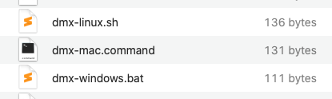

.. _installation:

############
Installation
############

************
Requirements
************

DMX is a web application. The *DMX Server* can run on any platform which supports **Java**, e.g. Windows, macOS, or Linux.

.. warning::

    | DMX requires **Java 8**.
    | DMX is not yet adapted to Java 9 or later.

| The *DMX Webclient* can run in **any modern web browser**.
| A Java browser plugin is *not* required.

.. _installation-types:

**********************
DMX installation types
**********************

There are 2 DMX installation types:

- *local* -- DMX Server and DMX Webclient run on *same* machine. Single-user.
- *networked* -- DMX Server and DMX Webclients run on *different* machines. Multi-user.

A default DMX installation is a *local* installation.

The DMX Server opens port ``8080``. Your computer is still safe though. The DMX Server comes with a request filter and by default it accepts requests only from localhost.

.. hint::

    **Linux users**: if your Linux distribution is APT-based (like Debian/Ubuntu) you can install DMX via apt. Skip to section :ref:`installation-linux-apt`.

    Alternatively you can run the generic zip based DMX installation. Just read on.

*****************************
Installation and first launch
*****************************

Although DMX is a client-server application, installation and first launch is as easy as buttering a toast:

1. Download `dmx-5.2.zip <https://download.dmx.systems/dmx-5.2.zip>`_
2. Unzip it. Result is a folder ``dmx-5.2``
3. Open the DMX Folder and run the starter script suitable for your platform:

   .. figure:: _static/starter-scripts.png

   The starter script runs without user interaction. The DMX Server is started, a lot of information is logged to the DMX terminal window, and finally a browser window opens, showing the *DMX Webclient*:

   .. figure:: _static/webclient-launch.png

      A pristine DMX Webclient when launched for the 1st time. The actual UI takes the back seat and gives way to your content. But at this moment you have none -- you're starting with a clean slate.

      .. hint::

         **Windows users**: The Windows Defender Firewall might ask you whether to grant network access to Java applications. Choose *"Private networks, such as my home or work network"*.

At 1st run the starter script creates an empty Corporate Memory: a folder ``dmx-db`` now exists inside the DMX Folder.

DMX does not install any files on your computer. Everything needed, including the database, exists inside the DMX Folder, and stays there.

*************************
Operate your installation
*************************

Configuration
=============

By default the DMX Server listens on port ``8080``.

To change the port edit ``org.osgi.service.http.port`` in file ``dmx-5.2/conf/config.properties``.
For the change to take effect, the DMX Server needs to be restarted, that is :ref:`stopped <stop-server>` and :ref:`started <start-server>` in turn.

Further configuration options are described in the :ref:`DMX Admin Guide <admin>`.

.. _start-server:

Starting the DMX Server
=======================

.. hint::

    Do not try starting the DMX Server if it is running already.

    In case you've (accidentally) closed the DMX Webclient window/tab (while the DMX Server is still running): proceed with :ref:`open-webclient`.

    In case you've changed DMX's config and want restart the server: :ref:`stop the server <stop-server>` first, and start it again.

To start the DMX Server, open the DMX Folder and run the starter script suitable for your platform:

The starter script runs without user interaction. While the DMX Server is started a lot of information is logged to the DMX terminal window. Finally a browser window opens, showing the *DMX Webclient*.

.. _stop-server:

Stopping the DMX Server
=======================

To shutdown the DMX Server, in the DMX terminal window enter ``stop 0`` and press ``Return``. While shutting down a lot of information is logged.

.. _open-webclient:

Opening the DMX Webclient
=========================

To open the DMX Webclient point your browser to ``http://localhost:8080/systems.dmx.webclient/``. Note the ``/`` at end.

The DMX Server must be running.

.. _uninstall-dmx:

Uninstall
=========

To uninstall DMX:

1. Stop the DMX Server
2. Delete the DMX Folder

This removes DMX completely from your computer, including the database.

The Java Runtime Environment needs to be uninstalled separately.

.. warning::

    Your Corporate Memory will be lost.

    To keep it make a copy of the ``dmx-db`` folder before deleting the DMX Folder.

.. _installation-linux-apt:

************************************
Installation from our APT repository
************************************

For APT-based Linux distributions (like Debian/Ubuntu) we provide an APT repository.
It is mainly intended for setting up a *networked* DMX installation on a server machine, but can be used for setting up a *local* DMX installation on a private machine as well (see :ref:`installation-types`).
The package has a built-in dependency to ``default-jre``.

Here is how to download and execute our install script.
It adds the repository, installs DMX from it, prompts the user for the DMX admin passphrase and starts DMX as a daemon:

.. code:: bash

    $ curl -sS https://download.dmx.systems/repos/dmx-install.sh | sudo bash

Configuration
=============

By default the DMX Server listens on port ``8080``.

To change the port edit ``org.osgi.service.http.port`` in file ``/etc/dmx/config.properties``.
For the change to take effect, the DMX Server needs to be restarted, that is :ref:`stopped <linux-stop-server>` and :ref:`started <linux-start-server>` in turn.

Further configuration options are described in the :ref:`DMX Admin Guide <admin>`.

.. _linux-start-server:

Starting the DMX Server
=======================

Invoke this command to start the daemon:

.. code::

    systemctl start dmx

.. _linux-stop-server:

Stopping the DMX Server
=======================

Stop the daemon by running:

.. code::

    systemctl stop dmx

.. _linux-open-webclient:

Opening the DMX Webclient
=========================

To open the DMX Webclient point your browser to ``http://localhost:8080/systems.dmx.webclient/``. Note the ``/`` at end.

The DMX Server must be running.
