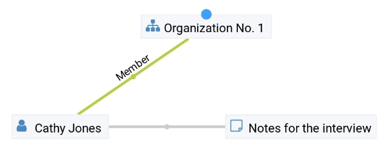
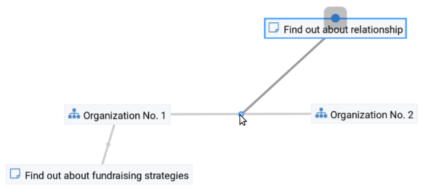

.. _intro:

############
What is DMX?
############

DMX is a knowledge building platform for individuals and work groups.

Before talking about *knowledge* in a sec, let's talk about *information*.
In DMX **information** is represented as *things* and *relationships* between things.

    A person, a organization, and a note, connected by relationships.

Things in DMX are called *Topics*, and relationships are basically called *Associations*. A topic can represent e.g. a person, an organization, a file, a book, or a planet. Also an idea or an emotion can be stored as a topic.

One specialty of the DMX data model is that associations can not only connect topics, but associations as well!

    2 notes, one is connected to a topic, and one to an association. The dark gray association connects a topic with an association. You can immediately say what the author want to express here, can't you?

... and yes, an association can also connect 2 associations. Not shown here.

DMX can't store **knowledge** though. No machine or software ever can. Knowledge exists in heads.

Specialty: the DMX UI is explicitly designed around the user's *situatedness* and supports knowledge building, memorization, and retrieval.

.. hint::

    This is a documentation rewrite project for DMX 5.2. It is work in progress.

    For a more complete documentation see DMX 5.0. Click in the bottom/left corner and under Versions choose ``stable``.
