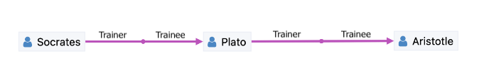
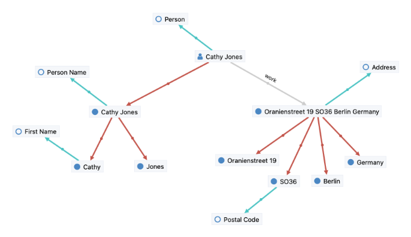
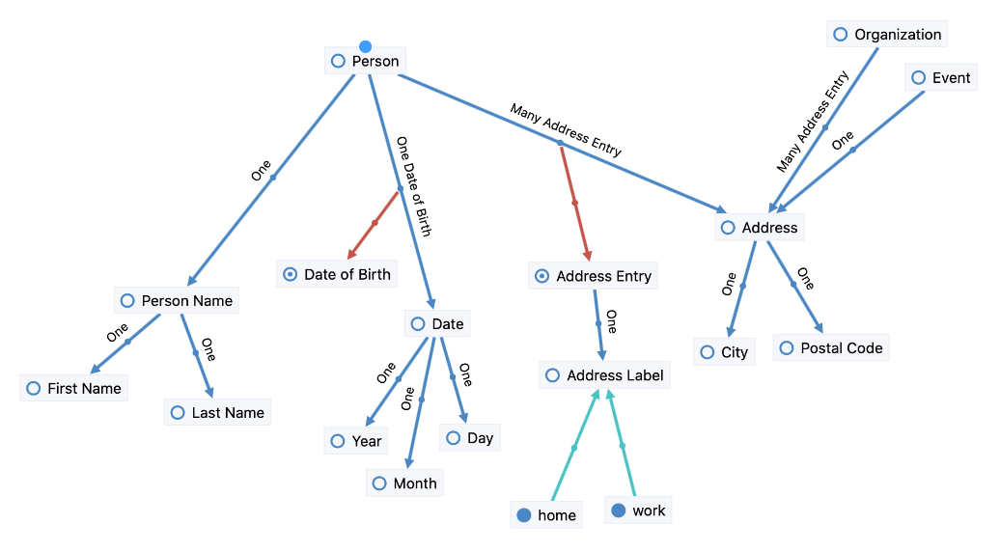

.. _overview:

############
DMX Overview
############

************
What is DMX?
************

DMX is a knowledge building platform for individuals and work groups.
The design of DMX is guided by the insight that machines do not store *knowledge* but *information* (see :ref:`preface`).
The DMX UI allows you to handle information in a way that supports knowledge building, memorization, and retrieval. It does so by putting you in direct contact with linked information -- instead of with applications and windows, and the borders this creates.
DMX strives to become a popular work environment for knowledge workers of all kind, e.g. students, authors, journalists, researchers, archivists.

DMX provides 4 things:

1. A **Corporate Memory** that serves as an accumulated body of data, information, and knowledge*) created in the course of an individual's or an organization's life.
2. An unified **User Interface** suitable for all areas:

    - Investigation
    - Authoring
    - Modeling
    - Collaboration
    - Presentation

3. An application model that is suitable for Domain Driven Design, in combination with a **Plugin Development Framework** for the development of full-stack plugins.
4. A pre-installed ontology (contacts, notes, web links, events) for basic information management needs.

Technically DMX is a web application server written in Java. Its service-oriented architecture is OSGi-based (Apache Felix); DMX application developers need no OSGi knowledge; JAX-RS knowledge is recommended though. DMX comes with web server (Jetty), database (Neo4j), the "DMX Webclient" (built in Vue.js, Vuex, Element UI) included, and offers a plugin development framework. DMX plugins are full-stack (from data model to front end) and hot deployable. A DMX default installation is *single-user*; its web server will reject any request not from localhost. From 5.0-beta-1 (Jan 30, 2019) on to current 5.2 the size of the DMX download zip file is unchanged at 7.5 MB -- much less than the competing Jakarta EE servers.

DMX is dual licensed Open Source software. The Community Edition is licensed under the GNU Affero General Public License (GNU AGPLv3).

The remainder of this "Overview" chapter is a concept-level introduction to DMX.

***********************
Topics and Associations
***********************

DMX represents information as *topics* and *associations*:

.. figure:: _static/organization-association.png

    3 topics connected by 2 associations. The topics represent a person, an organization, and a note respectively. One of the 2 associations is distinguished by color and label.

A **Topic** can represent any type of object, e.g. a person, an organization, a note, a contract, a project, a date, a planet name, a molecule, a review, or a book. Also an idea or an emotion can be expressed as a topic.

What object types are available is actually decided by the DMX user. A DMX user can create new types, as well as modify existing ones, interactively in the DMX Webclient. Another way of obtaining new types is by installing DMX plugins. A fresh DMX installation provides some basic types for information management (contacts, notes, web links, events).

An **Association** represents a relationship between two objects. The relationship's *meaning* is expressed by both, the association's *type* and *value*. Both are optional. A generic association still expresses *some* relationship between 2 objects.

Role Types
==========

At this point you may wonder: "Are associations directed?" Answer: "More than that."

In DMX the 2 ends of an association are not solely qualified by "source" and "target", but can be qualified by arbitrary *role types*, e.g. "Parent", "Child", "Cause", "Effect", "Trainer", "Trainee" etc.

    Plato is the Trainee in one association and the Trainer in another one.
    The pink associations are of type "Apprenticeship".

In DMX each of the 2 ends of an association is defined by:

- The *Player Object*: either a Topic, or an Association.
- A **Role Type** expresses what role the player object plays in the association.

One or both ends can still be unqualified (expressed by role type "Default"). Nondirectional associations are expressed by role type "Default" at both ends.

A DMX user can create new role types interactively in the DMX Webclient. Another way of obtaining new role types is by installing DMX plugins.

Associative Model of Data
=========================

The above images suggest the DMX storage model is *graph* based: *nodes* and *edges*. Actually DMX is based on an extension of the graph model: the *Associative Model of Data*.

.. figure:: _static/dmx-assoc-data-model.svg
   :width: 240px
   :align: left

While in the graph model an edge always connects 2 *nodes*, in the Associative Model of Data an edge can connect *edges* too. Either at one end (A2), or both (A3).

Basically DMX makes associations objects of discourse too. Associations can be associated with other topics/associations, just like topics. This results in expressive highly-connected structures at both levels, data model and content (= *instances*).

.. figure:: _static/create-assoc-with-assoc.png

    2 notes, one is connected to a topic, and one to an association. The dark gray association connects a topic with an association. You can immediately say what the author want to express here, can't you?

.. hint::

    Find out more about the `Associative Model of Data <devel.html#associative-model-of-data>`_ in the DMX Developer Guide.

******
Values
******

So far topics were depicted solely as *icon* plus *label*. But there is more to a person than a name, isn't it? Actually a value of type "Person" is an entire *value hierarchy*, for example: the Person has a name and an Address, the Address has a Postal Code, and the Postal Code is the string "SO36".

"Person" and "Address" in this example are *composite* values, and "Postal Code" is a *simple* value. And this is exactly how values are stored in the Corporate Memory: as an hierarchy of typed topics:

    A value of type "Person" as stored in the Corporate Memory. The value "Cathy Jones" is composed of a "Person Name" value and an "Address" value, which is composed of a "Street" value, a "Postal Code" value etc. The red associations are of type "Composition" and form the topic hierarchy. They are directed from "Parent" to "Child". The leaf-nodes are the *simple* values. Some values have their corresponding type topic revealed. The cyan associations are of type "Instantiation" and are directed from "Instance" to "Type".

DMX has the specialty that not only topics represent values, but associations too. In this regard there is no difference between topics and associations:

- both are typed
- both have a value

The type determines the structure of the value.

Detail Rendering
================

The above image shows how values are *stored* in DMX. But this is not necessarily a suitable way to *present* information or to *interact* with it. For every topic/association DMX provides a default *detail rendering*. It renders a composite value in a linear and compact form.

At any time a topic's/association's detail information is one click away, and once clicked, it is displayed in-place:

.. figure:: _static/in-map-details-pinning.png

    Topic detail information displayed in-place once a topic is clicked.
    The green associations are of type "Organization Involvement" and express that a Person is involved in an Organization, and in what way.

.. figure:: _static/create-organization-association.png

     A selected association (thicker line) and its detail information. Details comprise the association's type and value (not shown), and the 2 player topics, each one qualified by **Role Type**.

The detail rendering is driven by the topic's/association's type definition.

Custom Renderers
================

The detail rendering is customizable on a per-type basis.

A standard DMX installation provides custom renderers for the following types: "Topic Type", "Association Type", "File", "Folder", "Date", "Time" (composite), "URL", "Email Address", "File Size" (simple).

Further custom detail renderers can be obtained by installing DMX plugins.

*****
Types
*****

The above examples show topics of type "Person", "Organization", and "Note". Other *topic types* could be e.g. "Contract", "Project", "Date", "Planet Name", "Molecule", "Review", or "Book".

A fresh DMX installation provides some basic types for information management ("Person", "Organization", "Note", "Bookmark", "Event", "Address", "Email Address" etc.).

A DMX user can create new types, as well as modify existing ones, interactively in the DMX Webclient. Another way of obtaining new types is by installing DMX plugins.

**********
Topic Maps
**********

.. figure:: _static/detail-panel.png

    The typical DMX user interface presents a **Topic Map** consisting of topics and associations. The topic's type is represented by icon. Association types are differentiated by color.
