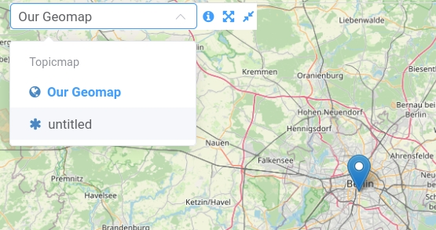
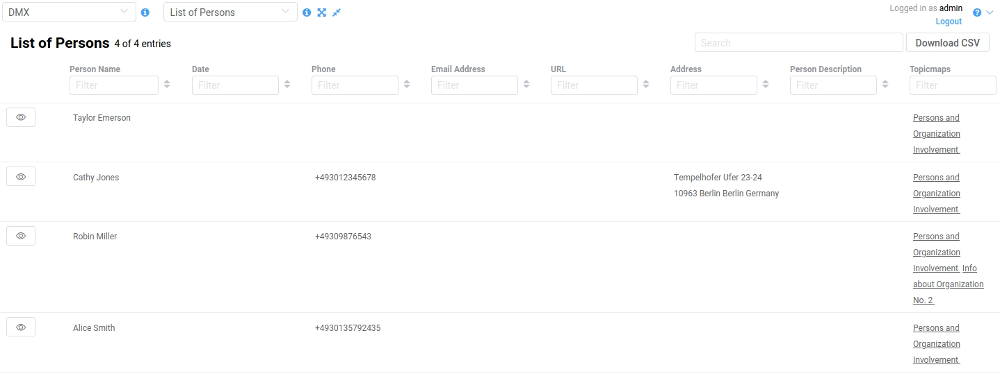
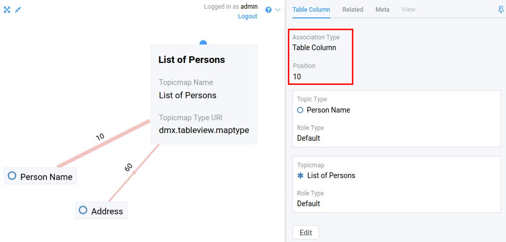
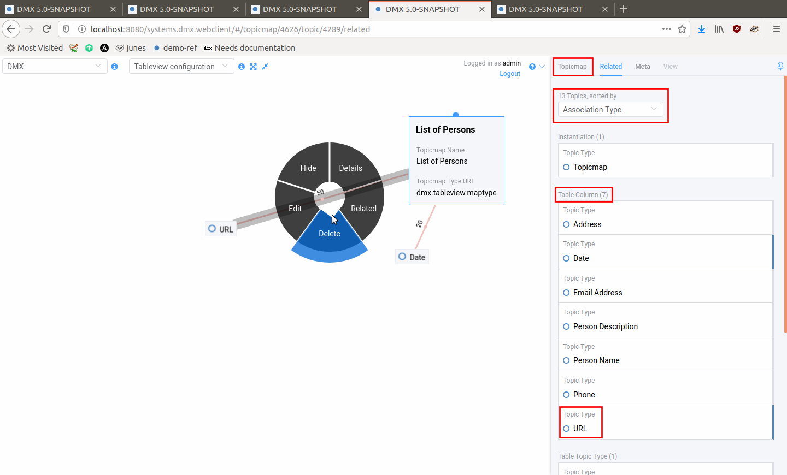
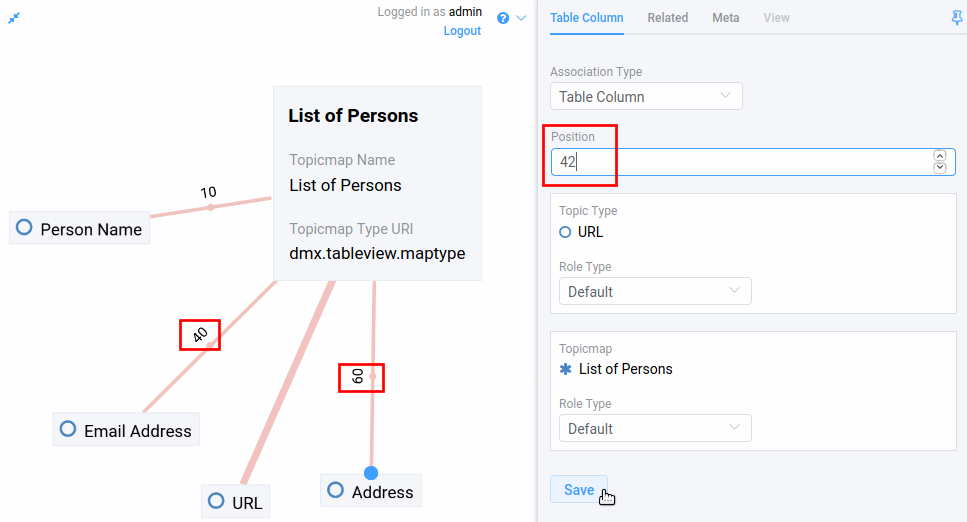
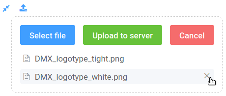
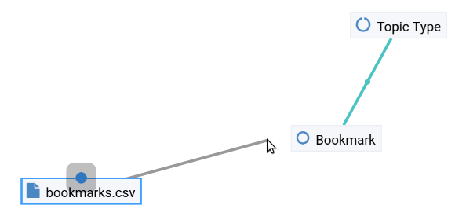
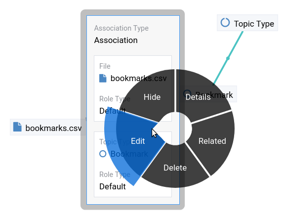
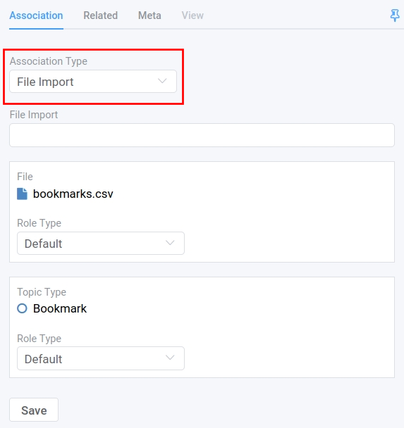
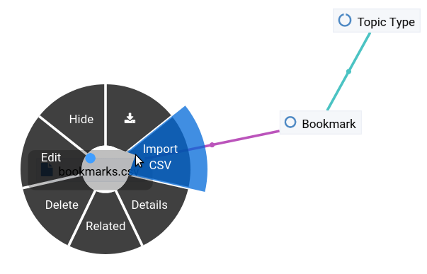

###########
DMX Plugins
###########

The functionalities of DMX can be extended through plugins.
Below you find an overview.

.. _plugins-overview-of-plugins:

*******************
Overview of Plugins
*******************

There is a variety of existing plugins.
Some of them are Free Software (see the table below).
Some freely available plugins can already be found in our `download section <https://download.dmx.systems/plugins/>`_, the others will follow soon.
Their source code is available in our the `plugin repositories <https://git.dmx.systems/dmx-plugins>`_.
The installation of plugins is explained in our :ref:`Admin Guide <admin-plugin-installation>`.

Some plugins are licensed under a proprietary license and can be purchased from us.

================================================================================================================================================================================  ===========================================================================================  ===========
Plugin Name                                                                                                                                                                       Functionality                                                                                License
================================================================================================================================================================================  ===========================================================================================  ===========
dmx-plugin-template (`source code <https://git.dmx.systems/dmx-plugins/dmx-plugin-template>`_)                                                                                    A starter project for writing a DMX plugin
dmx-littlehelpers (`source code <https://git.dmx.systems/dmx-plugins/dmx-littlehelpers>`_)                                                                                        Utilities for DMX plugin developers                                                          GNU AGPLv3
dmx-performance (`source code <https://git.dmx.systems/dmx-plugins/dmx-performance>`_)                                                                                            Creates a dummy topicmap with 150 topics/associations for performance testing
dmx-tableview (`source code <https://git.dmx.systems/dmx-plugins/dmx-tableview>`_, `download <https://download.dmx.systems/plugins/dmx-tableview/>`_)                             A standalone table view for DMX based on VueJS and ElementUI                                 GNU AGPLv3
dmx-tableview-command (`source code <https://git.dmx.systems/dmx-plugins/dmx-tableview-command>`_, `download <https://download.dmx.systems/plugins/dmx-tableview-command/>`_)     **Deprecated!**                                                                              GNU AGPLv3
dmx-ldap (`source code <https://git.dmx.systems/dmx-plugins/dmx-ldap>`_, `download <https://download.dmx.systems/plugins/dmx-ldap/>`_)                                            LDAP Authentication for DMX                                                                  GNU AGPLv3             
dmx-sendmail (`source code <https://git.dmx.systems/dmx-plugins/dmx-sendmail>`_)                                                                                                  A service to send mails using either SMTP or the HTTP Web API v3 of sendgrid.com             GNU AGPLv3
dmx-geomaps (`source code <https://git.dmx.systems/dmx-plugins/dmx-geomaps>`_, `download <https://download.dmx.systems/plugins/dmx-geomaps/>`_)                                   OpenStreetMap based geo maps for the DMX platform                                            GNU AGPLv3
dmx-geospatial (`source code <https://git.dmx.systems/dmx-plugins/dmx-geospatial>`_)                                                                                              Spatial database capabilities for DMX                                                        GNU AGPLv3
dmx-thymeleaf (`source code <https://git.dmx.systems/dmx-plugins/dmx-thymeleaf>`_)                                                                                                A DMX plugin to enable server-side HTML generation based on the Thymeleaf template engine    GNU AGPLv3 
dmx-tags (`source code <https://git.dmx.systems/dmx-plugins/dmx-tags>`_)                                                                                                          Tagging of topics or associations
dmx-entity-mapper                                                                                                                                                                 Mapping database fields related to concepts across IT systems                                proprietary
================================================================================================================================================================================  ===========================================================================================  ===========

.. _plugins-geodata:

******************
The Geomaps Plugin
******************

DMX offers a plugin to support geodata.
Every topic with an address can be shown on a geographical map.
The so-called geomaps are a special type of Topicmap in DMX.
Geomaps are based on `openstreetmap.org <https://www.openstreetmap.org>`_.
Here is an example of how to create and populate them:
Edit a person or an organization and add an address.

.. image:: _static/add-address.png
    :width: 800

Open the :ref:`Search/Create dialog <user-the-search-create-dialog>`.
Enter a name for the new Topicmap, e.g. "Our Geomap".
In the topic type selector scroll down to the "View" section, select "Geomap" and press "Create".
Note that the choice of views depends on the plugins you have installed.

.. image:: _static/add-geomap.png

Open the :ref:`Topicmap selector <user-the-topic-map-selector>` in the upper toolbar and select your newly created geomap.
The map is displayed with all items you assigned an address to.

If you click onto an item the in-map details show you what is there.

.. image:: _static/display-map-item.jpg
    :width: 400

.. note:: It is recommended to install the plugin before entering addresses! If you enter addresses while the Geomaps plugin is not installed, the addresses are not assigned any geo coordinates unless they are reedited and saved again while the plugin is installed.

You return to the other Topicmaps via the :ref:`Topicmap Selector<user-the-topic-map-selector>`.

.. _plugins-tableview:

********************
The Tableview Plugin
********************

The Tableview Plugin allows to display data in a table.

.. plugins-creating-a-tableview-topicmap

Creating a Tableview Topicmap
=============================

* Enter a name for the map into the Search/Create Dialog and select "Tableview" from the Topic Type menu.
* Choose the topic type of the instances you want to see in the first column. This makes most sense for :ref:`composites <user-composites-and-composition-definitions>`.

.. image:: _static/create-tableview-map.png

* The Tableview Topicmap opens automatically. It shows you every topic type that is part of the :ref:`composite <user-composites-and-composition-definitions>` you selected as a column. The columns are in the same order as they are in the composition definition.
* At the top there is a search field to filter the table view.
* Next to the search field there is a button that allows you to download the displayed data as a csv file.
* In addition, every column can be filtered and sorted via the little arrow buttons.
* In front of the first column there is an eye icon. It lets you reveal the topic on a Topicmap of your choice.
* The last column shows you which Topicmaps the topic is currently revealed on. You can jump to that Topicmap with a click.
* The Topicmap Selector brings you back to the other Topicmaps.

Modifying the number and order of columns
=========================================

**The number and the order of the table columns are configurable:**
Each column is modeled as an association between the Tableview Topicmap itself and the topic type to be displayed.
The according association type "Table Column" is a composite that contains a numerical child type "Position".
This position determines the position of the column in the table.

To **remove a column** proceed as follows:

* Search for the name of the Tableview Topicmap and open the Related tab.
* Sort the related item by association type and reveal the table column you want to remove.
* Delete the association between the column and the Tableview Topicmap. You will be asked to confirm the action.
* Reload the Tableview Topicmap to update the view.

To **add a column**, reveal the missing topic type and create an association to the Tableview Topicmap.
Edit the association and select "Table Column" as an association type.
Per default, the position field is left empty and the new column becomes the first column.
You **control the order of the columns** by editing the number in the "Position" field of the association.

* Check out the positions of the neighboring columns.
* Edit the newly created association and add a value for the position that lies between the numbers of the neighbors.

.. note:: Our Demo Server has a `Tableview Topicmap <https://demo.dmx.systems/systems.dmx.webclient/#/topicmap/37272>`_ to play with.

CSV Export
==========

You can export data from Tableview Topicmaps to a csv file by clicking the "Download CSV" button in the upper right corner of a Tableview.
If you limit the data set with a search filter next to the button the selected subset is exported.

.. _plugins-upload-dialog:

************************
The Upload Dialog Plugin
************************

The Upload Dialog plugin adds a file upload button to the DMX webclient.
You can find it in the toolbar:

.. image :: _static/upload-dialog-button.png

Once you click the button you see three actions: "Select file", "Upload to server" and "Cancel".
Select one or more files from your computer first.
The list of selected files is displayed.
You can remove individual files from the list by hovering onto it with your mouse and clicking the little cross.

Once your list is complete, click "Upload to server".

An instance of the Topic Type "File" is created and its details are displayed to you in the in-map details.

Configuration
=============

The Upload Dialog plugin has two settings that you configure in the DMX settings file ``conf/config.properties``:

With the ``dmx.filerepo.path`` you configure the folder on your harddisk in which you want the uploaded files to be saved. It has to be an existing folder.

.. code:: bash

    dmx.filerepo.path = /var/lib/dmx/dmx-filedir

With the ``dmx.filerepo.per_workspace`` you choose whether all uploaded files shall be saved directly in the filerepo path or whether DMX shall create subfolders per Workspace.
This setting has an **impact on access control**:
Per default all users have access to one big file repository folder you configure.
If you want to put the file repository under access control, set this setting to ``true``.
Each Workspace then gets its own subfolder so that files can be accessed according to the sharing mode of the Workspace.

.. code:: bash

    dmx.filerepo.per_workspace = true

************
CSV Importer
************

.. note:: The :ref:`Upload Dialog plugin <plugins-upload-dialog>` should be installed to ease the csv import workflow.

The CSV Importer plugin lets you import basic csv files to DMX.
It can import and update simple topics and their first level child topics.
Right now, only the data type "Text" is supported.

Your csv file *has* to use the pipe ``|`` character as a delimiter.
Here is an example file:

.. code:: bash

    deep.web | dmx.base.url                  	| dmx.bookmarks.description
    site     | https://www.dmx.berlin        	| <h1>DMX </h1>
Cope With Complexity

    demo     | https://demo.dmx.systems      	| <h1>Demo Server</h1>
try it now

    ci       | https://downloads.dmx.systems/ci | <h1>Continuous Integration</h1>
fresh nightly builds

    apidocs  | https://apidocs.dmx.systems   	| <h1>API Documentation</h1>
Javadocs built from the sources

    forum    | https://forum.dmx.systems        | <h1>DMX Forum</h1>
Place to ask questions or to show & tell others about your use of DMX

* Upload the csv file via the :ref:`Upload Dialog <plugins-upload-dialog>`.
* Reveal the target topic type topic. In this example that is the "Bookmark" topic type.
* Create an association from the csv file to the topic type and edit the association.

* Select the **association type "File Import"** and save the edit.

* Open the context menu and pull your mouse pointer onto "Import CSV".

