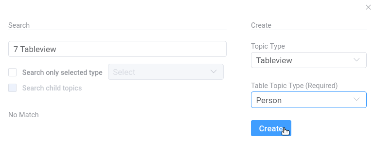

###########
DMX Plugins
###########

The functionalities of DMX can be extended through plugins.
Below you find an overview.

.. _plugins-overview-of-plugins:

*******************
Overview of Plugins
*******************

There is a variety of existing plugins.
Some of them are Free Software (see the table below).
Some freely available plugins can already be found in our `download section <https://download.dmx.systems/plugins/>`_, the others will follow soon.
Their source code is available in our the `plugin repositories <https://git.dmx.systems/dmx-plugins>`_.
The installation of plugins is explained in our :ref:`Admin Documentation <admin-plugin-installation>`.

Some plugins are licensed under a proprietary license and can be purchased from us.

================================================================================================================================================================================  ===========================================================================================  ===========
Plugin Name                                                                                                                                                                       Functionality                                                                                License
================================================================================================================================================================================  ===========================================================================================  ===========
dmx-plugin-template (`source code <https://git.dmx.systems/dmx-plugins/dmx-plugin-template>`_)                                                                                    A starter project for writing a DMX plugin
dmx-littlehelpers (`source code <https://git.dmx.systems/dmx-plugins/dmx-littlehelpers>`_)                                                                                        Utilities for DMX plugin developers                                                          GNU AGPLv3
dmx-performance (`source code <https://git.dmx.systems/dmx-plugins/dmx-performance>`_)                                                                                            Creates a dummy topicmap with 150 topics/associations for performance testing
dmx-tableview (`source code <https://git.dmx.systems/dmx-plugins/dmx-tableview>`_, `download <https://download.dmx.systems/plugins/dmx-tableview/>`_)                             A standalone table view for DMX based on VueJS and ElementUI                                 GNU AGPLv3
dmx-tableview-command (`source code <https://git.dmx.systems/dmx-plugins/dmx-tableview-command>`_, `download <https://download.dmx.systems/plugins/dmx-tableview-command/>`_)     **Deprecated!**                                                                              GNU AGPLv3
dmx-ldap (`source code <https://git.dmx.systems/dmx-plugins/dmx-ldap>`_, `download <https://download.dmx.systems/plugins/dmx-ldap/>`_)                                            LDAP Authentication for DMX                                                                  GNU AGPLv3             
dmx-sendmail (`source code <https://git.dmx.systems/dmx-plugins/dmx-sendmail>`_)                                                                                                  A service to send mails using either SMTP or the HTTP Web API v3 of sendgrid.com             GNU AGPLv3
dmx-geomaps (`source code <https://git.dmx.systems/dmx-plugins/dmx-geomaps>`_, `download <https://download.dmx.systems/plugins/dmx-geomaps/>`_)                                   OpenStreetMap based geo maps for the DMX platform                                            GNU AGPLv3
dmx-geospatial (`source code <https://git.dmx.systems/dmx-plugins/dmx-geospatial>`_)                                                                                              Spatial database capabilities for DMX                                                        GNU AGPLv3
dmx-thymeleaf (`source code <https://git.dmx.systems/dmx-plugins/dmx-thymeleaf>`_)                                                                                                A DMX plugin to enable server-side HTML generation based on the Thymeleaf template engine    GNU AGPLv3 
dmx-tags (`source code <https://git.dmx.systems/dmx-plugins/dmx-tags>`_)                                                                                                          Tagging of topics or associations
dmx-entity-mapper                                                                                                                                                                 Mapping database fields related to concepts across IT systems                                proprietary
================================================================================================================================================================================  ===========================================================================================  ===========

********************
The Tableview Plugin
********************

The Tableview Plugin allows to display data in a table.

Creating a Tableview Topicmap
=============================

To create a Tableview Topicmap, choose "Tableview" from the Topic Type menu in the Search/Create Dialog.

A new drop-down menu appears where you can select the Topic Type you want to see.

.. image:: _static/select-table-topic-type.png

This is what a Tableview Topicmap looks like:
The Topic Type you selected when creating the Tableview is displayed in the first column.
In the very right column you can see on which Topicmap(s) the topic is revealed and you can jump there by clicking it.
You can also click the eye icon at the very left of each row and select a Topicmap to reveal the Topic on.
If the Topic Type you selected is a composite (e.g. "Person"), you see all Topic Types that are part of the composition definition in the other columns.
If you selected a simple data type, all you see is the Topicmap(s) the instances are revealed on.

Switch back to the other Topicmaps using the Topicmap Selector.

CSV Export
==========

You can export data from Tableview Topicmaps to a csv file by clicking the "Download CSV" button in the upper right corner of a Tableview.
If you limit the data set with a search filter next to the button the selected subset is exported.
