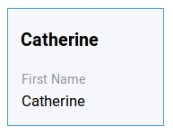
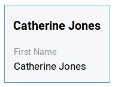

.. _tutorial:

#########################
Your first DMX experience
#########################

To make your first DMX experience you can:

* Visit the `DMX Demo Installation <https://demo.dmx.systems/systems.dmx.webclient/#/topicmap/8551>`_ and play with it. You can explore and search. To *edit* or *create* anything you need to login. See the information there.
* Install and run DMX on your computer. See :ref:`installation`.

.. _tutorial-a-first-look-at-dmx:

***********
The toolbar
***********

Always visible at the Webclient's top is the toolbar:

.. figure:: _static/upper-toolbar.png
    :alt: Tool bar with workspace and topicmap selection

* In the **upper right** corner there is a "Login" button. Log in with the user name "admin" and no password.
* In the **upper left** corner there is the :ref:`Workspace <user-the-workspace-selector>` selector. You can use this to switch between Workspaces. By default the "DMX" Workspace is selected.
* Next to it there is another drop-down menu. This is the :ref:`Topicmap <user-the-topic-map-selector>` selector. By default it shows a Topicmap called "untitled".

Both drop-down menus have a context information button "i" next to them.
Click it to reveal detail about the selected Topicmap or Workspace.

For more information visit our detailed guide to the :ref:`user interface<user-the-dmx-user-interface>`.

.. _tutorial-adding-your-first-topic:

**************
Create a topic
**************

Right-click somewhere into the Topicmap.
A dialog appears that lets you search all your content.
This is the :ref:`Search/Create Dialog<user-the-search-create-dialog>`.

.. image:: _static/search-create.png

DMX makes sure that you do not create anything that already exists.
That's why you enter whatever you want to create into the search field.
Let's assume you want to enter all persons and organizations involved in a project.
Enter a person's first name.
DMX will answer "No match".
Select "Person" in the "Create" section on the right from the Topic Type menu and click "Create".

.. image:: _static/create-person.png

You will see a rectangle appear on the Topicmap.
It represents a person with the name you just entered and it states that this is the person's first name.

If you enter a person's given name *and* surname into the Search/Create Dialog, DMX interprets both as first name:
The result would look like this:

To correct it long-press the rectangle and select "edit" from the :ref:`context menu <user-the-context-menu>`.
On the right-hand side the :ref:`detail panel <user-the-detail-panel>` shows up.

.. image:: _static/context-menu-edit.png

While you edit, the detail panel shows all fields you might need to describe a person.
Correct the first name and click the "Save" button at the very bottom.

Add a second topic:
Right-click on the empty background, enter e.g. "Notes for the interview" into the dialog, select the topic type "Note" and click "Create".

.. image:: _static/person-and-note.png

Add another topic, e.g. "Organization No. 1".
Select "Organization" from the list of topic types and press "Create".

.. image:: _static/person-note-organization.png

This is just a short walkthrough to help you create your first topics in DMX.
:ref:`Content Authoring<user-content-authoring>` is described in-depth in the DMX User Guide.
The next section is about the relations between the topics.

.. _tutorial-adding-your-first-association:

*********************
Create an association
*********************

To create an :ref:`association <user-creating-an-association>` between two topics you grab the little dot at the upper border of one of the two topics.
If the dot is not visible, hover over the topic with your mouse.
In this example the note shall be related to the person "Cathy Jones".

.. image:: _static/create-simple-association-1.png

Drag it onto the other topic until the topic is highlighted by a blue border.

.. image:: _static/create-simple-association-2.png

Then drop the association on the "Notes for the interview" item and release your mouse button. 

The association will be created and a rectangle appears.
These are the :ref:`in-map details <user-in-map-details>` of the newly created association.
They tell you that this is association is of type "Association" which is the most generic form of association in DMX.
Click somewhere onto the Topicmap to close the in-map details of the association.

*************************************
A glimpse into information management
*************************************

DMX comes with some predefined topic types that you saw in the topic type menu of the Search/Create dialog:

- Person
- Organization
- Note
- Event
- Bookmark

There are also some predefined association types.
One of those association types is called "Organizational Involvement" and it describes the role a person can have in an organization.

To specify the person's role in the organization, create an association from "Cathy Jones" to the "Organization No. 1".
The in-map details show up again.
DMX automatically created an association of type "Organizational Involvement".

.. image:: _static/create-organization-association.png

Right-click onto the association to open the context menu and select "Edit".

.. image:: _static/edit-organization-association.png

The detail panel opens again and displays a form.
You can now select an "Organizational Role" from a predefined set of possible values, e.g. "Member".

.. image:: _static/select-role.png

For your changes to take effect click "Save".

.. image:: _static/organization-association.png

Now this is a meaningful association.
If you right-click and select "Related" on "Organization No. 1" you see how the role can be useful when navigating in DMX.
If you have entered more than one person, you can scroll down in the detail panel to see all persons and their respective roles in the organization.

.. image:: _static/organizational-roles.png

In this short tutorial, we showed how to create topics and how to work with associations.
In DMX you are free to define your own topic types and association types.
Find out more about it in the section about :ref:`Modeling<user-modeling>`.
