##############
DMX User Guide
##############

.. _user-the-dmx-user-interface:

**********************
The DMX User Interface
**********************

.. _user-the-toolbar:

The Toolbar
===========

The upper toolbar contains the crucial steering tools for DMX: The workspace selector, the topicmap selector and the user menu.

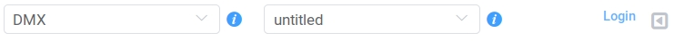

.. _user-the-workspace-selector:

The Workspace Selector
----------------------

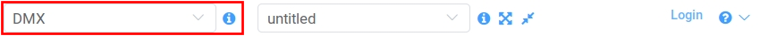

The *Workspace Selector* is part of the upper toolbar and lets you select your current workspace.
**Workspaces are the highest level of content organization in DMX.**
You can think of a workspace as a context in which you organize your work while you can associate items across different workspaces.

Everything you create is automatically assigned to the workspace selected in this menu.
**Every item in DMX is assigned to exactly one workspace.**

.. tip:: Look at how we recommend to use workspaces on our `Demo Server <https://demo.dmx.systems/>`_.

In DMX read and write permissions of users are tied to workspace memberships:
Every user can create, edit and delete their own workspaces.
If you create a new workspace you become its *owner* and you can invite users as members to share the workspace with.
If a user has read or write permission for an item depends on whether the user has read or write permission for the workspace the item is assigned to.
DMX's permissions concept is called **sharing modes**.
You can read more about the five sharing modes in the section :ref:`user-introduction-to-workspaces-and-sharing-modes`.

The DMX Standard Distribution comes with the following pre-installed workspaces: *System*, *Administration* and *DMX*.
Additionally, each user has a *private workspace*.
Content in a private workspace cannot be read by anyone other than the workspace owner.

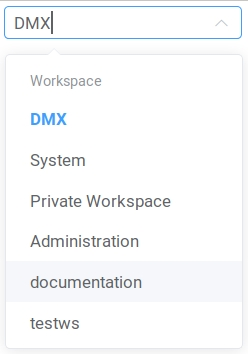

.. _user-the-topic-map-selector:

Your choice in the Workspace Selector has direct influence on the available contents in the next menu, the *Topicmap Selector*.

The Topicmap Selector
----------------------

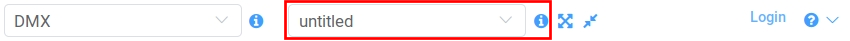

The *Topicmap Selector* is the second drop-down menu in the upper toolbar.
It lets you switch between all views in a workspace.
**A topicmap represents an individual working situation in the larger context of the selected workspace.**
On a topicmap you can visualize content that is relevant to the current context.
It shows a situation-based view of selected content from the database.

.. hint:: Go to our `Demo Server <https://demo.dmx.systems/>`_, navigate through the workspaces and have a look at the different topicmaps. They all show specific views on parts of the same underlying database.

For the moment, two types of topicmaps are supported: *Topicmaps* and *Geomaps*.

A new topicmap is always empty.
In the beginning, there is only one topicmap, it's called "untitled".
A topicmap view is like a canvas as it allows you to freely place items.
The layout of the topicmap is persisted over working sessions.
Edits to a topicmap are instantly mirrored to other connected users.
The size of a topicmap can be well beyond the size of your screen. You can move it with your mouse.

Find out more about working with topicmaps and geomaps in the section on :ref:`Organizing the working context<user-organizing-the-working-context>`.

.. _user-the-fit-button:

The Fit Button
--------------

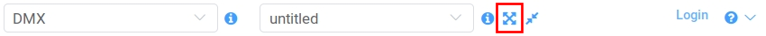

This button makes a topicmap fit into your current browser window.
It adjusts the zoom level of a topicmap.

You can find the fit button next to "i" button of the Topicmap Selector.
It has four arrows pointing from the center to the corners of a square.

.. _user-the-reset-zoom-button:

The Reset Zoom Button
---------------------

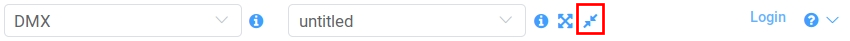

This button centers the topicmap and resets the maps zoom level to scale "1".
It has two arrows pointing from the corners to the center of a square and also sits next to the Topicmap Selector.

The Login Button
----------------

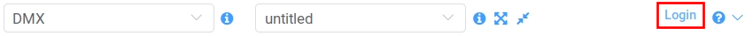

The "Login" button opens a dialog for you to log in to DMX.
It is at the right side of the upper toolbar.

The Help Menu
---------------

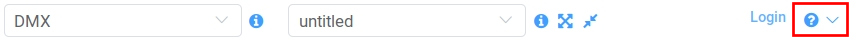

The help menu contains a link to this documentation.
It also links to the `DMX Community Forum <https://forum.dmx.systems>`_ where you can ask us and other users of DMX questions and find help.
"About DMX" displays information about the software version you are currently running.

You can find the "Help" menu in the very right corner of the upper toolbar.

.. _user-the-topic-map-panel:

The Topicmap Panel
==================

The Topicmap Panel is the main area of the DMX user interface.
It displays the currently chosen view.
The topicmap panel is as wide as your browser window unless you open the :ref:`detail panel<user-the-detail-panel>`.

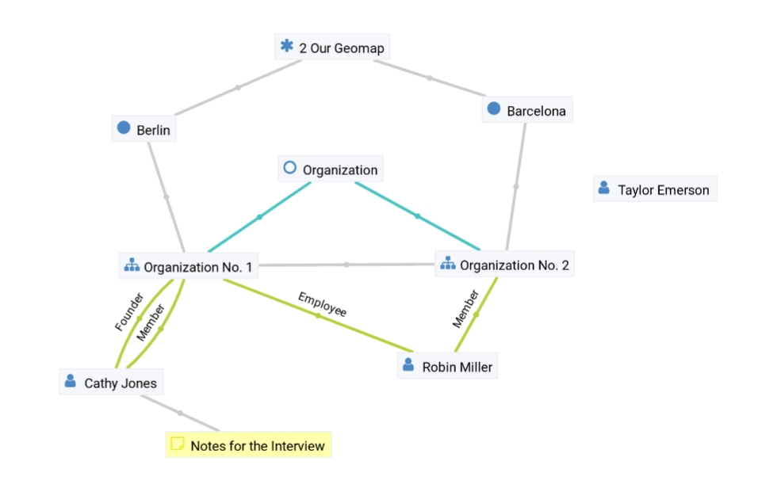

.. _user-the-context-menu:

The Context Menu
----------------

The context menu is part of the topicmap panel and thus available for any item on a map.
It is usually opened with a right-click on a topic or association.
By default, it gives you four commands to execute on the selected item:

* You can display an item's details.
* You can edit the item.
* You can hide the item from this topicmap.
* You can navigate to related items.

To close the context menu *without* any action, release your mouse in the center of the circle.

.. image:: _static/context-menu.png
    :width: 250

The context menu indicates whether you have write permission for an item or not.
If the term "Edit" is grayed out, you do not have write permission on the selected item.

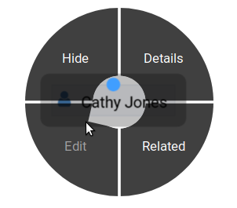

.. _user-in-map-details:

In-map Details
--------------

When you select an item on a topicmap, a rectangle opens up displaying details about the selected item.
This box is called the in-map details.

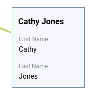

Note that the in-map details only show up if the detail panel is not visible.

.. _user-the-search-create-dialog:

The Search/Create Dialog
========================

The search for existing items and the creation of new ones is done in the same dialog box.
The search/create dialog is opened in the center of the screen with a right-click into the topicmap.
Advanced search options are explained below in the :ref:`Navigation section<user-searching-the-database>`.
Read more on how to create content in the section about :ref:`Content Authoring<user-content-authoring>`.

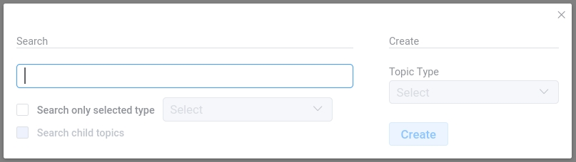

.. _user-the-detail-panel:

The Detail Panel
================

The "Detail Panel" is opened by clicking "Details", "Edit", or "Related" in the :ref:`context menu <user-the-context-menu>` of an item.
The detail panel shares your screen width with the "Topicmap Panel".
It has four tabs, "Info", "Related", "Meta", and "View" described below.

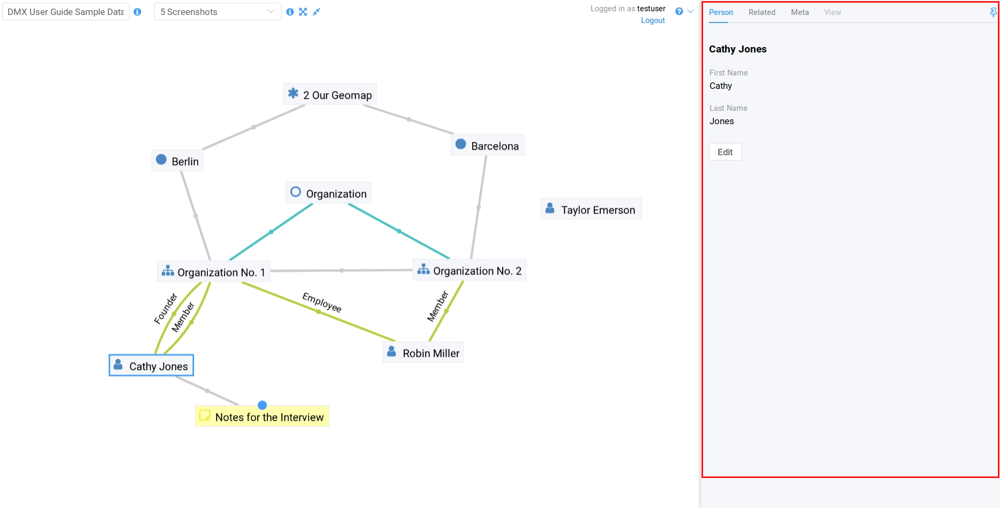

The detail panel allows DMX to display more information than the :ref:`in-map details <user-in-map-details>`.
It is also used for editing data.

The detail panel can only be opened if you have selected an item on the map.
Once opened, it stays open as long as you have selected an item.
When you unselect an item by clicking somewhere onto your topicmap the detail panel closes.

DMX avoids to display redundant information by not opening both the detail panel and the in-map details at the same time *unless* you explicitly :ref:`pin<user-pinning-things>` one of them:
To show selected "In-map Details" while the "Detail Panel" is open you can :ref:`pin<user-pinning-things>` the in-map details to your map.
Pinning shows "In-map Details" in a topicmap, no matter what.
Vice-versa you can also pin the "Detail Panel" by clicking the little pin icon in its upper right corner.
Using the same button you can un-pin and close the detail panel.

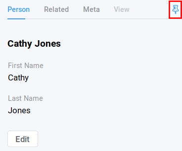

Note that the detail panel only displays details of a single selected item, not when you :ref:`bulk select<user-bulk-selection>` several items.

.. _user-detail-panel-the-info-tab:

The "Info" tab
--------------

The "Info" tab is the first section of the :ref:`detail panel<user-the-detail-panel>`.
It is named after the type of your current selection, e.g. a topic of type "Person" or "Event".
You can go to the info tab directly by choosing *Details* from the :ref:`context menu<user-the-context-menu>` or by selecting the first tab in the detail panel.

In **display mode** it shows the direct child topics of what is currently selected as this is the most commonly wanted information.
It only shows child topics with a value assigned, that is fields containing data.

You can use the display mode to reveal selected child topics in the topicmap panel by hovering the child topics and using the little eye symbol (at the very right).

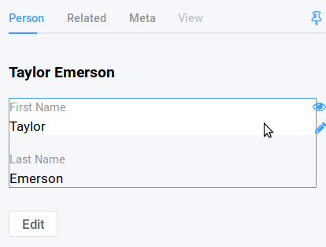

The info tab also has an **edit mode**.
You can enter the edit mode either directly from within the topicmap by clicking "Edit" in the :ref:`context menu<user-the-context-menu>` or by clicking the "Edit" button at the bottom of the "Info" tab.
If you enter the **Edit** mode, you get a form with all possible input fields regarding the respective item type.
The form is generated using the type definition representing the content (for more details, see our section on :ref:`Modeling<user-modeling>`).

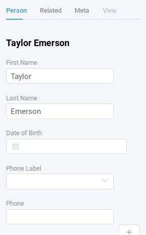

.. _user-detail-panel-the-related-tab:

The "Related" tab
-----------------

The "Related" tab is the second tab of the :ref:`detail panel<user-the-detail-panel>`.
It is designed for navigating along existing associations.
You can jump directly into the "Related" tab from within the topicmap using the :ref:`context menu<user-the-context-menu>` or - if the detail panel is already open - by choosing the second tab.
First you see the number of related items and the selected sort mode.

The tab's content is a sorted list of all items directly related to your current selection *except* its direct child topics.
(This avoids redundancy between the "Info" tab and the "Related" tab.)

Sorting of items
^^^^^^^^^^^^^^^^

The Related Tab has got three sort modes:

* by topic
* by topic type
* by association type

.. hint:: Go play with `sample data <https://demo.dmx.systems/systems.dmx.webclient/#/topicmap/15730/topic/8567/related>`_ on our Demo Server. Change the sort order to see what it does.

By default the list of related items is grouped by "Topic Type":
In the example below you can see that the selected organization is related to a city, a note, and to persons but also to the current topicmap and to the workspace you are in.
**This means that you can navigate your content and your data model in the same place.** (You will learn more about these concepts in the section about :ref:`Modeling<user-modeling>`.)
Additionally, every list item contains information about the association type between the selected person and the other items, e.g. person's involvement with the organization, or that this organisation is an instance of the topic type organization.

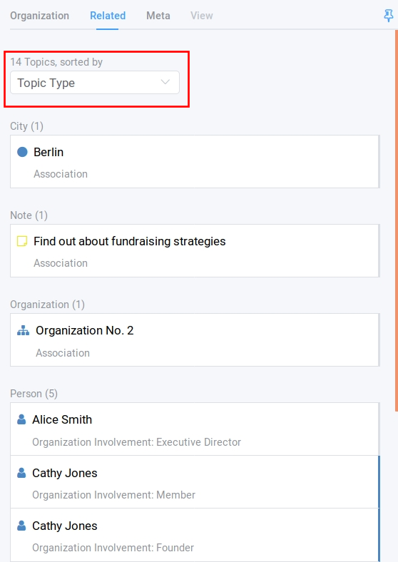

Depending on what you are searching for you might want to change the sort order to "Association Type" or "Topic".
This will present you the same data but group all items with an emphasis on their type of relation:

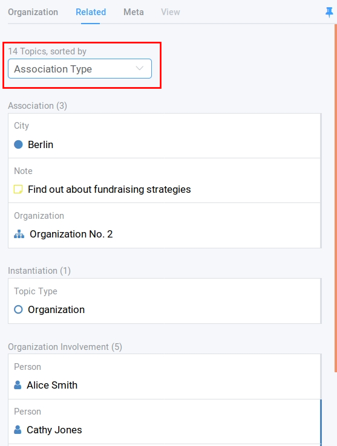

If you choose the sort mode "Topic", all displayed items are ordered alphabetically descending by their labels without any grouping by type.

Revealing items from the Related Tab
^^^^^^^^^^^^^^^^^^^^^^^^^^^^^^^^^^^^

When choosing a related item from the list you can control whether to also "focus" them or not (as illustrated in the following two figures):

1. When you click anywhere onto a list item, it is revealed and the focus switches (Figure 1). 
2. When you click on *the icon* of a list item you add it to the selected view without switching focus (Figure 2). So, clicking only the icon of a related item allows you to add a number of other related items in this list to the selected view.

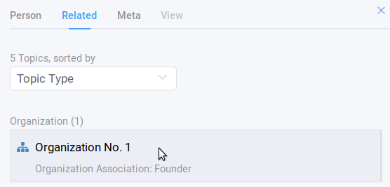

    Figure 1: Click anywhere on the item to **reveal and focus** the item.

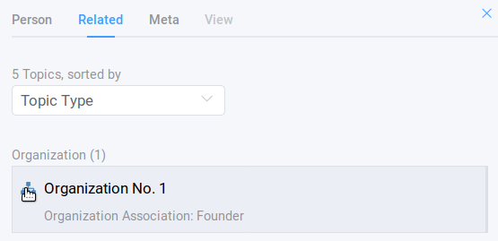

    Figure 2: Click on the icon of the item to **reveal without focussing** the item.

.. note:: Items that show a blue line at the right side are already part of the map so clicking them will bring them into "focus". Clicking an item without a blue line will add it to the selected map. So, clicking on a related item either "focuses" or "adds" it to a selected view. 

.. _user-detail-panel-the-meta-tab:

The "Meta" tab
--------------

The "Meta" tab in the "Detail Panel" is the third tab and displays a summary of metadata about the selected item:

* the item's technical identifier (ID)
* the Uniform Resource Identifier (see `Wikipedia: URI <https://en.wikipedia.org/wiki/Uniform_Resource_Identifier>`_)
* the creation date and the author's user name
* the date of the last modification and the respective author's user name
* the *Workspace* this item resides in as well as the workspace owner's name
* the *Type* of the item (DMXType)
* all *Topicmaps* the item is *visible* (not hidden) on

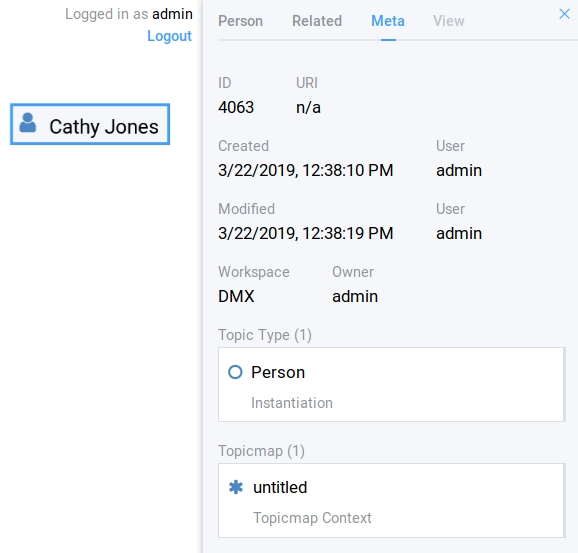

Note that in contrast to the Meta tab the "Related tab" lists *all* related database content, e.g. topicmaps an item is part of but currently not visible in (*hidden*).

.. _user-detail-panel-the-view-tab:

The "View" tab
--------------

The fourth tab "View" gives you access to what is called a "View Configuration".
With view configurations you can control the *visual appearance* of topics and associations of a specific type.
So, editing a view configuration influences how items are rendered across all topicmaps.
At the moment, DMX allows you to perform the following customizations for topic and association types:

* Topic Types: *Icon, Font Color, Background Color*
* Association Types: *Association Color*

If you need any further assistance for editing "View Configurations" the sections about :ref:`assigning icons to topic types<user-topic-type-icons>` and :ref:`assigning colors to association types<user-assigning-colors-to-association-types>` cover that.

For the moment view configurations are only available on a per-type base (which is why the "View" tab is grayed out on any item which does not represent a *Type Definition*).
You can learn more about working with type definitions in the section about :ref:`Modeling<user-modeling>`.

The Login Dialog
================

In a standard DMX installation, once you click "Login" in the upper toolbar you get this login dialog that prompts you for a user name and a password:

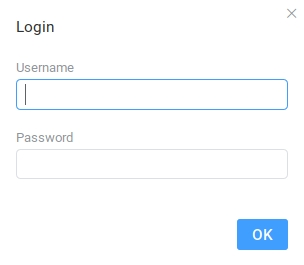

In some cases this dialog looks different.
This can be the case when the DMX installation you are working with is run by your organization and you were told to use your normal credentials you have with the organization.
In that case you can select the authentication method from the drop-down menu in the login dialog.
To use the user name and password from your organization select the "LDAP" method and enter your credentials.

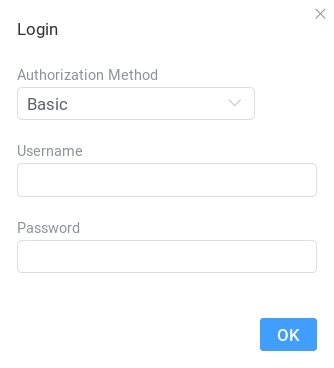

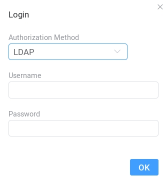

.. note:: You can learn how to install plugins in our :ref:`Admin Documentation <admin-plugin-installation>`.

.. _user-content-authoring:

*****************
Content Authoring
*****************

.. _user-creating-a-topic:

Creating a topic
================

Right-click onto the topicmap.
The search/create dialog appears.

DMX wants to make sure that you do not create something that already exists.
That's why you enter whatever you want to create into the search field.
Enter a term, e.g. a person's given name..
DMX will answer "No match".
Select "Person" from the predefined topic types and click "Create".

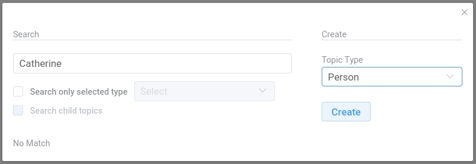

You will see a rectangle on your topicmap.
It contains the name you entered and it states that this is the person's first name.

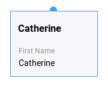

Whenever you create a new topic the dialog proposes you to create something of the same topic type as last time.
You can change this by seleting a different topic type from the drop-down menu.

.. _user-dmx-default-topic-types:

DMX's default topic types
-------------------------

The DMX Standard Distribution comes with a few predefined topic types that you can select in the :ref:`Search/Create Dialog <user-the-search-create-dialog>`:

- *Note*
- *Event*
- *Person*
- *Organization*
- *Bookmark*

These standard type definitions have been synthesized from a variety of Personal Information Management (PIM) applications.
One advantage of DMX is that you have these different types of information in one interface and not spread out in address books, calendars, browsers and file manager windows.

Using the DMX platform for personal information management is the use case of the DMX Standard Distribution.
If you want to learn about other use cases check out the :ref:`list of currently available extensions<plugins-overview-of-plugins>` for DMX.

If you want to develop your own type definitions, the :ref:`Modeling section in this guide<user-modeling>` is the best place to start.

.. _user-creating-an-association:

Creating an association
=======================

To create an association between two items you need to connect the dots. Start with grabbing the little gray (or blue) dot appearing at the border of the item you want to connect.

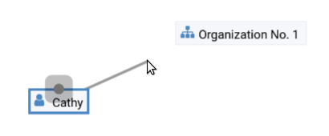

Drag the line onto the other item until it is highlighted by a blue border.

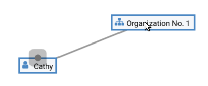

Then drop the line to create a new association. A rectangle will open that shows you the in-map details of the newly created association.
Click somewhere into the map to hide the in-map details of the new association.

Note that an association does not necessarily connect two topics:
You can also create associations between a topic and an association or between two associations.
To do so, attach the line to the little dot in the middle of the assocation.

.. image:: _static/create-assoc-with-assoc.png

Now what is important is that there are different association types.
The association in this example is of the most generic type called *Association*.
You can use it to note down that these two items are somehow related but you can't tell anything more specific (yet) about the association.

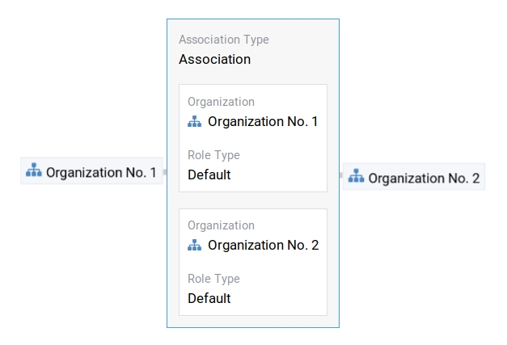

If you need specific types of associations you can create your own association types.
This is explained step-by-step in the section about :ref:`modeling<user-modeling>`.

.. If you develop your own application you should always create custom association types for your application. This is because users of DMX expect that all associations of type *Association* do not carry any additional semantics.

Thinking of real-world examples, you will find that there is often more than one association between two things.
So DMX lets you create many different associations between two items.

.. hint:: You can play with different associations resp. association types on our Demo server, e.g. in the `Person and Organizations topicmap <https://demo.dmx.systems/systems.dmx.webclient/#/topicmap/8551>`_.

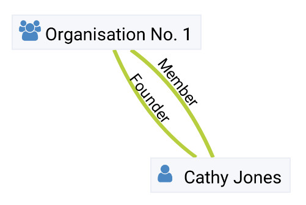

.. _user-editing-content:

Editing content
===============

.. _user-editing-in-the-detail-panel:

Editing in the detail panel
---------------------------

To start adding details to a topic you can use the *Edit* command from the :ref:`context menu<user-the-context-menu>` of an item.
The detail panel opens, with the "Info" tab selected and in "Edit" mode.
Now you have the topicmap on the left side of your screen and the detail panel on the right side.

Here is what an item looks like in "Edit" mode in the first tab of the detail panel.

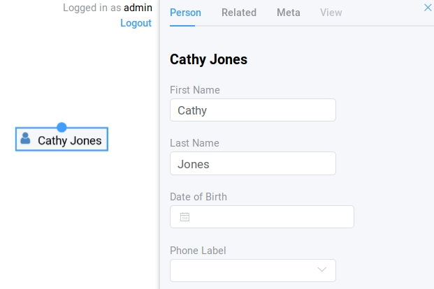

When finished editing the item, press the "Save" button at the very bottom of the tab.
There is an in-depth explanation of the four detail panel tabs above, in the section about the :ref:`Detail Panel <user-the-detail-panel>`.

.. _user-inline-editing:

Inline editing
--------------

You can also edit items in map using the inline editing mode.
Click to select the topic and move your mouse to the upper right corner of the box.
In the upper right corner a closed lock appears, click to unlock it.

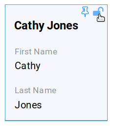

Double-click onto the content you want to change, do your edit and save the change.

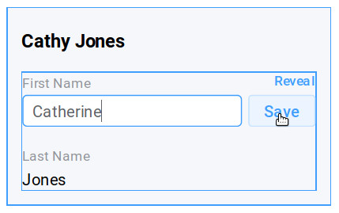

Inline Topic Links
------------------

When editing an HTML field of an item you can directly link to other topics of your knowledge base.
Select the text you want to use as label for the link and then use the editor's "T" icon.

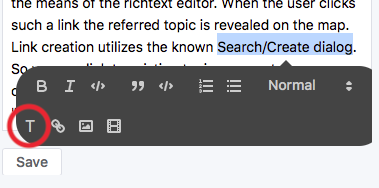

Link creation utilizes the :ref:`search/create dialog <user-the-search-create-dialog>`.
Using it you can link to existing topics or create new ones on-the-fly.

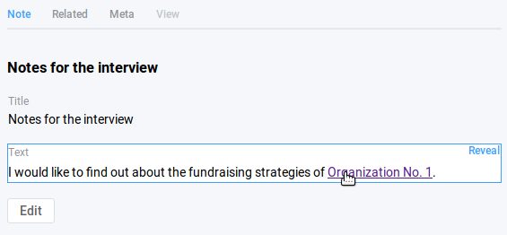

Clicking on inline topic links will reveal the linked topic in a topicmap.

.. _user_uploading-or-embedding-images:

Uploading or embedding images
-----------------------------

Uploading images is currently only possible through embedding them in HTML fields.
To upload or embed an image select some text in an HTML field.
The richtext editor opens.

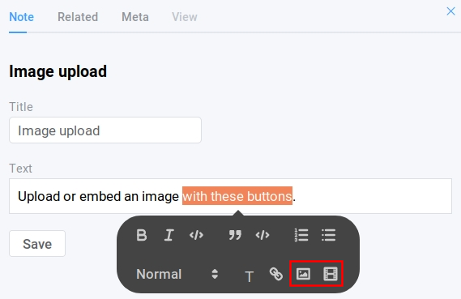

The image icon lets you upload an image from your computer into the HTML field.
The film icon lets you embed an image from a website.
For a more detailed description you are invited to have a look at one of our examples on :ref:`how to model a database of plants <user-model-composite-with-composite>` and how to picture plants in DMX through uploaded images.

.. hint:: You can find the same example on the Demo server in the topicmap `Modeling patterns and pitfalls <https://demo.dmx.systems/systems.dmx.webclient/#/topicmap/14435>`_ to play with.

.. _user_deleting-things:

Deleting things
===============

.. warning:: There is an important difference between hiding items and deleting them. **If you delete items they are removed from the database forever.** If you hide them, they are just no longer visible on the topicmap but you can bring them back by revealing them.

You delete things via the context menu on the topicmap.
Keep the *Alt* key pressed and left-click onto the item you want to delete.
To delete drag your mouse anywhere into the red area.
To abort let go of both the "Alt" key and the mouse button while the cursor is in the middle of the circle.

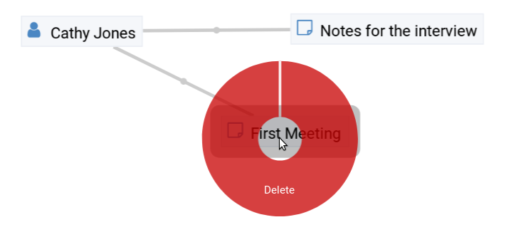

When you select "Delete" a dialog window opens.
It informs you about the number of items you are about to delete.
You can confirm or cancel the deletion.

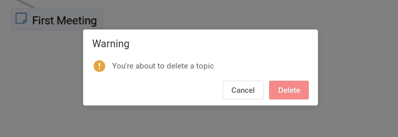

.. _user-bulk-deletion:

Bulk deletion
-------------

To delete several items in one go select all of them by clicking them with the CTRL or SHIFT key pressed.

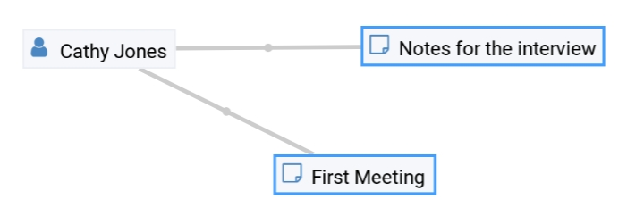

Then proceed as above:
Left- or right-click onto the item and drag your mouse onto the *Delete* command.

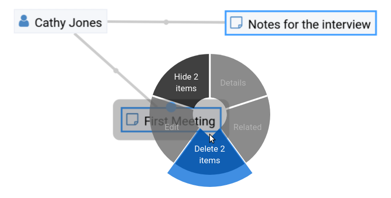

When you select *Delete* a confirmation dialog window opens to inform you about the number of items you are about to delete.
You can confirm or cancel the deletion.

.. _user-organizing-the-working-context:

******************************
Organizing the working context
******************************

The DMX database contains your knowledge at large, your knowledge base.
Everything you enter is saved in the knowledge base until you delete it.
What is important:
Every item is saved in the knowledge base only *once*, even if you re-enter it or use it in many different contexts.

To visualize your knowledge base in different situations you use topicmaps.
In each topicmap different items from your knowledge base may be relevant and the rest stays hidden.
Thus, every topicmap represents *one* view, perspective, or working situation.

The following figure shows the relationship between content and its use in different working situations:

In the upper half two different working situations are shown (*Topicmaps*).
On each of the maps there is a selection of topics and associations revealed depending on what the topicmap is about.

In the lower half you see a representation of a DMX database.
It contains your complete knowledge graph made up of topics and associations.
(Note that it also contains topic *types* and association *types* which are not visualized here for clarity.)

In the upper half there are two different working contexts respectively topicmaps.
On each of them there is a selection of topics and associations revealed depending on what the topicmap is about.
There can be much more content in the database than what you actually display but everything that is visible in topicmaps is stored in the database.

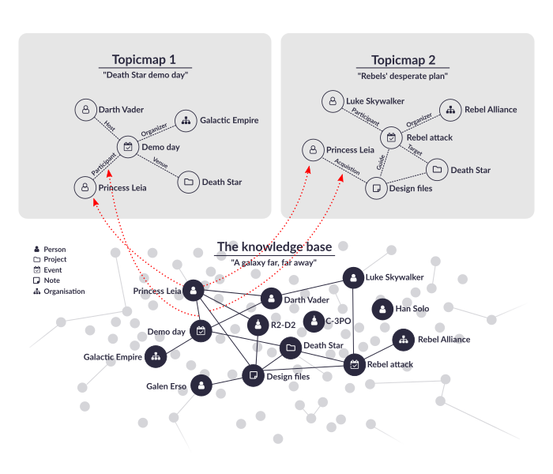

.. _user-working-with-topicmaps:

Working with topicmaps
======================

.. _user-creating-a-topicmap:

Creating a topicmap
-------------------

To document a meeting, prepare for an interview or to do some research you can create a topicmap.
To create a new topicmap open the :ref:`search/create dialog <user-the-search-create-dialog>` (right click).
Enter the name of the new topicmap, select *Topicmap* from the "Create" menu and confirm with "Create".

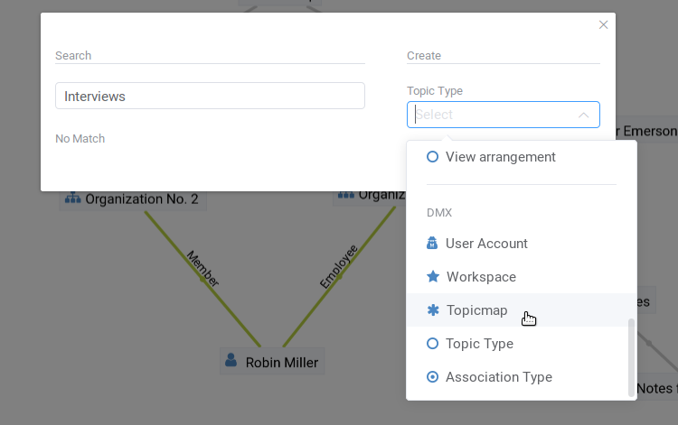

For topicmaps, the creation dialog has an additional choice between (usual) topicmaps and geo maps (see below).
Once created, the new topicmap is opened.
You can see its name in the :ref:`Topicmap Selector<user-the-topic-map-selector>` and use it to switch between topicmaps.

.. _user-renaming-a-topicmap:

Renaming a topicmap
-------------------

You can rename a topicmap by clicking the "i" button next to the :ref:`Topicmap Selector<user-the-topic-map-selector>`.

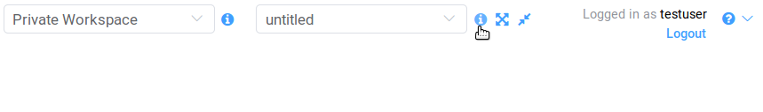

The "i" button reveals the topicmap topic itself on the topicmap.
Long-click onto it and select "Edit" from the context menu.

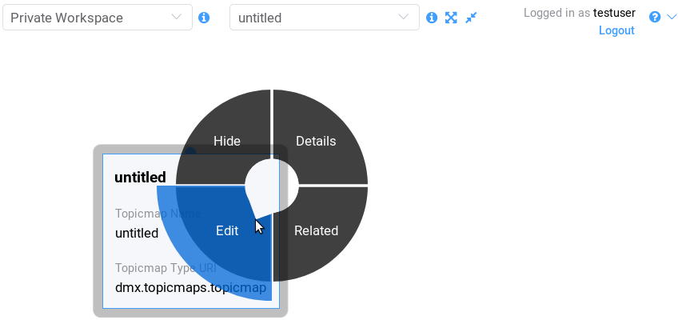

The detail panel opens and lets you change the name.

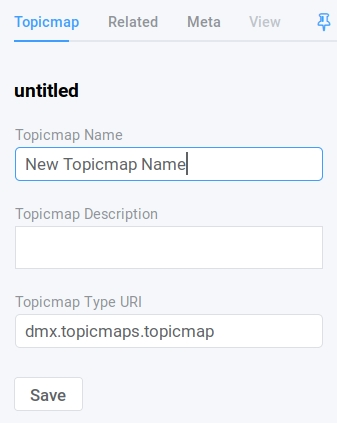

After saving the change the new name appears in the Topicmap Selector.
You can :ref:`hide <user-hiding-items>` the topicmap topic from the map via the context menu.

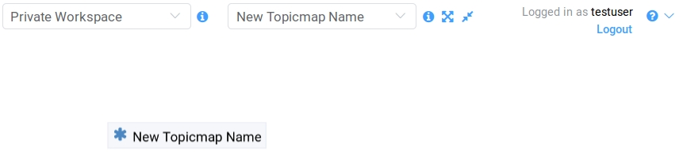

.. _user-geodata:

Displaying Geodata
------------------

DMX comes with built-in support for geodata.
Every topic with an address can be shown on a geographical map.
The so-called geomaps are a special type of topicmap in DMX.
Geomaps are based on `openstreetmap.org <https://www.openstreetmap.org>`_.
Here is an example of how to create and populate them:
Edit a person or an organization and add an address.

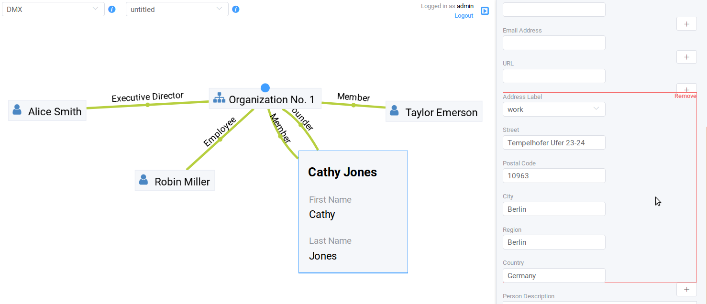

Open the search and create dialog.
Enter a name for the new topicmap, e.g. "Our Geomap".
In the topic type selector choose "Topicmap".
Underneath it you can now choose the type of topicmap you want to add.
Select "Geomap" and press "Create".

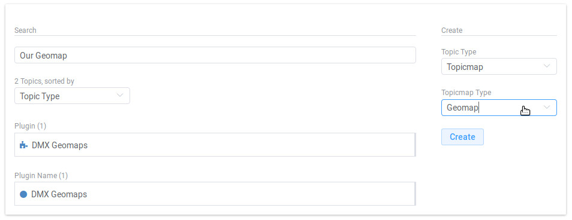

Open the topicmap selector in the upper toolbar and select your newly created geomap.
The map is displayed with all items you assigned an address to.

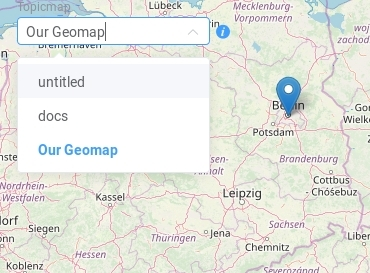

If you click onto an item the in-map details show you what is there.

.. image:: _static/display-map-item.jpg
    :width: 400

Again, you return to the other topicmaps via the :ref:`Topicmap Selector<user-the-topic-map-selector>`.

.. _user-moving-things-around:

Moving things around
====================

Note that you can drag the whole topicmap into any direction.
Just hold the left mouse button pressed somewhere on the topicmap and drag.

Moving topics
-------------

Grab individual items with your mouse and drag them where you want them to be.

Panning/zooming the topicmap
----------------------------

Zooming in or out is done by scrolling up or down.
Your cursor is the focus for panning.
The :ref:`fit<user-the-fit-button>` and :ref:`reset zoom<user-the-reset-zoom-button>` buttons in the upper toolbar help you to readjust a topicmap to your screen respectively to its original position.

.. _user-hiding-items:

Hiding things
=============

.. note:: There is an important difference between hiding items and deleting them. If you delete items they are immediately removed from the database. If you hide them, they are just no longer visible on the topicmap but you can bring them back by revealing them.

You can hide items from the topicmap by long-clicking onto them and using the "Hide" button in the context menu.
If you bring them back to the map later by searching them, they will reappear in the same spot in your map.
All previously revealed associations do so as well (see :ref:`Automatic Revelation of Associations<user-automatic-relevation of associations>`).

.. _user-pinning-things:

Pinning things
==============

You can "open" more than one item at the same time by pinning the in-map details.
This is very useful for comparisons.
Select a topic or an association so that its in-map details open.
Click the little pin to keep them open.

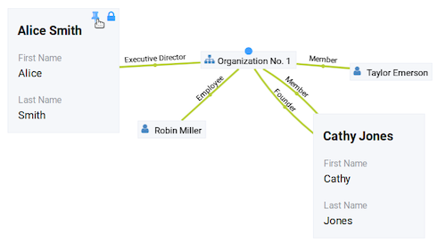

Note that the pinnings are persisted in the database along with the topicmaps.
That is why you can prepare a topicmap with pinned in-map details, knowing that everyone who opens the topicmap will see it in that very state.

Bulk operations
===============

.. _user-bulk-selection:

Bulk selection
--------------

You can bulk select several items by keeping the CTRL or SHIFT key pressed and drawing a rectangle around the items you want to select.
You can also click them with the CTRL or SHIFT key pressed.
The selected topics now have a blue border.

Moving topic clusters
---------------------

Once you have bulk selected a few items, you can drag the whole selection where you want to place it.

.. image:: _static/bulk-move.jpg
    :width: 600

.. _user-hiding-multiple-items:

Hiding multiple items
---------------------

To hide several items at once select them by keeping the CTRL or SHIFT key pressed and drawing a rectangle around them or by clicking them with the CTRL or SHIFT key pressed.

Customizing the Look & Feel
===========================

.. _user-topic-type-icons:

Assigning icons and colors to topic types
-----------------------------------------

You can assign icons from the Font Awesome collection to your topic types.
Editing the view configuration is explained with the topic type "Publication".
In the section about :ref:`Modeling <user-modeling>` you will learn how to create such a topic type.
Let's say you have a topic type "Publication" and you want all publications in your map to have a book icon.

- Click onto the topic type "Publication", *not* onto an individual publication you already added. You are about to modify the general concept of all your publications, not an existing instance of it.
- Open the detail panel by selecting "Details" from the context menu.
- Go to the fourth tab called "View". Here you can view and edit the configuration of the topic type. Click "Edit".
- Click into the white field labeled "Icon".

- You can either select an icon directly or use the search box.

- Hit save to apply the icon to all topics that are publications.

Adding colors to different topic types can help you to keep track of your content on a populated topic map.
You can customize both the icon color and the background of a topic type.
The settings are in the "View" tab of a topic type as well.
Each of them lets you open a color picker or enter a 6 digit color hexcode.

After saving, all instances of that topic type are recolored to match your setting.

.. _user-assigning-colors-to-association-types:

Assigning colors to association types
-------------------------------------

You can assign colors to association types just as you can assign icons to topic types.
Select the association type on your map, open the details panel and open the fourth tab "View".
Choose a color for your association type and save it.

.. _user-navigation:

**********
Navigation
**********

.. _user-searching-the-database:

Searching the database
======================

To search in DMX open the :ref:`search/create dialog <user-the-search-create-dialog>` with a right-click on a topicmap.
Start typing what you are looking for.
DMX immediately displays all results that you have read access to.
You refine the search by typing in more letters.

Note that the unfiltered search results include everything:
Your actual content, e.g. persons you entered, is displayed as well as topic types, topicmaps, association types etc.

.. _user-advanced-search-filter-types:

Advanced Search with the Type Filter
------------------------------------

The :ref:`search/create dialog <user-the-search-create-dialog>` has two checkboxes right under the search field.
They narrow down your search results to certain topic types according to your filter.

When you just enter a search term you potentially get a lot of unwanted results:

The first checkbox **"Search only selected type"** lets you select a topic type you want to apply the search to.
Tick the box, then select a topic type:

If the topic type you need is not displayed in the drop-down menu you can add it:
Scroll down to the bottom of the drop-down menu.
Select "Customize Type List..." and tick all types you want to have in the drop-down menu.

After that you see the choice was adapted to your needs:

.. image:: _static/advanced-search-custom-type-list.png

The second checkbox **"Search child topics"** lets you run more complex searches by applying the filter to the selected topic type and its children:
In this example you can see that searching for the term "Berlin" in the topic type "Person" does not give any results because no person in the database is called "Berlin".

Ticking the second checkbox additionally searches address entries as a child type of the person type.
This lets you find all persons with an address in Berlin.

.. _user-advanced-search-lucene:

Advanced Search with Lucene
---------------------------

The search in DMX is run by the powerful Lucene search engine.
You can run simple queries by just entering a search term.
If this brings up too many results from your database, you can narrow down your search with more complex queries.
DMX supports the `Lucene Query Parser Syntax <https://lucene.apache.org/core/3_5_0/queryparsersyntax.html>`_.
Let's look at a few examples:

.. note:: Enter more than one character to start searching.

When your search term consists of letters, you will only get results *starting* with this string.
You won't see results containing the search term *in the middle* of a word.
In the following example with the search term "cd" you see that "cde" is displayed in the results, while "bcd" or "abcdef" are not.

If you add a wildcard symbol in the beginning you ask for items beginning with one or multiple other characters and ending with the search term.
Add another wildcard at the end of the search term to query for items *containing* it somewhere in the middle.
There are two wildcard symbols:

*  ``?`` The question mark represents *one* character.
*  ``*`` The asterisk represents zero, one or multiple characters.

If you enter more than one search term into the Search/Create Dialog the search engine interprets a logical AND connection between them.
In this example we search for everything containing "abc" AND "def" but not the standalone "abc".

If you want to find all items that contain either "abc" OR "def" OR even both you replace the logical AND with a logical OR like so:

To get the *exact* search phrase consisting of multiple words enter it surrounded by double quotes.

.. _user-associative-navigation:

Associative navigation
======================

As DMX is made to work like a human brain you can navigate in an associative way.
To navigate across topics along associations use the '*Related* command in the :ref:`context menu<user-the-context-menu>` of any item.
This opens the "Related" tab of the :ref:`detail panel<user-the-detail-panel>`.

Here you can learn more about the features of the :ref:`"Related" tab<user-detail-panel-the-related-tab>`.

Switching between topicmaps
===========================

You can switch between all *Topicmaps* of a *Workspace* by using the :ref:`Topicmap Selector<user-the-topic-map-selector>` in the upper toolbar.

If you reveal the topicmaps themselves in a topicmap you can jump to different topicmaps with a double-click.

Switching between workspaces
============================

Use the workspace selector to switch between workspaces.

Using the browser history
=========================

Every view onto an item has a stable deep link that you can use for navigating back and forth in your browser:
If you have nothing selected the URL, that is the address in your browser, shows the exact link to this topicmap.

If you select something the URL changes:
The ID of the currently selected item is appended to the URL.

The state of the detail panel is reflected in the URL, too:
It changes depending on the tab you have opened.

Using the back button of your browser brings you back to the situation you were looking at before.
It is not an "undo" though:
Going back does not revert your latest change.

.. _user-automatic-relevation of associations:

Automatic revelation of associations
====================================

Whenever you hide items, all visible associations connected to this item are hidden, too, as illustrated by the following example.
This is because associations cannot lack the player at the other end.

This is the original state of your topicmap:

Here, the person is hidden as well as all associations that were revealed before:

If you want to restore the view you had earlier you can just reveal the person and all associations *that were not explicitly hidden* before are brought back onto the topicmap.
Note that if you hide one of the person's associations manually, this association stays hidden when you hide and reveal the person.
In this case the topicmap would look like this before and after revealing the person:

.. _user-collaboration-and-sharing:

*************************
Collaboration and Sharing
*************************

.. _user-creating-user-accounts:

Creating user accounts
======================

.. note:: If you have existing users in an LDAP directory we recommend you to use our `LDAP plugin <https://download.dmx.systems/plugins/dmx-ldap/>`_. Learn how to install it in our :ref:`Admin Documentation<admin-plugin-installation>`.

In DMX, you create user accounts just the way you create everything else, too:
Enter a user name into the search field.
If the name does not exist yet you create it by selecting the topic type "User Account".
After that, a password field appears. 
Only privileged accounts (like admin) can create user accounts.

What is displayed after account creation is just the *user name*?
The *user account* consists of the user name and the password.
Investigate the newly created user name via the "Related" button.
The user name is associated with some information:

* disk quota: how much space the user can use on the computer
* what type of sharing modes the account owner can select when creating new workspaces
* if the account owner is allowed to log in at all

It is important that every user account is tied to the "System" workspace (see below). In short, this allows others to read their user name (only the name) to share content.

.. _user-introduction-to-workspaces-and-sharing-modes:

Introduction to workspaces and sharing modes
============================================

In DMX workspaces are the highest level content is organized in.
Workspaces can be compared to folders containing everything related to a working area, a project, or an area of life.
**Each topic and association is tied to exactly *one* workspace but you can display them in many topicmaps.**
A workspace can have one or many members who have access to its content.
**Read and write permissions are tied to workspaces.**
This feature makes workspaces the basis of collaboration and the key to the configuration of access control:

DMX has five sharing modes:

* **private**: In a private workspace just the owner of the workspace can read and write.
* **confidential**: In a confidential workspace the owner can read and write. Workspace members can read, but not change anything.
* **collaborative**: A collaborative workspace can be read and edited by the owner and by all workspace members.
* **public**: A public workspace is world-readable. It can be read and edited by the owner and by all workspace members. The default "DMX" workspace is an example of a public workspace.
* **common**: For common workspaces, you can configure the behaviour in the configuration file ``config.properties``. You can decide whether you want to allow reading and/or writing for non-logged in users. If configured accordingly, a common workspace on a DMX instance connected to the internet can be readable and writable to *everyone* on the internet. See our :ref:`Admin Documentation<admin-request-filters>` for more details.

Every workspace has an owner, usually the creator, and optional members.
When you are logged in you can access the different workspaces via the :ref:`workspace selector<user-the-workspace-selector>` in the upper left corner.
Once you log out DMX will switch back to a public (world-readable) workspace like the default workspace called "DMX".
All items that are publicly readable stay visible, the rest disappears from the view.
In a public workspace you are no longer able to edit but you still have a customizable view of the topicmap, which means that you can move items and reveal other world-readable items.
If you explicitly do not want or need any of the five sharing modes, you can disable them via :ref:`configuration<admin-workspace-sharing-modes>`.

DMX comes with four default workspaces with the following sharing modes:

* **DMX**: This workspace a public, it is the one that is displayed publicly when people come to the site.
* **Private Workspace**: This is the private workspace of the respective logged in user. Only this user can see and and edit their items as the workspace is private.
* **Administration**: Only the admin or members can view and edit items in this workspace. Unprivileged user accounts do not have this entry in the menu.
* **System**: The System workspace is readable by everyone who is logged in. It contains all user names that exist in this DMX installation. The user names are readable to all users. This is needed for sharing content with others as you will see below.

.. _user-sharing-a-workspace:

Sharing a workspace
===================

Here is how creating a shared workspace works:

* Log in as an unprivileged user and go to your private workspace where you can edit.
* Open the search field and **create a workspace**. Make it a collaborative workspace to give others write permission.

* The new workspace automatically opens. Click onto the blue information icon next to the workspace selector to reveal the workspace topic itself on the topicmap.
* To add members to the workspace you can just search for their user names and click them to reveal them on the map. As mentioned above, all user names are visible to all other logged in users. In DMX, membership is tied to user names.
* If you don't know their user names you search for the topic type "Username" and navigate its "Related" tab to see the existing user names in the detail panel. Reveal those you want to give access.
* Now that you have the workspace itself and a user name on your topicmap you can just **create an association between the user name and the workspace**.
* Next you have to qualify this association as a membership: Edit the association.

* In the detail panel you can now select the association type "Membership". You are done!

* Here are the details of the workspace membership association.

* The user you shared your workspace with can now log in, select your collaborative workspace and add something, e.g. a note. This note is now accessible to all members of the workspace. It will appear on the selected topicmap, visible to all workspace members looking at the same topicmap.

.. note:: You can create membership associations to every workspace that you have write permission in.

.. _user-modeling:

*********
Modeling
*********

A data model is an abstract model that defines all elements needed to represent items, their properties and their relationships.
DMX enables users to create their own data models.

.. _user-introduction-to-data-modeling:

Introduction to Data Modeling
==============================

DMX is built upon the so-called Associative Model of Data.
It uses a suitable database model which can be considered opposed to the widely used Relational Database Management Systems.

If you want to dive deeper into this concept, we recommend the following sources:

* Joseph V. Homan, Paul J. Kovacs: `A Comparison Of The Relational Database Model And The Associative Database Model <http://iacis.org/iis/2009/P2009_1301.pdf>`_, in: Issues in Information Systems, Volume X, No. 1, 2009 (6 page article)
* Simon Williams: `The Associative Model Of Data <https://link.springer.com/content/pdf/10.1057/palgrave.jdm.3240049.pdf>`_, in: Journal of Database Marketing, Volume 8, 4, 2001 (24 page article)
* Simon Williams: The `Associative Model Of Data <http://www.sentences.com/docs/other_docs/AMD.pdf>`_, Lazy Software, 2nd edition, 2002 (book, 284 pages)

.. _user-types-versus-instances:

Types versus instances
----------------------

To understand the fundamental concepts of DMX it is very important to understand the distinction between topics and topic types, respectively between associations and association types.
This distinction separates an abstract concept (types) from the particular occurences (instances) of the concept.

For example, the particular bicycle in your garage is an instance of the type of thing known as "The bicycle".
Types are the ideas or abstract descriptions of the things you want to represent.
They can be sets, collections, object classes or kinds of things.

Instances of a type are the concrete items, the content (topics and associations).
In DMX you can visualize both, types and instances, even in the same topicmap.

.. _user-topics-and-topic-types:

Topics and topic types
----------------------

On the level of topic types you describe models of the topics you want to create.
You can add your own topic types.

==========  ==================
Topic Type  Instances / Topics
==========  ==================
Fruit       banana, apple, cherry
First name  Cathy, Alice, Robin
Color       red, yellow, blue, green
==========  ==================

.. note:: In DMX every topic is an in instance of a specific topic type.

.. _user-associations-and-association-types:

Associations and association types
----------------------------------

Associations represent the relationships between items.
They represent real-world semantics.
These can be relationships between topics or between associations or between a topic and an association.
The most important characteristic of associations in DMX is that you can qualify them to give them the meaning *you* need.
You do this by creating association types.

===================  =======================  ========================
Association type     Related items            Instances / Associations
===================  =======================  ========================
Organizational role  person and organization  founder, member, employee
Involvement          person and publication   author, editor, reader, subject
Relationship         person and person        friend, enemy, lover, mentor
===================  =======================  ========================

.. note:: Every association is an instance of a specific association type.

.. _user-simple-data-types:

Simple data types
-----------------

Every topic or association has a data type.
There are six different data types in DMX.
Four of them are so-called **simple** types:

* **text:** This is the default data type and it contains a text string.
* **number:** An example is "year".
* **boolean:** yes/no resp. true/false
* **html:** HTML

.. _user-composites-and-composition-definitions:

Composites and composition definitions
--------------------------------------

The two other data types are **composites**.
First of all, "composite" means that this data type is put together from several simple data types.
The name of a person mostly consists of at least a first name and a last name.
An address entry is put together from a street name, a number, a postal code, a city.

A **composition definition** is an association type within a composite:
As you will see below you define a composite by creating associations between topic types and/or association types.
By doing so you define the parent-child relations, the cardinality of properties, and the identity attributes (unique identifiers) for your data model.
This kind of association type is called a composition definition.

For associations there is just *one* composite data type which is obviously called composite.
For topic types DMX has both composite types: **value** and **identity**.

These terms exist to clarify what you are referring to when changes occur.
Think of real-world contexts and how people are able to understand what changed.
If a person has a new address this could mean they moved, but it could also mean the street was renamed.
You can model these two different case by using the data types "identity" and "value".

The composite type "identity"
-----------------------------

In DMX, identity is used when you want to refer to the same thing as before even if something changes.
If an address changes because the street is renamed you would still mean the same house at the same geolocation.
If you save a bookmark to refer to an article and the URL of that article changes, the article and its description would be the same as before.
If you edit a person's details in your address book the person itself stays the same, even if their phone number changes.

The composite type "value"
--------------------------

The composite data type "value" is used whenever you want to refer to something different upon a change.
While the topic type *person* is a composite of the data type "identity", topic type *person name* is a composite of the data type "value":

If a person changes their name the change is done by deleting the *association* to the old name and by creating an association to the new name.

The background to this is the following:
In DMX, every item is saved in the database only *once*.
For example, there is one last name called "Jones" in the database.
All persons who share this name are associated to it.
Technically, this means that many parents share the same child.
Upon a change of name, the old name stays in the database because it may be associated to other items:
Many people are called Cathy or Jones so the database entries can be considered to be a dictionary of names.
The persons are just associated to immutable names but the *associations* between them can be deleted and redone.

Here is what this change looks like:
Before, the person Cathy Jones is related to the person name, a composite of first name and last name.
This is shown by the red associations.

To assign a different name to the person, you just edit the person's entry and change the name.
The association between the person and the person name is deleted.
A new association is created.
The old person name stays in the database, disconnected from this instance of a person.
If you are sure you do not need it, you can explicitly delete it.

.. _user-defining-your-own-type-uris:

Defining your own Type URIs
---------------------------

Upon creation every type gets an automatically generated Type URI.
It looks like this:

URIs (Uniform Resource Identifiers) identify resources unambiguously.
For global uniqueness they follow a specific syntax.

When you dive into modeling or development with DMX you should adapt these Type URIs to your own projects with meaningful names.
Developers working with the types in a specific project can then address them easily without unintended duplicates or changes.

There is a best practice for choosing your Type URIs:
Namespaces shall follow the pattern ``domain.project.typename``.
You can use DNS domains for the first part, or just think of an unambiguous abbreviation.
An example for the URI of a topic type "publication" on our own demo server could be ``systems.dmx.demo.publication`` or just ``dmx.demo.publication``.

You can edit the Type URIs via the edit button.

.. note:: You have adapt the TypeURIs before adding any instances!

.. _user-creating-a-simple-topic-type:

Creating a simple topic type
============================

You can add a topic type via the Search & Create Dialog.
Search for what you want to add.
If it does not exist in the DMX database, yet, select the topic type "Topic Type" and click "Create".
By default, a new topic type has the simple data type "Text".

.. _user-creating-a-composite-topic-type:

Creating a composite topic type
===============================

To create your own topic type with a few properties here is how to proceed.
Let's say you want to add a topic type "publication".
Each publication shall have a title and a year.

- Open the search field. Enter "Publication", select "Topic Type" and press "create".
- Go into editing mode via the context menu. **Change the data type from "Text" to "Identity"** and hit "Save". Click somewhere into your map to close the detail panel.
- Open the search field and enter "Title". You will find that two entries already exist. They come from the default topics types "Event" and "Note" which also have titles. Create a new topic type "Title".
- Create an association between the title item and the publication item. DMX will display what you just created:

  * You created an association of the type "Composition Definition". Composition Definition means that you are defining a more complex context between items on your map: The relationship between a publication, a title and a year. 
  * "Cardinality: One" means that each publication has exactly one title, not more. 
  * The rest of the information refers to the role types: The publication is called the parent type, the title is the child type. These are technical terms to define that a publication has a title, but a title does not have a publication.

.. _user-identity-attributes:

.. note:: **Identity Attributes**

    For a composite with the data type "identity" you should define at least one identity attribute. The identity attribute is the item's unique identifier - the information that makes it unique. If needed, you can define more than one identity attribute. When modeling a composite it is important that you **add the identity attribute as the first child to the parent**. This is how you tell DMX to fill in *this* field with what you enter into the Search/Create Dialog.

- Add an identity attribute. In our example the title shall be the unique identifier of the publication. You thus edit the association you just created between the title and the publication. Tick the checkbox "Identity Attribute". (In real life, you would maybe use the ISBN number as the identity attribute or as one of several identity attributes.)

- Right below that checkbox there is another one called "Include in Label". Tick it for the information that should be used in the item's name. It determines which attribute is shown on the topicmap and on top in the detail panel. In this example we want the book title to appear there.

- Again, click somewhere onto the map and reopen the search field. Search for the year and open the existing topic type "Year". Pull it onto the publication.

You are now ready to use this data model you just built to add content.

- Open the search field and enter the title of a publication. From the Topic Type menu you can now select "Publication".
- The title is automatically filled in from the search field.
- Edit your new publication and add a year.

Creating an association type
============================

One of the strengths of DMX is that you can build your own association types in the same user interface.
Let's say you want to express the relationship between persons and publications.
A person can be the author, the publisher, the reader, or even the subject of a publication.

* Create a topic type "Publication".
* Create an association type and give it a name, e.g. "Relationship publication - person".
* Select "Composite" as a data type.

* Create a topic type, name it "Role referring to publication" or anything that suits you. Its data type is "Text".
* Create an association between the topic type and the association type and edit the newly created association between them. Click onto the "View" tab and then "Edit" to edit its configuration.
* Open the "Widget" setting and select "Select". This will allow you to select roles from a predefined list when adding content later.
* There are two more checkboxes called "clearable" and "customizable". It only makes sense to use them in connection with  "Widget: Select". Both have an effect on editing association types later on. Here is what they do: "Clearable" decides whether you allow instances of this association type to *only* have the values you explicitly defined or whether it shall be possible to clear the field to leave it empty. In this case, there will be a little cross icon for clearing it. "Customizable" decides whether you allow to enter values on the fly by just typing in something different that was not predefined by you. If both checkboxes are left empty, one of your predefined values *has* to be selected. The value cannot be empty and there will be no possibility of typing into the field.

* Create a topic "Author" that has the topic type "Role referring to publication" which is selectable from the create menu. If you want to have more roles, add them likewise.
* Create a person.
* Create a publication.
* Create an association between the person and the publication and edit the association. Open the drop-down menu under "Association Type" and select "Relationship publication - person". Hit the save button and the edit button again. There is a new drop-down menu that lets you select the role the person shall have related to the publication.

You now have a map like this.
On the left side you see the data model.
There is your topic type "Publication" with a title and a year.
And there is the association type you built with a few selectable roles.

On the right side you see the actual content, the instances.
To continue working with a less crowded map, you might want to :ref:`bulk select and hide<user-hiding-multiple-items>` the data model.

.. image:: _static/topic-map-with-own-assoc-and-instances.jpg

.. _user-custom-association-types:

Custom Association Types
------------------------

Custom Association Types are a different way of modeling associations.
They are a powerful, semantic authoring tool that is unique to DMX.
Custom Association Types are used to represent parent-child relationships when you create instances.
Their semantics are carried over to all instances without you creating associations manually in each instance.
At the same time you benefit from DMX's model-driven form generator: The form you edit parent instances with will contain fields for all identity attributes of child instances. You thus get a form with all properties you want to add.

.. note:: **When to use Custom Association Types?**

    #. If your data model contains a clear parent-child relationship Custom Association Types are the recommended way of modeling these relationships. This is the case when you need a child type to describe the whole entity. (For example you want publications to have authors, and authors are persons.) Create a Composition Definition between parent type and child type and add a Custom Association Type to it as described below.
    #. If your data model does not have a such clear parent-child relationship we recommend to create associations manually.

The same context as shown above can be modeled using a Custom Association Type.

* Create the topic types "Publication" (data type "identity") and "Publication Title" (text).
* Reveal the built-in topic type "Year".
* Reveal the built-in topic type "Person".
* Create an association type called "Author".
* Create an association between the topic type Person and the topic type Publication. Edit it and open the drop-down menu "Custom Association Type". Select "Author" and click save.

.. image:: _static/create-custom-association.png
    :width: 400

Your Composition Definition looks like this:

This is your data model:

Use this model to create an instance:

* Create a person or reveal an existing one.
* Create a new publication by entering a title into the search/create dialog and selecting the topic type publication.
* Edit the publication.
* In the form you now have fields for the year and the author (first name, last name).
* When typing in a name, DMX's autocompletion offers you existing person names that you can select. If the author you enter does not yet exist in the database, DMX creates a new person and directly adds the custom association "Author" between this person and the publication.

.. _user-creating-a-role-type:

Creating a role type
====================

Oftentimes when you create associations it is clear which of the two connected players is in which role:
In the example above, the publication is the parent type and the title is the child type.
There are cases though where you want to define your own role types because without them the relationship (or its "direction") is not clear:
This is likely needed when two players of the same type are associated.
An example could be a hierarchical relationship between two persons like an employment relation.
You would model the employment relation as an association type.
But when you create instances of this association you would not see which player is in which role:
Which person is the manager and which person is the employee?
Here is how to deal with this use case:

* Create the association type "Employment relation".
* Create two new role types called "Manager" and "Employee".

Create your content, the instances:

* Create two persons.
* Create an assocation between them, edit it and select the association type "Employment relation". Look at the in-map details: Both persons have the default role type. You cannot tell who is in which role.

* Edit the association again and edit the roles of both players. The role types you created are selectable from the drop-down menu.

This is what your result looks like:

Exploring the data model
========================

You can explore the data model by revealing its parts in topicmaps.
The topic types with all their properties (that is associations to other topic types) are saved in the database just like all your content.
To understand how topic types and association types are built you can thus just navigate them.

To explore an example, we can once more refer to the built-in topic type "Person".
To look at the data model of a person, click onto an instance, e.g. a person you created and select "Related".

The :ref:`detail panel<user-the-detail-panel>` on the right side will open.
You are now looking at the :ref:`Related tab<user-detail-panel-the-related-tab>`.
It displays a list of all items that are logically related to this concrete person:

- the organization you linked the person to
- the name of the person (because so far this is the only information you added to the person)
- the topic type "person". Your concrete person is an instance of the general idea of persons, so it is linked to this general idea, the topic type.
- the topicmap this topic is associated with
- the workspace the topic is in

You can now click on each of the list items and they will appear on the topicmap.
Click onto the topic type "person".
The topic type "person" is displayed with an association to the instance "Cathy Jones".
The link between both has a different color and you can again click onto the link, show what is related and you can see that this association is an "instantiation":
The topic is one instance of the topic type.
To see if there are more instances (more persons), show the "Related" tab of the topic type "person".
Among other information about how the topic type is integrated into the rest of the context you can see all existing persons you entered so far.

Here you are looking at your data and at a part of the data model it is based upon.
Again, you can hide what you do not want to see in your map when you are done exploring.

.. _user-edge-connections:

Visualizing edge connections
============================

In the examples above you have seen nodes that are connected by edges, e.g. two topics (or topic types) that are connected by associations.
This is not sufficient in a data model that is supposed to show real-world relationships.
The associations themselves can be very complex and can have many properties.

With DMX's associative data model, these complex associations can be modeled and they can even be visualized on topicmaps:
They show as associations connected to other associations.

Let's return to the example of a publication and its author:
The authorship is a qualified description of the association between a person and a publication.
If you look at the "Related" tab of such a qualified association you can see the connection between the association and and the association type: 

.. _user-modeling-patterns-and-pitfalls:

Modeling patterns and pitfalls
==============================

.. _user-model-dates-or-time-spans:

How to model topic types with dates or time spans?
--------------------------------------------------

Let's say you want to model plants.
Among other properties, they shall have a blooming period.
Here is how to proceed:

Create a topic type "Tree".
Edit it and change its data type to "identity".

.. note:: **The data type "identity"**

    #. Your tree is more complex than just a text field or a number: You want to add properties to it. You thus do not need a simple but a :ref:`composite data type<user-composites-and-composition-definitions>`.
    #. You choose "identity" (not "value") because upon a change of properties you still mean the same tree. You want to add, remove, or change properties, the number of properties might grow over time. By choosing the data type "identity" you tell DMX that regardless of those changes you will mean the same thing.

Create a topic type "Tree name".
It can keep the default data type "text". 
Create an association between the "Tree name" and the "Tree".
By dragging from the child type ("Tree name") to the parent type ("Tree") you assign the right order on the fly.

Create a topic type "Blooming period".
Edit it and change its data type to "value".
Create an association between the topic type "Blooming period" and the topic type "Tree".

.. note:: **The data type "value"**

    #. Your blooming period is also more complex than a number. Even a single date (instead of a period with a beginning and an end) consists of more than a number, e.g. a day, a month, and a year. So you need a :ref:`composite data type<user-composites-and-composition-definitions>` here, too.
    #. You choose "value" (not "identity") because your data will just *not* stay identical when you change it. The blooming periods "April to June" and "June to July" are different blooming periods (even if they change for the same plant).

To add dates to your topic type "Blooming period", just use the predefined date topic type:
Search for it and reveal it on the topicmap.

Investigate it by looking at the in-map details.

In the next step you assign *two* dates to the topic type "Blooming period":
The start date and the end date.

.. note:: **Custom Association Types**

    You cannot create two or more associations of the same association type between two items. Use :ref:`Custom Association Types<user-custom-association-types>` to avoid errors.

Create the first association between the topic type "Date" and the topic type "Blooming period".
Edit the association and open the drop-down menu called "Custom Association Type".
Select "From".

For the end date create another association between the topic type "Date" and the topic type "Blooming period".
Edit it, too, and select the Custom Association Type "To" this time.

Your data model now looks like this:

To check, create an instance, a tree, click edit, you now have a form for dates.

.. _user-model-composite-with-composite:

How to model a composite with a related composite?
--------------------------------------------------

Let's stick with the example of modeling plants.
For each plant you want to have the possibility to add images.
The form in the detail panel of a plant shall include all necessary details about an image:
You want each image to have a title, an attribution, and the image itself (whether embedded or uploaded).

Create a topic type "Tree".
Edit it and change its data type to "identity".

Create a topic type "Tree Image".
Change its data type to "value".

.. note:: **The data type "value"**

    In this example, we want the "Tree Image" to represent the following: If we change any of its properties, it would no longer be the same image. If we change the title, the attribution or the link to the actual image file, it shall be a different image.

Add three more topic types:

* Image Title (data type text)
* Attribution (data type text)
* Link to image (data type HTML)

Create associations between the topic types:

* Pull the "Tree Image" onto the "Tree". Edit the association. Change the cardinality to "Many" so that you can add several images to each tree.
* Create associations from each of the other three topic types to the "Tree Image".

You now have this view:

Investigate your composite "Tree Image":

Next, we have to edit an association inside the composite "Tree Image":
Edit the first association (Tree Image -> Image Title). The "Image Title" shall be the **unique identifier of our composite** "Tree Image". Set the "Identity Attribute" and the "Include in Label" button to *true*.

.. image:: _static/detail-panel-identity-and-label.png

The model is ready to use: Create an instance of "Tree". Your edit form now has fields to enter all properties of your image. You have an "add" button (with a "+") to add more than one image, as you stated that a tree can have many images (cardinality "Many").

When you save the details, the detail panel hides the empty fields.

The in-map details also just display the information you entered while empty fields are hidden. 

.. _user-change-order-of-fields:

How to change the order of fields in a form?
--------------------------------------------

You modeled a composite and when you created your first instance you saw that the fields are in the wrong order?
You can fix it.
DMX creates the form in the order you created the associations in when modeling.
In this example we will change the order of the "To" and "From" fields:

Both fields are associated to a composite "Blooming period".
Edit that composite.

In the detail panel you can now drag the child types into the right order with your mouse.

.. _user-unclutter-choice-of-topic-types:

How to unclutter the choice of topic types
------------------------------------------

When you have created many topic types for building composites you will notice that the drop-down menu for topic type creation fills up with topic types you might not need there.

To clean up, reveal a topic type you want to hide from the create menu on your topicmap.
Open the detail panel by selecting "Details" from the context menu.
In the detail panel switch to the fourth tab, the "View" tab and edit the View Configuration.
Untick the "Add to Create Menu" checkbox and save the change.

