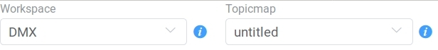
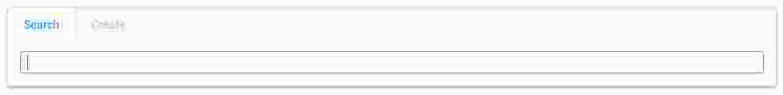
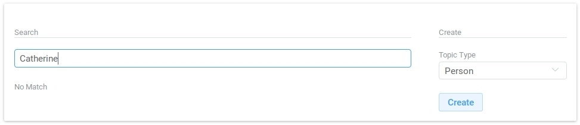
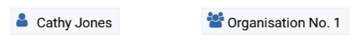
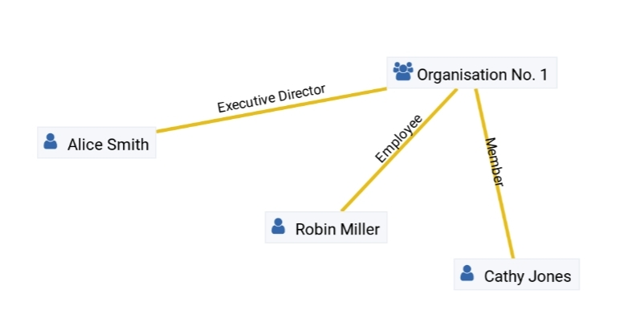
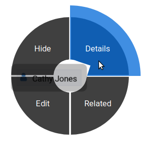
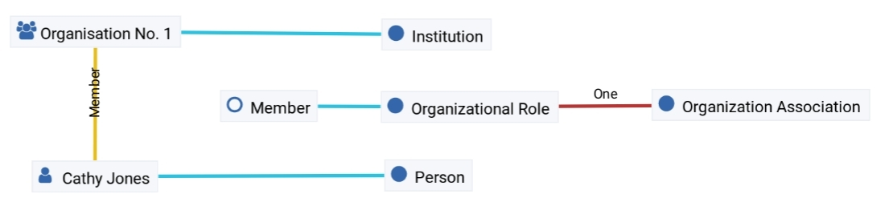

######################
DMX User Documentation
######################

Please note we have a :ref:`glossary-label` for the terms used in this documentation.

************************
Getting started with DMX
************************

To get started with DMX you can

* visit our `public demo site`_ and play with DMX. Do not enter any private or sensitive information on the demo site!
* run DMX on your computer by choosing one of the following ways:

  * :ref:`installation-zip-label` (Windows, Mac, Linux)
  * :ref:`installation-apt-label` (Linux only)

.. _public demo site: https://demo.dmx.systems

Introduction to the web interface
=================================
When you first look at a blank DMX interface, there is not much there, yet. Here is what you see in the upper tool bar:

* In the upper right corner there is a "Login" button. Log in with the username "admin" and no password.
* In the upper left corner there is a drop-down menu called "Workspace". The only existing workspace is called "DMX". This is your general context everything you are about to do is going to be in (for the moment). Later you will be able to select one of all your workspaces here.
* Next to it there is another drop-down menu called "Topicmap". There is only one topic map, it's called "untitled".

* Both have a context information button. Click them to see more information. For the moment the most interesting information is the access control. **The first default workspace and the default topic map are in SharingMode "public" that is: They are not private, but world-readable.**

Adding your first topic
=======================

Right-click anywhere into the empty space. You will notice that there are two items somewhere in your topic map: "DMX" and "untitled" with two different icons. Where do they come from? You uncovered your workspace and your topic map by retrieving their extra information. Do you want to know more about them? Yes, but not now. Let's hide (not delete!) them! Long-click one of them and hold the mouse button until a dark circle with four buttons appears. Pull the mouse onto "Hide". Hide the other one as well.

Right-click into the emptiness. A window appears that offers you to search something or to create something. Let's create something!

DMX wants to make sure that you do not create something that already exists. That's why you enter whatever you want to create into the search field. Let's assume you want to enter all persons and organizations involved in a project. Start by entering a name. DMX will answer "No match". Select "Person" from the prefined topic types and click "Create".

You will see a square on your topic map. It contains the name you entered and it states that this is the person's first name. Oh no! You entered the given name and the surname? Let's correct this: Long-press the square and select "edit" from the context menu. On the right-hand side there is a detail panel now. It contains many fields you might need to edit any topic you categorized as a person. Correct the name and click the save button at the very bottom. Add a second topic, e.g. "Organization No. 1". Select the topic type "institution" this time.

Adding your first association
=============================

Next you want to enter how the person is related to the organization. You can establish a connection between the two topics by drawing the person onto the organization. A square will appear that tell you this is an "Organization Association". You can view and edit details of associations the same way you can with topics. If you do so you will notice that an "Organization Association" has a specific drop-down menu called "organizational role". It lets you choose the person's role from a predefined set of common roles people have in organizations. Later you will learn how to create custom relationships ("associations") and how to predefine their properties.

Moving the map and the items
==============================
Note that you can drag the whole topic map into any direction. You can also grab every item and drag it where you want it to be.

Hiding items
============

You can hide items from the topic map by long-clicking onto them and using the "Hide" button in the context menu. If you bring them back to the map later by searching them, they will reappear in the same spot in your map.

DMX's default topic types
====================================

As you have seen, DMX comes with a few predefined topic types: Event, institution, note, web resource, and person. Each topic type brings certain fields you can fill in: While events have dates and locations, persons can have numbers and web resources have a URL. As you probably need more to map what you have in mind you will now learn how to create your own topic types.

******************************
Getting to know the data model
******************************

One of the core characteristics of DMX is that you can look at the underlying data model and modify it in the same interface.

Exploring your first topic
==========================

To look at the data model of a person, click onto the person you created and select "What's related". The detail panel on the right side will open. It has four tabs. The first one ("person") shows all the content you entered. You are now looking at the second one, called "Related". It displays a list of all items that are logically related to this concrete person:

- the institution you linked the person to
- the name of the person (because so far this is the only information you added to the person)
- the topic type "person". Your concrete person is an instance of the general idea of persons, so it is linked to this general idea, the topic type. You can think of the topic type as the definition of what a person is.
- the topic map this topic is associated with
- the workspace the topic is in

You can now click on each of the list items and they will appear on the topic map. Click onto the topic type "person". The topic type "person" is displayed with an association to the instance "Cathy Jones". The link between both has a different colour and you can again click onto the link, show "What's related" and you can see that this association is an "instantiation": The topic is one instance of the topic type. To see if there are more instances (more persons), show the "What's related" of the topic type "person". Among other information about how the topic type is integrated into the rest of the context you can see all existing persons you entered so far.

Here you are looking at your data and at a part of the data model it is based upon. Again, you can hide what you do not want to see in your map when you are done exploring.

Create your first topic type
===================================

**************
Access Control
**************

