######################
DMX User Documentation
######################

Please note we have a :ref:`glossary-label` for the terms used in this documentation.

.. _user-getting-started-with-dmx-label:

************************
Getting started with DMX
************************

To get started with DMX you can

* visit our `public demo site`_ and play with DMX. Do not enter any private or sensitive information on the demo site!
* run DMX on your computer by choosing one of the following ways:

  * :ref:`installation-zip-label` (Windows, Mac, Linux)
  * :ref:`installation-apt-label` (Linux only)

.. _public demo site: https://demo.dmx.systems

.. _user-introduction-to-web-interface-label:

Introduction to the web interface
=================================

When you first look at a blank DMX interface, there is not much there, yet.
Here is what you see in the upper tool bar:

* In the upper right corner there is a "Login" button. Log in with the username "admin" and no password.
* In the upper left corner there is a drop-down menu called :ref:`"Workspace"<glossary-workspace-label>`. The only existing workspace is called "DMX". This is your general context everything you are about to do is going to be in (for the moment). Later you will be able to select one of all your workspaces here.
* Next to it there is another drop-down menu called :ref:`"Topicmap"<glossary-topic-map-label>`. There is only one topic map, it's called "untitled".

.. figure:: _static/upper-toolbar.jpg
    :alt: Tool bar with workspace and topic map selection

* Both have a context information button. Click them to see more information. For the moment the most interesting information is the access control. **The first default workspace and the default topic map are in SharingMode "public" that is: They are not private, but world-readable.**
* In the upper right corner there is a button with an arrow. It is greyed out if nothing is selected. Later you can open the detail panel by pressing it.

.. _user-adding-your-first-topic-label:

Adding your first topic
=======================

Right-click into the emptiness. A window appears that offers you to search something or to create something. Let's create something!

.. image:: _static/search-create.jpg

DMX wants to make sure that you do not create something that already exists.
That's why you enter whatever you want to create into the search field.
Let's assume you want to enter all persons and organizations involved in a project.
Start by entering a name.
DMX will answer "No match".
Select "Person" from the predefined :ref:`topic types<glossary-topics-and-topic-types-label>` and click "Create".

.. image:: _static/create-person.jpg

You will see a rectangle on your topic map.
It contains the name you entered and it states that this is the person's first name.
Oh no!
You entered the given name and the surname?
Let's correct this:
Long-press the rectangle and select "edit" from the context menu.

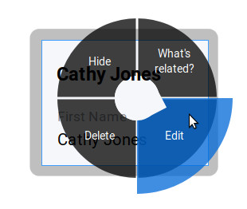

On the right-hand side there is a :ref:`detail panel<glossary-detail-panel-label>` now.
It contains many fields you might need for all persons.
Correct the name and click the save button at the very bottom.
Add a second topic, e.g. "Organization No. 1".
Select the topic type "institution" this time.

.. image:: _static/person-organization.jpg

.. _user-adding-your-first-association-label:

Adding your first associations
==============================

Next you want to enter how the person is related to the organization.
You can establish a connection between the two topics by draging the person onto the organization.
A square will appear that tell you this is an "Organization Association".
You can view and edit details of associations the same way you can with topics.
If you do so you will notice that an "Organization Association" has a specific drop-down menu called "organizational role".
It lets you choose the person's role from a predefined set of common roles people have in organizations.
Later you will learn how to create custom relationships ("associations") and how to predefine their properties.

.. image:: _static/diff-roles-in-organization.jpg

Thinking of real-world social networks, you will find that often people have more than one role.
DMX can represent this:
Simply drag the person onto the organization again and specify their second role.

.. image:: _static/multiple-assocs.jpg
    :width: 300

.. _user-editing-topics-label:

Editing topics
==============

.. _user-editing-via-detail-panel-label:

The detail panel
----------------

To add more details to a topic you use the detail panel on the right side.
There are two ways to open it:
You can use the edit button from the context menu (see above).
You can also select the item with a click and use the arrow button in the upper right corner to open the detail panel.

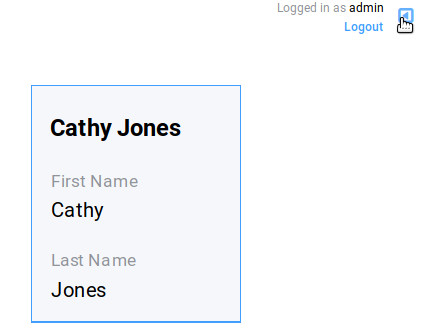

.. _user-inline-editing-label:

Inline editing
--------------

For quick changes of fields you already filled in you can use the inline editing mode.
Click to select the topic and move your mouse to the upper right corner of the displayed square.
A little closed lock appears. Click to unlock it.

.. image:: _static/inline-editing-unlock.jpg

Double-click onto the content you want to change, do your edit and save the change.

.. image:: _static/inline-editing.jpg

.. _user-getting-to-know-the-data-model-label:

******************************
Getting to know the data model
******************************

.. _user-dmx-default-topic-types-label:

DMX's default topic types
====================================

As you have seen, DMX comes with a few predefined topic types:

- event,
- institution,
- note,
- web resource,
- person.

Each topic type brings certain fields you can fill in:
While events have dates and locations, persons can have telephone numbers and web resources have a URL.
As you probably need more than these presets to map what you have in mind you will now learn how to create your own topic types.

One of the core characteristics of DMX is that you can look at the underlying data model and modify it in the same interface.

.. _user-exploring-your-first-topic-label:

Exploring a topic
=================

.. image:: _static/context-menu.png
    :width: 220

To look at the data model of a person, click onto the person you created and select "What's related".
The detail panel on the right side will open.
It has four tabs.
The first one ("person") shows all the content you entered.
You are now looking at the second one, called "Related".
It displays a list of all items that are logically related to this concrete person:

- the institution you linked the person to
- the name of the person (because so far this is the only information you added to the person)
- the topic type "person". Your concrete person is an instance of the general idea of persons, so it is linked to this general idea, the topic type. You can think of the topic type as the definition of what a person is.
- the topic map this topic is associated with
- the workspace the topic is in

You can now click on each of the list items and they will appear on the topic map.
Click onto the topic type "person".
The topic type "person" is displayed with an association to the instance "Cathy Jones".
The link between both has a different color and you can again click onto the link, show "What's related" and you can see that this association is an "instantiation":
The topic is one instance of the topic type.
To see if there are more instances (more persons), show the "What's related" of the topic type "person".
Among other information about how the topic type is integrated into the rest of the context you can see all existing persons you entered so far.

Here you are looking at your data and at a part of the data model it is based upon.
Again, you can hide what you do not want to see in your map when you are done exploring.

.. image:: _static/intro-data-model.jpg

.. _user-create-your-first-topic-type-label:

Create your first topic type
============================

To create your own topic type with a few properties here is how to procede.
Let's say you want to add a topic type "publication".
Each publication shall have a title and a year.

- Open the search field. Enter "Publication", select "Topic Type" and press "create".
- Go into editing mode via the context menu. Change the data type from "Text" to "Identity" and hit "Save". Click somewhere into your map to close the detail panel.
- Open the search field and enter "Title". You will find that two entries already exist. They come from the default topics types "Event" and "Note" which also have titles. Create a new topic type "Title".
- Grab the title item and pull it on the publication item. DMX will display what you just created:
  * You created an association of the type "Composition Definition". Composition Definition means that you are defining a more complex context between item on your map: The relationship between a publication, a title and a year. 
  * "Cardinality: One" means that each publication has exactly one title, not more. 
  * The rest of the information refers to the role types: The publication is called the parent, the title is the child. These are technical terms to define that a publication has a title, but a title does not have a publication.

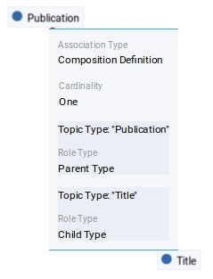

- Again, click somewhere onto the map and reopen the search field. Search for the year and open the existing topic type. Pull it onto the publication.

You are now ready to use this data model you just built to add content.

- Open the search field and enter the title of a publication. From the Topic Type menu you can now select "Publication".
- As the title was the first property you added to the composition, it is automatically filled in from the search field.
- Edit your new publication and add a year.

.. _user-create-your-first-custom-association-type-label:

Create your first association type
==================================

One of the strengths of DMX is that you can build your own association types that are machine-readable.
Here is how to build such an association:
Let's say we want to express the relationship between persons and publications.
A person can be the author, the publisher, the reader, or even the subject of a publication.

* Create a topic type "Publication" if you haven't done so above.
* Create an association type and give it a name, e.g. "Relationship person - publication".
* Select "Composite" as a data type.

.. image:: _static/custom-assoc.jpg

* Create a topic type, name it "Role referring to publication" or anything that suits you. The data type is "Text".
* Drag the topic type onto the association type and edit the newly created association between them. Click onto the "View" tab and click "Edit" to edit its configuration.
* Open the "Widget" setting and select "Select". This will allow you to select roles from a predefined list when adding content later.
* There are two more checkboxes called "clearable" and "customizable". It only makes sense to use them in connection with  "Widget: Select". Both have an effect on editing association types later on. Here is what they do: "Clearable" decides whether you allow instances of this association type to *only* have the values you explicitly defined or whether it shall be possible to clear the field to leave it empty. In this case, there will be a little cross icon for clearing it. "Customizable" decides whether you allow to enter values on the fly by just typing in something different that was not predefined by you. If both checkboxes are left empty, one of your predefined values *has* to be selected. The value cannot be empty and there will be no possibility of typing into the field.

.. image:: _static/selectable-role.jpg

* Create a topic "Author" the has the topic type "Role referring to publication" which is selectable from the create menu. If you want to have more roles, add them likewise.
* Create a person.
* Create a publication.
* Drag the person onto the publication and edit the association. Open the drop-down menu under "Association Type" and select "Relationship person - publication". Hit the save button and the edit button again. There is a new drop-down menu that lets you select the role the person shall have related to the publication.

.. image:: _static/select-role.jpg

You now have a map like this.
On the left side you see the data model.
There is your topic type "Publication" with a title and a year.
And there is the association type you built with a few selectable roles.

On the right side you see the actual content, the instances.
To continue working, you might want to :ref:`bulk select<user-bulk-selection-label>` and :ref:`hide<user-hide-items-label>` the data model.

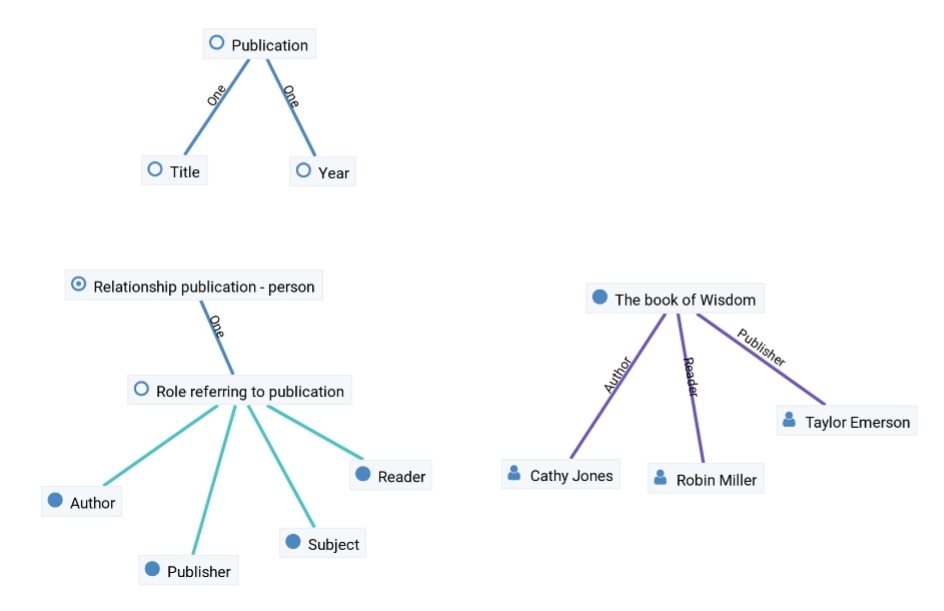

.. _user-edge-connections-label:

Visualizing edge connections
============================

In the examples above you have seen nodes that are connected by edges, e.g. two topics (or topic types) that are connected by associations.
This is not sufficient in a data model that is supposed to show real-world relationships.
The associations themselves can be very complex and can have many properties.
DMX can visualize this as edges connecting to other edges.

Let's return to the example of a publication and its author:
The authorship is a qualified description of the association between a person and a publication.
If you reveal the "What's related" of such a qualified association you can see the connection between the association and and the association type: 

.. image:: _static/edge-connection.jpg

.. _user-topic-maps-label:

************************************
Organizing and navigating Topic Maps
************************************

.. _user-introduction-to-detail-panel-label:

Navigating via the detail panel
===============================

The detail panel offers lots of features to explore your data so here is an in-depth introduction to the detail panel.

The detail panel can only be opened if you have selected an item on the map and it will stay open as long as you have a selected item.

The "Info" tab
--------------

The first tab is a general info tab.
It is always named after the type of the selected item, e.g. "Person" or "Event".
In its display mode it shows only those fields containing data.
You can click "Reveal" on details to reveal them on the current topic map.

.. image:: _static/detail-panel-reveal-button.png

The first tab also has an edit button at the bottom.
If you enter the editing mode, you get all fields that you can fill in for the respective topic type or association type.
These fields come from your type definitions (see below).

.. image:: _static/detail-panel-editing-mode.jpg

The "Related" tab
-----------------

The second tab is called "Related".
It lists *all* topics related to your selection: 

* On top, you can see the number of related items and the sort order. By default the list is sorted by topic type. In the example below you can see that the selected person is related to an organization, to the person's name, to a publication, to the topic type "Person", to the topic map you are working on and to the workspace you are in. This means that you can navigate your content and your data model in the same place. (You will learn more about these concepts in the section about the :ref:`DMX data model<user-getting-to-know-the-data-model-label>`.)
* Additionally, every list item contains information about the association type between the selected person and the other items, e.g. their role in the organization, or that this person is an instance of the topic type person.

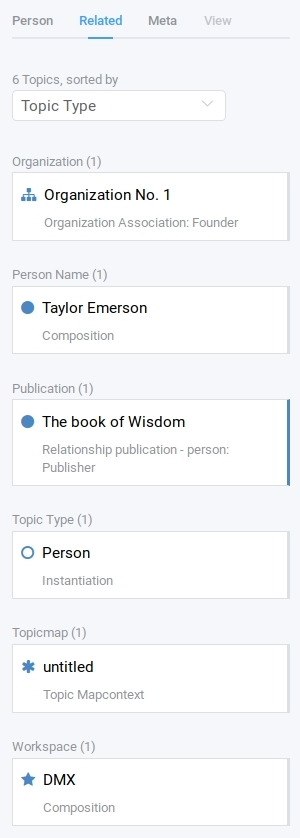

* Depending on what are searching you might want to change the sort order. If you select "Association Type" in the upper drop-down menu you get a different view onto the same data: Think of a working situation where you look for all publications the selected person wrote or for all organizations that person is related to. You could list them with the sort order "Association Type" as shown here:

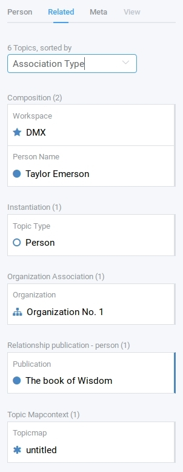

* The third sorting mechanism is called "Topic". It displays the same information in alphabetical order of the labels (that is the "display names" of the items).
* Items that have a blue border on the right side are already revealed on the map. All other items can be revealed with a click.

The "Meta" tab
--------------

The third tab "Meta" is still under development, so right now you don't see any thing there.

The "View" tab
--------------

The fourth tab "View" allows you to view and edit the *configuration of types*.
Thus, the tab is greyed out if the selected item is not a topic type or an association type but an individual topic or an association.
(Read more about the background of the data model in the section about the :ref:`DMX data model<user-getting-to-know-the-data-model-label>`.)
What you can configure in this "View config" has nothing to do with editing the actual data model.
These changes just have an impact on how items are rendered on your topic map:
You can assign custom icons to topic types, or colors to association types.
(This is covered below in the sections about :ref:`Assigning icons to topic types<user-topic-type-icons-label>` and :ref:`Assigning colors to association types<user-assoc-type-color-label>`.)

.. _user-navigating-topic-maps-via-deep-links-label:

Navigating via deep links
=========================

Every view onto an item has a stable deep link that you can use for navigating in your browser:
If you have nothing selected the URL, that is the address in your browser, shows the exact link to this topic map.

.. image:: _static/deep-link-topic-map.jpg

If you select something the URL changes:
The ID of the currently selected item is appended to the URL.
You can use this link you return to the same item over and over again.

.. image:: _static/deep-link-topic-map-with-topic.jpg

The state of the detail panel can be addressed directly, too:

* Append "/info" to the URL and the detail panel's "Info" tab will open.
* Append "/edit" to enter the editing mode directly.
* Append "/related" to open the "Related" tab directly.

.. image:: _static/deep-link-topic-map-with-topic-in-edit-mode.jpg

This means that ou can use the back and forward buttons of your browser to navigate.
Going back brings you back to the situation you were looking at before.
It is not an "undo" though:
Going back does not revert you latest change.

.. _user-geodata-label:

Displaying Geodata
==================
DMX comes with built-in support for geodata.
The feature is still under construction.
Right now every topic with an address can be shown on a map.
The so-called geomaps are a special type of topic map in DMX.
Geomaps are based on openstreetmap.org.
Here is an example of how to create and populate them:
Edit a person or an institution and add an address.

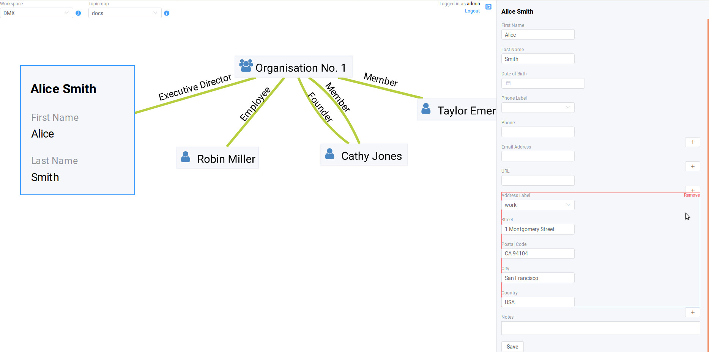

Open the search and create dialogue.
Enter a name for the new topic map, e.g. "Our Geomap".
In the topic type selection choose "Topicmap".
Underneath it you can now choose the type of topic map you want to add.
Select "Geomap" and press "Create".

.. image:: _static/add-geomap.jpg

Open the topic map selection in the upper toolbar and select your newly created geomap.
The map is displayed with all items you assigned an address to.

.. image:: _static/topic-map-selection.jpg

If you click onto an item the in-map details show you what is there.

.. image:: _static/display-map-item.jpg
    :width: 400

You return to the normal topic map via the same "Topicmap" drop-down menu.

.. _user-moving-the-map-and-the-items-label:

Moving the map and the items
============================
Note that you can drag the whole topic map into any direction.
You can also grab every item and drag it where you want it to be.
Zooming in or out is done by scrolling up or down.

.. _user-bulk-selection-label:

Bulk selection
==============
To move more than one item at a time you can bulk select several items by keeping the CTRL key pressed and drawing a rectangle around the items you want to select.
You can also click them with the CTRL key pressed.
The selected topics now have a blue border.
Drag the whole selection where you want to place it.

.. image:: _static/bulk-select.jpg
    :width: 600

.. image:: _static/bulk-move.jpg
    :width: 600

.. _user-hide-items-label:

Hiding items
============

You can hide items from the topic map by long-clicking onto them and using the "Hide" button in the context menu.
If you bring them back to the map later by searching them, they will reappear in the same spot in your map.

.. _user-topic-type-icons-label:

Assigning icons to topic types
==============================

You can assign icons from the Font Awesome collection to your topic types.
Let's say you have a topic type "Publication" and you want all publications in your map to have a book icon.

- Click onto the topic type "Publication", //not// onto an individual publication you already added. You are about to modify the general concept of all your publications, not an existing instance of it.
- Use the little arrow in the upper right corner to open the detail panel.
- Go to the fourth tab called "View". Here you can view and edit the configuration of the topic type. Click "Edit".
- Click into the white field labeled "Icon".

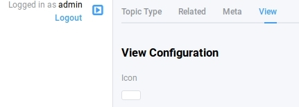

- You can either select an icon directly or use the search box.
- Hit save to apply the icon to all topics that are publications.

.. image:: _static/new-icon.jpg

.. _user-assoc-type-color-label:

Assigning colors to association types
======================================

You can assign colors to association types just as you can assign icons to topic types.
Select the association type on your map, open the details panel and open the fourth tab "View".
Choose a color for your association type and save it.

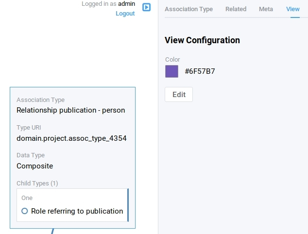

.. _workspaces-collaboration-acl-label:

***********************************************
User Accounts, Collaboration and Access Control
***********************************************

.. _user-creating-user-accounts-label:

Creating user accounts
======================

In DMX, you create user accounts just the way you create everything else, too:
Enter a user name into the search field.
If the name does not exist yet you create it by selecting the topic type "User Account".
After that, a password field appears. 
Only privileged accounts (like admin) can create user accounts.

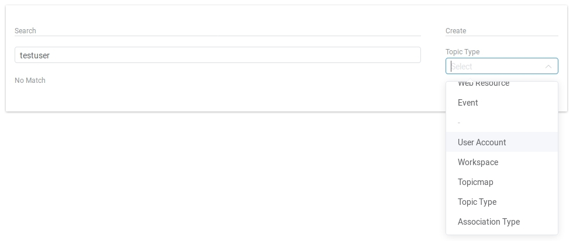

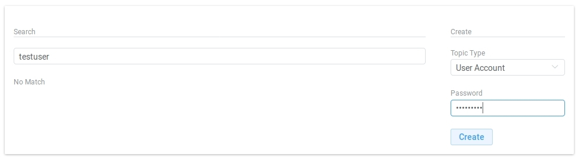

What is displayed after account creation is just the *user name*.
The *user account* consists of the user name and the password.
Investigate the newly created user name by revealing "What's related".
The user name is associated with some information:

* disk quota: how much space the user can use on the computer
* if the account owner can share workspaces with others
* if the account owner is allowed to log in at all

It is important that every user account is tied to the "System" workspace (see below). In short, this allows others to read their user name (only the name) to share content.

.. image:: _static/user-name-related.jpg
    :width: 400

.. _user-introduction-to-workspaces-and-sharing-modes-label:

Introduction to workspaces and sharing modes
============================================

In DMX workspaces are the highest level content is organized in.
Read and write permissions are tied to workspaces.
Every topic or association is assigned to exactly *one* workspace.
That is why workspaces are the key to the configuration of access control.
There are five sharing modes:

* **private**: In a private workspace just the owner of the workspace can read and write.
* **confidential**: In a confidential workspace the owner can read and write. Group members can read, but not change anything.
* **collaborative**: A collaborative workspace can be read and edited by the owner and by all group members.
* **public**: A public workspace is world-readable. The default "DMX" workspace is an example of a public workspace.
* **common**: In a common workspace everyone can read and write. No login is required.

Every workspace has an owner, usually the creator, and optional members.
When you are logged in you can access the different workspaces via the drop-down menu in the upper left corner.
Once you log out DMX will switch back to a public (world-readable) workspace like the default workspace called "DMX".
All items that are publicly readable stay visible, the rest disappears from the view.
You are no longer able to edit but you still have a customizable view of the topic map, which means that you can move item and reveal other world-readable items.

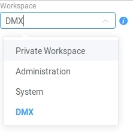

DMX comes with four default workspaces with the following sharing modes:

* **DMX**: This workspace a public, it is the one that is displayed publicly when people come to the site.
* **Private Workspace**: This is the private workspace of the respective logged in user. Only this user can see and and edit their map as it is private.
* **Administration**: Only admins can view and edit this workspace. Unprivileged user accounts do not have this entry in the menu.
* **System**: The System Workspace is readable by everyone who is logged in. It contains all user names that exist in this DMX installation. The user names are readable to all users. This is needed for sharing content with others as you will see below.

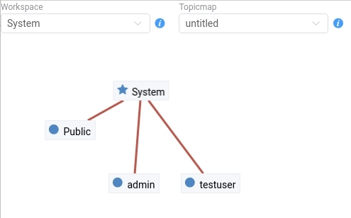

.. _user-sharing-a-workspace-label:

Sharing a workspace
===================

Here is how creating a shared workspace works:

* Log in as an unprivileged user and go to your private workspace where you can edit.
* Open the search field and **create a workspace**. Make it a collaborative workspace to give others write permission.

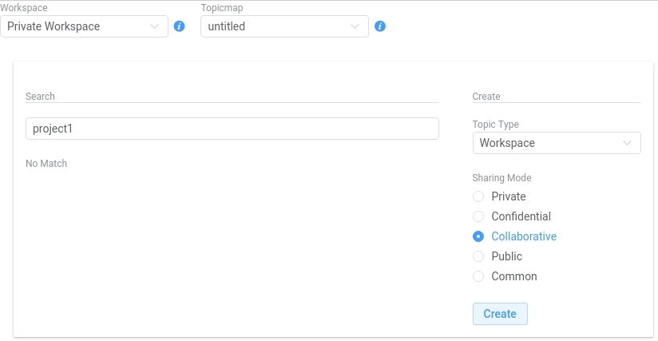

* The new workspace automatically opens. Click onto the blue information icon next to the workspace selection to reveal the workspace topic itself on the topic map.
* To add members to the workspace you can just enter user names and click them to reveal them on the map. As mentioned above, all user names are visible to all other logged in users via the system workspace. In DMX, membership is tied to user names that is why you need read permission on the user names.
* If you don't know their user names you can go to the System workspace and investigate.
* Now that you have the workspace itself and a user name on your topic map you can just **drag the user name onto the workspace** to create an association between them.
* Next you have to qualify this association as a membership: Edit the association.

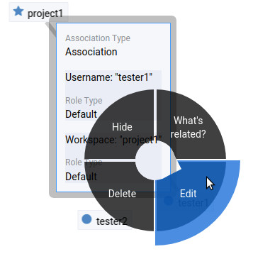

* In the detail panel you can now select the association type "Membership". You are done!

.. image:: _static/edit-ws-assoc2.png

* The user you shared your workspace with can now log in, select your collaborative workspace and add something, e.g. a note. It will automatically appear in the workspace, visible to all workspace members.

.. note:: You can create memberships in every workspace that you have write permission in.

