##############
DMX User Guide
##############

.. _user-beginners-tutorial:

*******************
Beginners' Tutorial
*******************

To get started with DMX you can

* visit our `public demo site`_ and play with DMX. Do not enter any private or sensitive information on the demo site!
* run DMX on your computer by choosing one of the following ways:

  * :ref:`installation-zip` (Windows, Mac, Linux)
  * :ref:`installation-apt` (Linux only)

.. _public demo site: https://demo.dmx.systems

.. _user-a-first-look-at-dmx:

A first look at DMX
===================

When you first look at a new installation of DMX, there is not much there, yet.
We have a detailed guide to the :ref:`user interface<user-the-dmx-user-interface>` below but here are some essentials:

* In the upper right corner there is a "Login" button. Log in with the user name "admin" and no password.
* In the upper left corner there is a workspace selector. The only existing workspace is called "DMX". This is your general context everything you are about to do is going to be in (for the moment). Later you will be able to select one of all your workspaces here.
* Next to it there is another drop-down menu. This is the topic map selector. Right now, there is only one topic map, it's called "untitled".

.. figure:: _static/upper-toolbar.png
    :alt: Tool bar with workspace and topic map selection

* Both have a context information button. Click them to see more information. For the moment the most interesting information is the access control. **The first default workspace and the default topic map are in SharingMode "public" that is: They are not private, but world-readable.** This is important to keep in mind if you are trying DMX on our public demo site or if you installed it on a server that is connected to the internet. You can find out more about access control in the section about :ref:`Collaboration and Sharing<user-collaboration-and-sharing>`.
* In the upper right corner there is a button with an arrow. It is grayed out right now.

.. _user-adding-your-first-topic:

Adding your first topic
=======================

:ref:`Content Authoring<user-content-authoring>` is described in-depth below.
This is just a short walkthrough to help you create your first items in DMX.

Right-click into the emptiness.
A window appears that offers you to search something.
This is the search/create dialog.
Let's create something!

.. image:: _static/search-create.jpg

DMX wants to make sure that you do not create something that already exists.
That's why you enter whatever you want to create into the search field.
Let's assume you want to enter all persons and organizations involved in a project.
Enter a person's first name.
DMX will answer "No match".
Select "Person" from the predefined topic types and click "Create".

.. image:: _static/create-person.jpg

You will see a rectangle on your topic map.
It contains the name you entered and it states that this is the person's first name.
Oh no!
You entered the given name and the surname?
Let's correct this:
Long-press the rectangle and select "edit" from the context menu.

.. image:: _static/context-menu-edit.jpg

On the right-hand side the detail panel opens.
It contains many fields you might need for all persons.
Correct the name and click the save button at the very bottom.
Add a second topic, e.g. "Notes for the interview".
Select the topic type "Note".

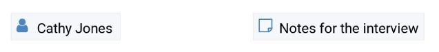

Add a third topic e.g. "Organization No. 1".
Select the topic type "Organization" this time.

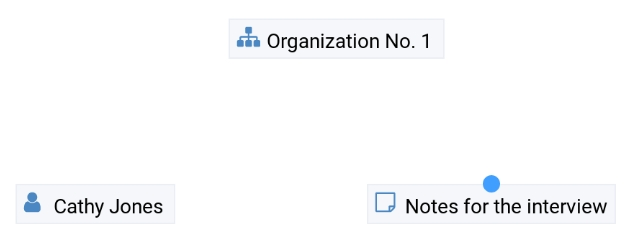

.. _user-adding-your-first-association:

Adding your first association
=============================

Next, you want to visualize that the note is related to the person.

To create an association between two topics you grab the little dot at the upper border of one of the two topics.

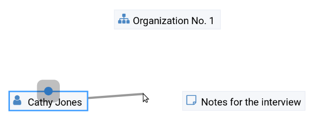

Drag it onto the other topic until that topic is highlighted by a blue border.

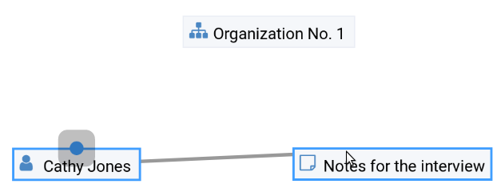

A rectangle appears.
These are the in-map details.
They tell you that this is an "Association", that the association type is "Association".
You can think of it as a very simple association:
You just drew a line between two topics.
Neither does the line have a dedicated meaning nor is it machine-readable.
Click somewhere onto the topic map to close the in-map-details.

A glimpse into the PIM application
==================================

You can see the difference between a simple drawn line and a qualified association with the following example:
DMX comes with a few predefined topic types that you just selected from:

- person,
- organization,
- note,
- event,
- bookmark.

These topic types all come from classical Personal Information Management (PIM).
As using DMX for PIM is a popular use case, there are also some predefined association types.
One of those association types describes the role a person has in an organization.

We will now give the person an organizational role to see that this is a different association type:
Grab the little dot of the person's rectangle and create an association to the organization.
The in-map details show at once that the association type is "Organization Association".

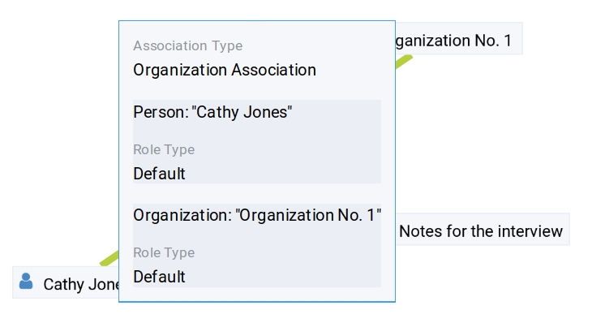

Next, we have to assign the exact role.
Right-click onto the rectangle or directly onto the association.
The context menu opens.
Select "Edit".

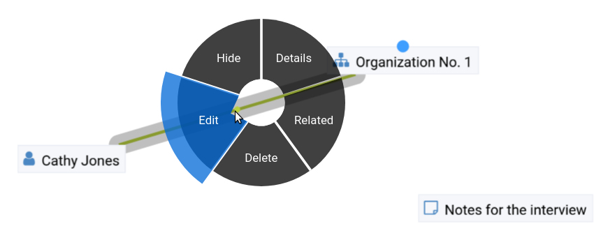

The detail panel opens.
You can now select an "Organizational Role" from a predefined set of possible values, e.g. "Member".

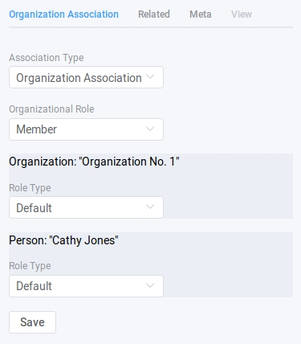

Click "Save".

.. image:: _static/organization-association.png

This is a machine-readable association:
You can open the context menu of the organization with a right-click and select "What's related".
If you have entered more than one person, you can scroll down in the detail panel to see all persons and their respective roles in the organization.

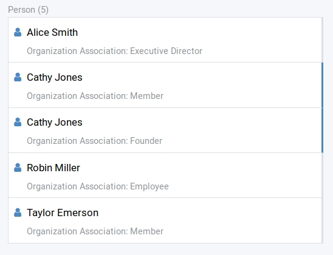

In DMX you are free to define your own topic types and association types.
Find out more about it in the section about :ref:`Modelling<user-modelling>`.

.. _user-the-dmx-user-interface:

**********************
The DMX User Interface
**********************

.. _user-the-toolbar:

The Toolbar
===========

The upper toolbar contains some of the crucial steering tools for DMX.

.. figure:: _static/upper-toolbar.png
    :alt: Tool bar with workspace and topic map selector

.. _user-the-workspace-selector:

The Workspace Selector
----------------------

In the upper left corner there is a drop-down menu called "Workspace".
This is the workspace selector.
Workspaces are the highest level of content organization in DMX.
You can think of workspaces as the folders you put your different projects into.
When you start to work on a blank DMX installation, the only existing workspace is called "DMX".
Read more about workspaces in the section :ref:`user-introduction-to-workspaces-and-sharing-modes`.

.. image:: _static/workspace-selector.png

.. _user-the-topic-map-selector:

The Topic Map Selector
----------------------

Next to the workspace selector there is another drop-down menu called "Topicmap".
This is the topic map selector.
A topic map represents an individual working situation.
The user chooses what is relevant to the current context and visualizes it by revealing the relevant topics and associations from the database in a topic map.
Thus it shows a situation-based selection of the whole database content.
In the beginning, there is only one topic map, it's called "untitled".

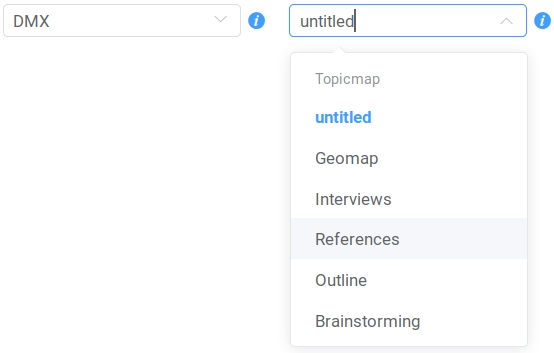

The Login Button
----------------

The "Login" button is located in the upper right corner of the toolbar.

The Detail Panel Switch
-----------------------

The button with the little arrow in the very corner is the switch to open the :ref:`detail panel<user-the-detail-panel>`.

.. _user-the-topic-map-panel:

The Topic Map Panel
===================

The topic map panel is the main area of the DMX user interface.
It displays the currently chosen topic map.
The topic map panel is as big as your browser window unless you open the :ref:`detail panel<user-the-detail-panel>`.

.. image:: _static/topic-map-panel.png

.. _user-the-context-menu:

The Context Menu
----------------

The context menu is opened with a right-click on items.
It has four buttons to interact with the item:

* You can edit it.
* You can hide it from the current topic map
* You can delete it. **Be careful! The item is deleted at once!**
* You can show what is related to this item.

To close the context menu *without* any action, click into its middle.

.. image:: _static/context-menu.png
    :width: 250

.. _user-in-map-details:

In-map Details
--------------

Whenever you select an item on a topic map, a rectangle opens up displaying details about the selected item.
This box is called the in-map details.

.. image:: _static/in-map-details.jpg

The Search/Create Dialog
========================

The search for existing items and the creation of new one is done in the same dialog box.
The search/create dialog is opened with a right-click into the topic map.
Read more how to create content in the section about :ref:`Content Authoring<user-content-authoring>`.

.. image:: _static/search-create.jpg

.. _user-the-detail-panel:

The Detail Panel
================

The detail panel offers lots of features to explore your data so here is an in-depth introduction to the detail panel.

The detail panel can only be opened if you have selected an item on the map and it will stay open as long as you have a selected item.

.. _user-detail-panel-the-info-tab:

The "Info" tab
--------------

The first tab is a general info tab.
It is always named after the type of the selected item, e.g. "Person" or "Event".
In its display mode it shows only those fields containing data.
You can click "Reveal" on details to reveal them on the current topic map.

.. image:: _static/detail-panel-reveal-button.png

The first tab also has an edit button at the bottom.
If you enter the editing mode, you get all fields that you can fill in for the respective topic type or association type.
These fields come from the type definitions. (Please see the section about :ref:`Modelling<user-modelling>`.)

.. image:: _static/detail-panel-editing-mode.jpg

.. _user-detail-panel-the-related-tab:

The "Related" tab
-----------------

The second tab is called "Related".
It lists *all* items related to your selection: 

* On top, you can see the number of related items and the sort order. By default the list is sorted by topic type. In the example below you can see that the selected person is related to an organization, to the person's name, to a publication, to the topic type "Person", to the topic map you are working on and to the workspace you are in. This means that you can navigate your content and your data model in the same place. (You will learn more about these concepts in the section about :ref:`Modelling<user-modelling>`.)
* Additionally, every list item contains information about the association type between the selected person and the other items, e.g. their role in the organization, or that this person is an instance of the topic type person.

.. image:: _static/detail-panel-related-tab.jpg

* Depending on what are searching for you might want to change the sort order. If you select "Association Type" in the upper drop-down menu you get a different view onto the same data: Think of a working situation where you look for all publications the selected person wrote or for all organizations that person is related to. You could list them with the sort order "Association Type" as shown here:

.. image:: _static/detail-panel-related-tab-sort-order.jpg

* The third sorting mechanism is called "Topic". It displays the same information in alphabetical order of the labels (that is the "display names" of the items).
* Items that have a blue border on the right side are already revealed on the map. All other items can be revealed with a click.

.. _user-detail-panel-the-meta-tab:

The "Meta" tab
--------------

The third tab "Meta" is still under development, so right now you don't see anything there.

.. _user-detail-panel-the-view-tab:

The "View" tab
--------------

The fourth tab "View" allows you to view and edit the *configuration of types*.
Thus, the tab is grayed out if the selected item is not a topic type or an association type but an individual topic or an association.
(Read more about the background of the data model in the section about MODELLING.
What you can configure in this "View config" has nothing to do with editing the actual data model.
These changes just have an impact on how items are rendered on your topic map:
You can assign custom icons to topic types, or colors to association types.
(This is covered below in the sections about :ref:`Assigning icons to topic types<user-topic-type-icons>` and :ref:`Assigning colors to association types<user-assigning-colors-to-association-types>`.)

.. _user-content-authoring:

*****************
Content Authoring
*****************

.. _user-creating-a-topic:

Creating a topic
================

Right-click onto the topic map.
The search/create dialog appears.

.. image:: _static/search-create.jpg

DMX wants to make sure that you do not create something that already exists.
That's why you enter whatever you want to create into the search field.
Enter a term, e.g. a person's given name..
DMX will answer "No match".
Select "Person" from the predefined topic types and click "Create".

.. image:: _static/create-person.jpg

You will see a rectangle on your topic map.
It contains the name you entered and it states that this is the person's first name.

Whenever you create a new topic the dialog proposes you to create something of the same topic type as last time.
You can change this by seleting a different topic type from the drop-down menu.

.. _user-dmx-default-topic-types:

DMX's default topic types
-------------------------

DMX comes with a few predefined topic types that you can select from:

- person,
- organization,
- note,
- event,
- bookmark.

Each topic type brings certain fields you can fill in:
While events have dates and locations, persons can have telephone numbers and web resources have a URL.

These topic types all come from classical PIM applications (Personal Information Management).
The special feature here is that you have different types of information in one interface and not spread out in address books, calendars, browsers and files.
Using DMX for PIM is just *one* proposal for a use case.

.. _user-creating-an-association:

Creating an association
=======================

To create an association between two topics you grab the little gray dot at the upper border of one of the topics.

.. image:: _static/create-association-1.png

Drag it onto the other topic until that topic is highlighted by a blue border.

.. image:: _static/create-association-2.png

Then let go and a rectangle will open that shows you the in-map details of the newly created association.
Click somewhere into the map to hide the in-map details.

Now what is important is that there are different association types.
If you just draw a line between two things to create an association you will see a gray line.
Its association type is just "association".
You can use these associations to visualize your associations but they are *not* machine-readable.

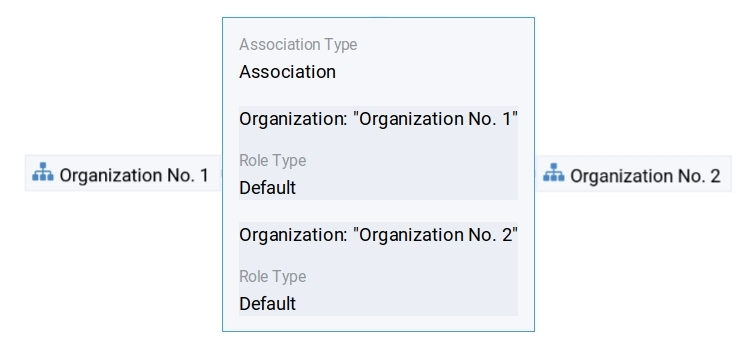

If you need machine-readable associations you have to give your associations a meaning.
This is explained step-by-step in the section about :ref:`Modelling<user-modelling>`.

Thinking of real-world social networks, you will find that there is often more than one association between two things.
DMX can represent this:
You can simply create another association between them.

.. image:: _static/multiple-assocs.jpg
    :width: 600

.. _user-editing-content:

Editing content
===============

.. _user-editing-in-the-detail-panel:

Editing in the detail panel
---------------------------

To add more details to a topic you use the detail panel on the right side.
There are two ways to open it:
You can use the edit button from the context menu (see above).
You can also select the item with a click and use the arrow button in the upper right corner to open the detail panel.

.. image:: _static/button-detail-panel.jpg

The detail panel opens so that you have the topic map on the left side of your screen and the detail panel on the right side.
There is an in-depth explanation of the detail panel's features :ref:`further down<user-the-detail-panel>`.
Here is what is looks like:

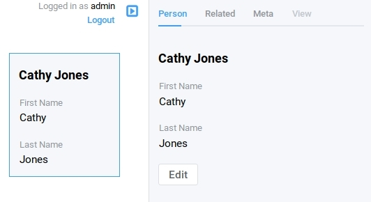

.. _user-inline-editing:

Inline editing
--------------

For quick changes of fields you already filled in you can use the inline editing mode.
Click to select the topic and move your mouse to the upper right corner of the displayed square.
A little closed lock appears. Click to unlock it.

.. image:: _static/inline-editing-unlock.jpg

Double-click onto the content you want to change, do your edit and save the change.

.. image:: _static/inline-editing.jpg

Inline Topic Links
------------------

When editing the text field of an item you can embed links to other topics into the text.
These inline topic links are clickable so that the referred topics are revealed on the topic map.
Link creation utilizes the search/create dialog.
So you can link to existing topics or create new ones on-the-fly.
Select the term you want to embed the link into and use the editor's "T" icon to create the link.

.. image:: _static/editor-t-icon.png

.. image:: _static/clickable-inline-topic-links.png

Deleting things
===============

.. warning:: There is an important difference between hiding items and deleting them. **If you delete items they are immediately removed from the database without any further questions!** If you hide them, they are just no longer visible on the topic map but you can bring them back by revealing them.

You delete things via the context menu on the topic map.
Left-click onto the item and drag your mouse onto the delete button.

.. image:: _static/delete-item.png

Bulk deletion
-------------

To delete several items in one go select all of them by clicking them with the Ctrl key pressed.

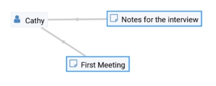

Then procede as above:
Left-click onto the item and drag your mouse onto the delete button.

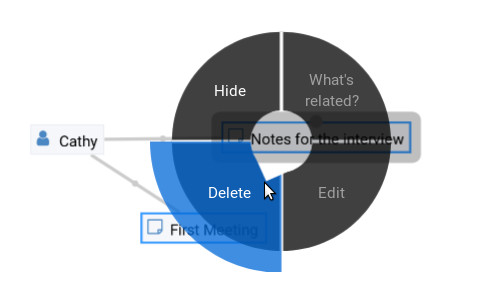

******************************
Organizing the working context
******************************

The DMX database contains your knowledge at large.
Everything you enter is saved in the database until you delete it.
What is important:
Every item is saved in the database *once* only, even if you use it in many different contexts.

To make use of your knowledge base in different working situations you can use topic maps.
On each topic map you can reveal what is relevant from the same underlying database.
The rest stays hidden.
Thus, every topic map represents *one* view, perspective, or working situation.

The following figure shows the relationship between content and its use in different working situations.
In the lower half you see a representation of a DMX database.
It contains lots of topic and associations.
(Note that it also contains topic *types* and association *types* which are not visualized here for clarity.)

In the upper half there are two different working contexts respectively topic maps.
On each of them there is a selection of topics and associations revealed depending on what the topic map is about.
There can be much more content in the database than what you actually display but everything that is visible in topic maps is stored in the database.

.. figure:: _static/illustration-database-topic-maps.png
    :alt: Illustration of DMX topic maps each with a set of data revealed from the same underlying database.

Creating a topic map
====================

To start working in a new context or on a different part of your larger project you can create a new topic map.
This is done just like always:
Open the search/create dialog.
Choose a name for the topic map, search if it already exists, and create it by selecting the topic type "Topicmap".

.. image:: _static/create-topic-map.png

For topic maps, the creation dialog has an additional choice between (usual) topic maps and geo maps (see below).
Once created, the new empty topic map is opened.
You can see its name in the :ref:`Topic Map Selector<user-the-topic-map-selector>` and use it to switch between topic maps.

.. _user-geodata:

Displaying Geodata
------------------

DMX comes with built-in support for geodata.
Every topic with an address can be shown on a map.
The so-called geomaps are a special type of topic map in DMX.
Geomaps are based on openstreetmap.org.
Here is an example of how to create and populate them:
Edit a person or an organization and add an address.

.. image:: _static/add-address.png
    :width: 800

Open the search and create dialog.
Enter a name for the new topic map, e.g. "Our Geomap".
In the topic type selection choose "Topicmap".
Underneath it you can now choose the type of topic map you want to add.
Select "Geomap" and press "Create".

.. image:: _static/add-geomap.jpg

Open the topic map selection in the upper toolbar and select your newly created geomap.
The map is displayed with all items you assigned an address to.

.. image:: _static/topic-map-selection.jpg

If you click onto an item the in-map details show you what is there.

.. image:: _static/display-map-item.jpg
    :width: 400

Again, you return to the other topic maps via the :ref:`Topic Map Selector<user-the-topic-map-selector>`.

.. _user-moving-things-around:

Moving things around
====================

Note that you can drag the whole topic map into any direction.
Just hold the right mouse button pressed somewhere on the topic map and drag.

Moving topics
-------------

Grab individual items with your mouse and drag them where you want them to be.

Panning/zooming the topic map
-----------------------------

Zooming in or out is done by scrolling up or down.

.. _user-hiding-items:

Hiding things
=============

.. note:: There is an important difference between hiding items and deleting them. If you delete items they are immediately removed from the database. If you hide them, they are just no longer visible on the topic map but you can bring them back by revealing them.

You can hide items from the topic map by long-clicking onto them and using the "Hide" button in the context menu.
If you bring them back to the map later by searching them, they will reappear in the same spot in your map.

Pinning things
==============

You can "open" more than one item at the same time by pinning the in-map details.
This is very useful for comparisons.
Select a topic or an association so that its in-map details open.
Click the little pin to keep them open.

.. image:: _static/in-map-details-pinning.png

Note that the pinnings are stored in the database along with the topic maps.
That is why you can prepare a topic map with pinned in-map details, knowing that everyone who opens the topic map will see it in that very state.

Bulk operations
===============

.. _user-bulk-selection:

Bulk selection
--------------

You can bulk select several items by keeping the CTRL key pressed and drawing a rectangle around the items you want to select.
You can also click them with the CTRL key pressed.
The selected topics now have a blue border.

Moving topic clusters
---------------------

Once you have bulk selected a few items, you can drag the whole selection where you want to place it.

.. image:: _static/bulk-select.jpg
    :width: 600

.. image:: _static/bulk-move.jpg
    :width: 600

.. _user-hiding-multiple-items:

Hiding multiple items
---------------------

To hide several items at once select them by keeping the CTRL key pressed and drawing a rectangle around them or by clicking them with the CTRL key pressed.

.. image:: _static/bulk-hide.png
    :width: 600

Customizing the Look & Feel
===========================

.. _user-topic-type-icons:

Assigning icons to topic types
------------------------------

You can assign icons from the Font Awesome collection to your topic types.
Let's say you have a topic type "Publication" and you want all publications in your map to have a book icon.

- Click onto the topic type "Publication", //not// onto an individual publication you already added. You are about to modify the general concept of all your publications, not an existing instance of it.
- Use the little arrow in the upper right corner to open the detail panel.
- Go to the fourth tab called "View". Here you can view and edit the configuration of the topic type. Click "Edit".
- Click into the white field labeled "Icon".

.. image:: _static/open-icon-selection.jpg

- You can either select an icon directly or use the search box.
- Hit save to apply the icon to all topics that are publications.

.. image:: _static/new-icon.jpg

.. _user-assigning-colors-to-association-types:

Assigning colors to association types
-------------------------------------

You can assign colors to association types just as you can assign icons to topic types.
Select the association type on your map, open the details panel and open the fourth tab "View".
Choose a color for your association type and save it.

.. image:: _static/new-assoc-color.jpg

.. _user-navigation:

**********
Navigation
**********

Searching the database
======================

To search the DMX database open the Search/Create dialog with a left-click in the topic map.
Start typing what you are looking for.
DMX immediately displays all results that you have read access to.
You refine the search by typing in more letters.

.. image:: _static/search-results.jpg

Note that the search results include everything:
Your actual content, e.g. persons you entered, is displayed as well as topic types, topic maps association types etc.

.. _user-associative-navigation:

Associative navigation
======================

As DMX is made to work like a human brain you can navigate in an associative way.
The "What's related" tab of the :ref:`detail panel<user-the-detail-panel>` detail panel permits you to navigate the database by listing all associated items.

Open the "What's related" of an item to get there.

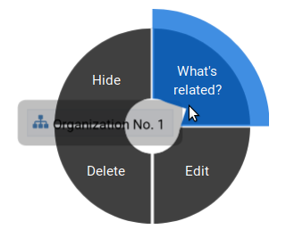

Read more about the possible sort orders in the section about the :ref:`"Related" tab<user-detail-panel-the-related-tab>` of the detail panel.

Switching between topic maps
============================

You can switch between your topic maps by using the topic map selector in the tool bar.

If you reveal the topic maps themselves in a topic map you can jump to different topic maps with a double-click.

.. image:: _static/revealed-topic-maps.png

Switching between workspaces
============================

Use the workspace selector to switch between workspaces.

.. image:: _static/workspace-selector.png

Using the browser history
=========================

Every view onto an item has a stable deep link that you can use for navigating back and forth in your browser:
If you have nothing selected the URL, that is the address in your browser, shows the exact link to this topic map.

.. image:: _static/deep-link-topic-map.jpg

If you select something the URL changes:
The ID of the currently selected item is appended to the URL.

.. image:: _static/deep-link-topic-map-with-topic.jpg

The state of the detail panel is reflected in the URL, too:
It changes depending on the tab you have opened.

.. image:: _static/deep-link-topic-map-with-topic-in-edit-mode.jpg

Using the back button of your browser brings you back to the situation you were looking at before.
It is not an "undo" though:
Going back does not revert your latest change.

.. _user-collaboration-and-sharing:

*************************
Collaboration and Sharing
*************************

.. _user-creating-user-accounts:

Creating user accounts
======================

In DMX, you create user accounts just the way you create everything else, too:
Enter a user name into the search field.
If the name does not exist yet you create it by selecting the topic type "User Account".
After that, a password field appears. 
Only privileged accounts (like admin) can create user accounts.

.. image:: _static/user-account-creation.jpg

.. image:: _static/user-account-password.jpg

What is displayed after account creation is just the *user name*.
The *user account* consists of the user name and the password.
Investigate the newly created user name by revealing "What's related".
The user name is associated with some information:

* disk quota: how much space the user can use on the computer
* if the account owner can share workspaces with others
* if the account owner is allowed to log in at all

It is important that every user account is tied to the "System" workspace (see below). In short, this allows others to read their user name (only the name) to share content.

.. image:: _static/user-name-related.jpg
    :width: 400

.. _user-introduction-to-workspaces-and-sharing-modes:

Introduction to workspaces and sharing modes
============================================

In DMX workspaces are the highest level content is organized in.
Workspaces can be compared to folders containing everything related to a working area, a project, or an area of life.
Each topic and association is tied to exactly *one* workspace but you can display them in many topic maps.
A workspace can have one or many members who have access to its content.
Read and write permissions are tied to workspaces.
This feature makes workspaces the basis of collaboration and the key to the configuration of access control:

DMX has five sharing modes:

* **private**: In a private workspace just the owner of the workspace can read and write.
* **confidential**: In a confidential workspace the owner can read and write. Group members can read, but not change anything.
* **collaborative**: A collaborative workspace can be read and edited by the owner and by all group members.
* **public**: A public workspace is world-readable. The default "DMX" workspace is an example of a public workspace.
* **common**: In a common workspace everyone can read and write. No login is required.

Every workspace has an owner, usually the creator, and optional members.
When you are logged in you can access the different workspaces via the :ref:`workspace selector<user-the-workspace-selector>` in the upper left corner.
Once you log out DMX will switch back to a public (world-readable) workspace like the default workspace called "DMX".
All items that are publicly readable stay visible, the rest disappears from the view.
You are no longer able to edit but you still have a customizable view of the topic map, which means that you can move items and reveal other world-readable items.

.. image:: _static/workspace-selector.png

DMX comes with four default workspaces with the following sharing modes:

* **DMX**: This workspace a public, it is the one that is displayed publicly when people come to the site.
* **Private Workspace**: This is the private workspace of the respective logged in user. Only this user can see and and edit their map as it is private.
* **Administration**: Only admins can view and edit this workspace. Unprivileged user accounts do not have this entry in the menu.
* **System**: The System Workspace is readable by everyone who is logged in. It contains all user names that exist in this DMX installation. The user names are readable to all users. This is needed for sharing content with others as you will see below.

.. image:: _static/system-workspace.jpg

.. _user-sharing-a-workspace:

Sharing a workspace
===================

Here is how creating a shared workspace works:

* Log in as an unprivileged user and go to your private workspace where you can edit.
* Open the search field and **create a workspace**. Make it a collaborative workspace to give others write permission.

.. image:: _static/workspace-creation.jpg

* The new workspace automatically opens. Click onto the blue information icon next to the workspace selection to reveal the workspace topic itself on the topic map.
* To add members to the workspace you can just enter user names and click them to reveal them on the map. As mentioned above, all user names are visible to all other logged in users via the system workspace. In DMX, membership is tied to user names that is why you need read permission on the user names.
* If you don't know their user names you can go to the System workspace and investigate.
* Now that you have the workspace itself and a user name on your topic map you can just **create an association between the user name and the workspace**.
* Next you have to qualify this association as a membership: Edit the association.

.. image:: _static/edit-ws-assoc.jpg
    :width: 300

* In the detail panel you can now select the association type "Membership". You are done!

.. image:: _static/edit-ws-assoc2.png

* The user you shared your workspace with can now log in, select your collaborative workspace and add something, e.g. a note. It will automatically appear in the workspace, visible to all workspace members.

.. note:: You can create memberships in every workspace that you have write permission in.

.. _user-modelling:

*********
Modelling
*********

.. _user-introduction-to-data-modelling:

Introduction to Data Modelling
==============================

.. _user-topics-and-topic-types:

Topics and topic types
----------------------
In the DMX data model, the whole world consists of topics and associations.
You can think of them as things and how they are related to each other.
Thus, a topic can be anything, a contact, a location, a file, a website, a thought etc.

In contrast to topics, topic types are more general:
A topic type is the idea of a topic without its concrete shape.
On the level of types you describe models of what you want to create.

As an example, think of mapping your music collection:
The topic type could be called "album".
An album could have an author, a title, a year, a genre etc.
In DMX you create a topic type with these fields (which are also topic types).
Each concrete album you create then has a form with these fields to fill in.

DMX comes with a few predefined topic types, e.g. person, organization, or note.
You can add your own topic types and by doing so you define your own data model.

.. _user-associations-and-association-types:

Associations and association types
----------------------------------

Associations represent the relationships between items.
They represent real-world semantics.
These can be relationships between topics or between associations or even between a topic and an association.
The most important characteristic of associations in DMX is that you can qualify them to give them the meaning *you* need.
They are not just drawn lines between two dots, but they can have association types.
While a line between two items is human-readable, an association that has an association type is machine-readable, too.
With association types you can tell more about the links between your Topics.
Timelines, roles in an organization or authorship information are examples of association types.

To stick with the example of the music collection, authorship would be the association type you define.

The Associative Model Of Data
-----------------------------

DMX is built upon the so-called Associative Model of Data.
It uses a suitable database model which can be considered opposed to the widely used Relational Database Management Systems.

If you want to dive deeper into this concept, we recommend the following sources:

* Joseph V. Homan, Paul J. Kovacs: `A Comparison Of The Relational Database Model And The Associative Database Model <http://iacis.org/iis/2009/P2009_1301.pdf>`_, in: Issues in Information Systems, Volume X, No. 1, 2009 (6 page article)
* Simon Williams: `The Associative Model Of Data <https://link.springer.com/content/pdf/10.1057/palgrave.jdm.3240049.pdf>`_, in: Journal of Database Marketing, Volume 8, 4, 2001 (24 page article)
* Simon Williams: The `Associative Model Of Data <http://www.sentences.com/docs/other_docs/AMD.pdf>`_, Lazy Software, 2nd edition, 2002 (book, 284 pages)

.. _user-types-versus-instances:

Types versus instances
----------------------

As seen, types are the ideas or abstract descriptions of the things you want to map.
Instances, as opposed to types, are the concrete things, your content.
If you have a topic type "colour", all individual topics like "red", "green", "blue" are instances of the topic type colour.
Instances are the concrete occurences of the type:
Topics are always instances of their topic type.
Associations are instances of their association type.

In DMX, this difference is important to understand as you *can* visualize both layers, even in the same topic map!

.. _user-simple-data-types:

Simple data types
-----------------

Every topic or association has a data type.
They are six different data types in DMX.
Four of them are so-called **simple** types:

* **text:** This is the default data type and it contains a text string.
* **number:** An example is "year".
* **boolean:** yes/no resp. true/false
* **html:** HTML

.. _user-composites-and-composition-definitions:

Composites and composition definitions
--------------------------------------

The two other data types are **composites**.
First of all, "composite" means that this data type is put together from several simple data types.
The name of a person mostly consists of at least a first name and a last name.
An address entry is put together from a street name, a number, a postal code, a city.

For associations there is just *one* composite data type which is obviously called composite.
For topic types DMX has both composite types: **value** and **identity**.

These terms exist to clarify what you are referring to when changes occur.
Think of real-world contexts and how people are able to understand what changed.
If a person has a new address this could mean they moved, but it could also mean the street was renamed.
You can model these two different case by using the data types "identity" and "value".

The composite type "identity"
-----------------------------

In DMX, identity is used when you want to refer to the same thing as before even if something changes.
If an address changes because the street is renamed you would still mean the same house at the same geolocation.
If you save a bookmark to refer to an article and the URL of that article changes, the article and its description would be the same as before.
If you edit a person's details in your address book the person itself stays the same, even if their phone number changes.

.. image:: _static/composite-identity.png

The composite type "value"
--------------------------

The composite data type "value" is used whenever you want to refer to something different upon a change.
While the topic type *person* is a composite of the data type "identity", topic type *person name* is a composite of the data type "value":

.. image:: _static/composite-value.png

If a person changes their name the change is done by deleting the *association* to the old name and by creating an association to the new name.

The background to this is the following:
In DMX, every item is saved in the database only *once*.
For example, there is one last name called "Jones" in the database.
All persons who share this name are associated to it.
Technically, this means that many parents share the same child.
Upon a change of name, the old name stays in the database because it may be associated to other items:
Many people are called Cathy or Jones so the database entries can be considered to be a dictionary of names.
The persons are just associated to immutable names but the *associations* between them can be deleted and redone.

Here is what this change looks like:
Before, the person Cathy Jones is related to the person name, a composite of first name and last name.
This is shown by the red associations.

.. image:: _static/changing-a-persons-name1.png

To assign a different name to the person, you just edit the person's entry and change the name.
The association between the person and the person name is deleted.
A new association is created.
The old person name stays in the database, disconnected from this instance of a person.
If you are sure do not need it, you can explicitly delete it.

.. image:: _static/changing-a-persons-name2.png

.. _user-creating-a-topic-type:

Creating a topic type
=====================

To create your own topic type with a few properties here is how to procede.
Let's say you want to add a topic type "publication".
Each publication shall have a title and a year.

- Open the search field. Enter "Publication", select "Topic Type" and press "create".
- Go into editing mode via the context menu. Change the data type from "Text" to "Identity" and hit "Save". Click somewhere into your map to close the detail panel.
- Open the search field and enter "Title". You will find that two entries already exist. They come from the default topics types "Event" and "Note" which also have titles. Create a new topic type "Title".
- Create an association between the title item and the publication item. DMX will display what you just created:
  * You created an association of the type "Composition Definition". Composition Definition means that you are defining a more complex context between item on your map: The relationship between a publication, a title and a year. 
  * "Cardinality: One" means that each publication has exactly one title, not more. 
  * The rest of the information refers to the role types: The publication is called the parent, the title is the child. These are technical terms to define that a publication has a title, but a title does not have a publication.

.. image:: _static/composition-definition.jpg
    :width: 300

- Again, click somewhere onto the map and reopen the search field. Search for the year and open the existing topic type. Pull it onto the publication.

You are now ready to use this data model you just built to add content.

- Open the search field and enter the title of a publication. From the Topic Type menu you can now select "Publication".
- As the title was the first property you added to the composition, it is automatically filled in from the search field.
- Edit your new publication and add a year.

Creating an association type
============================

One of the strengths of DMX is that you can build your own association types in the same user interface.
Let's say you want to express the relationship between persons and publications.
A person can be the author, the publisher, the reader, or even the subject of a publication.

* Create a topic type "Publication".
* Create an association type and give it a name, e.g. "Relationship publication - person".
* Select "Composite" as a data type.

.. image:: _static/create-machine-readable-association.jpg

* Create a topic type, name it "Role referring to publication" or anything that suits you. Its data type is "Text".
* Create an association between the topic type and the association type and edit the newly created association between them. Click onto the "View" tab and then "Edit" to edit its configuration.
* Open the "Widget" setting and select "Select". This will allow you to select roles from a predefined list when adding content later.
* There are two more checkboxes called "clearable" and "customizable". It only makes sense to use them in connection with  "Widget: Select". Both have an effect on editing association types later on. Here is what they do: "Clearable" decides whether you allow instances of this association type to *only* have the values you explicitly defined or whether it shall be possible to clear the field to leave it empty. In this case, there will be a little cross icon for clearing it. "Customizable" decides whether you allow to enter values on the fly by just typing in something different that was not predefined by you. If both checkboxes are left empty, one of your predefined values *has* to be selected. The value cannot be empty and there will be no possibility of typing into the field.

.. image:: _static/selectable-role.jpg

* Create a topic "Author" that has the topic type "Role referring to publication" which is selectable from the create menu. If you want to have more roles, add them likewise.
* Create a person.
* Create a publication.
* Create an association between the person and the publication and edit the association. Open the drop-down menu under "Association Type" and select "Relationship publication - person". Hit the save button and the edit button again. There is a new drop-down menu that lets you select the role the person shall have related to the publication.

.. image:: _static/select-role.jpg

You now have a map like this.
On the left side you see the data model.
There is your topic type "Publication" with a title and a year.
And there is the association type you built with a few selectable roles.

On the right side you see the actual content, the instances.
To continue working with a less crowded map, you might want to :ref:`bulk select and hide<user-hiding-multiple-items>` the data model.

.. image:: _static/topic-map-with-own-assoc-and-instances.jpg

Exploring the data model
========================

You can explore the data model by revealing its parts in topic maps.
The topic types with all their properties (that is associations to other topic types) are saved in the database just like all your content.
To understand how topic types and association types are built you can thus just navigate them.

To explore an example, we can once more refer to the built-in topic type "Person".
To look at the data model of a person, click onto an instance, e.g. a person you created and select "What's related".

.. image:: _static/context-menu.png
    :width: 220

The :ref:`detail panel<user-the-detail-panel>` on the right side will open.
You are now looking at the :ref:`Related tab<user-detail-panel-the-related-tab>`.
It displays a list of all items that are logically related to this concrete person:

- the organization you linked the person to
- the name of the person (because so far this is the only information you added to the person)
- the topic type "person". Your concrete person is an instance of the general idea of persons, so it is linked to this general idea, the topic type.
- the topic map this topic is associated with
- the workspace the topic is in

You can now click on each of the list items and they will appear on the topic map.
Click onto the topic type "person".
The topic type "person" is displayed with an association to the instance "Cathy Jones".
The link between both has a different color and you can again click onto the link, show "What's related" and you can see that this association is an "instantiation":
The topic is one instance of the topic type.
To see if there are more instances (more persons), show the "What's related" of the topic type "person".
Among other information about how the topic type is integrated into the rest of the context you can see all existing persons you entered so far.

Here you are looking at your data and at a part of the data model it is based upon.
Again, you can hide what you do not want to see in your map when you are done exploring.

.. image:: _static/intro-data-model.png

.. _user-edge-connections:

Visualizing edge connections
============================

In the examples above you have seen nodes that are connected by edges, e.g. two topics (or topic types) that are connected by associations.
This is not sufficient in a data model that is supposed to show real-world relationships.
The associations themselves can be very complex and can have many properties.

With DMX's associative data model, these complex associations can be modelled and they can even be visualized on topic maps:
They show as associations connected to other associations.

Let's return to the example of a publication and its author:
The authorship is a qualified description of the association between a person and a publication.
If you reveal the "What's related" of such a qualified association you can see the connection between the association and and the association type: 

.. image:: _static/edge-connection.jpg
